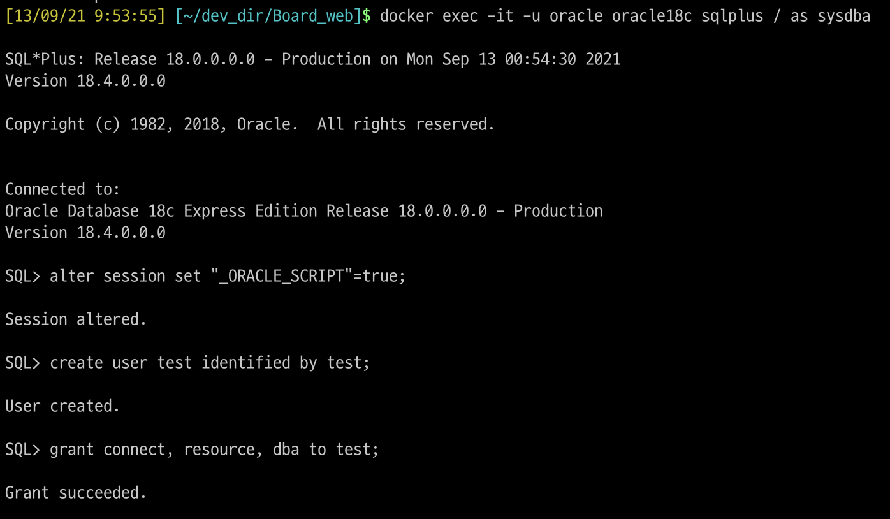

oracle 18c 이미지 다운로드

 `$ docker pull vitorfec/oracle-xe-18c` 입력

`$ docker run --name oracle18c -d -p 5150:22 -p 5151:1521 -e ORACLE_PWD:1234 vitorfec/oracle-xe-18c` oracle18c 이미지 실행

`$ docker ps -a` 실행중인 도커 확인

오라클 쉘 접속 (sqlplus)

`$ docker exec -it -u oracle oracle18c sqlplus / as sysdba` 

계정 생성 및 권한 부여

- 계정 규칙 제한 풀기

`$ alter session set "_ORACLE_SCRIPT"=true;`

- 계정생성 (test / 1234)

SQL> create user test identified by 1234;

- 권한 추가

SQL> grant connect, resource, dba to test;

sql developer 로 연결을 하려고 했으나, username 과 password 인식이 안되서 어떻게 해야하나 고민중..

21.09.16_연결 해결