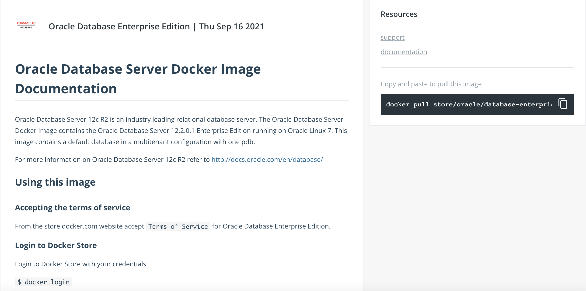
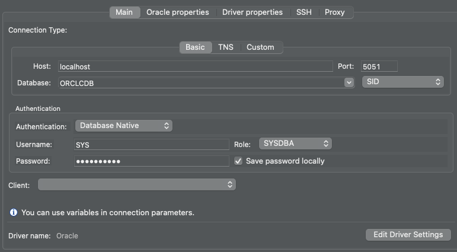
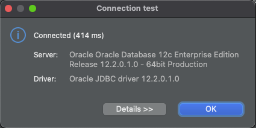
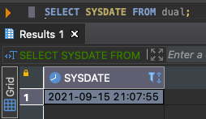

oracle12c 를 임시로 사용하고 추후에 18c로 변경할 예정.

terminal 에서 도커 로그인

`$ docker login`

[github](https://hub.docker.com/_/oracle-database-enterprise-edition)

위 링크에서 

docker pull

`$ docker pull store/oracle/database-enterprise:12.2.0.1-slim` 

run docker image 

`$ docker run --name oracle12c -d -p 5050:22 -p 5051:1521 store/oracle/database-enterprise:12.2.0.1-slim`

docker start

`$ docker start oracle12c`

start sql developer DBeaver

The default password to connect to the database with `sys` user is `Oradoc_db1`.

SID : ORCLCDB

연결 테스트 후 등록.

sql> `select sysdate from dual`

**Dual 테이블**

1. 오라클 자체에서 제공되는 테이블(dummy table)

2. 간단하게 함수를 이용해서 결과값을 확인 할 때 사용

3. SYS사용자가 소유하는 오라클의 표준 테이블(public)