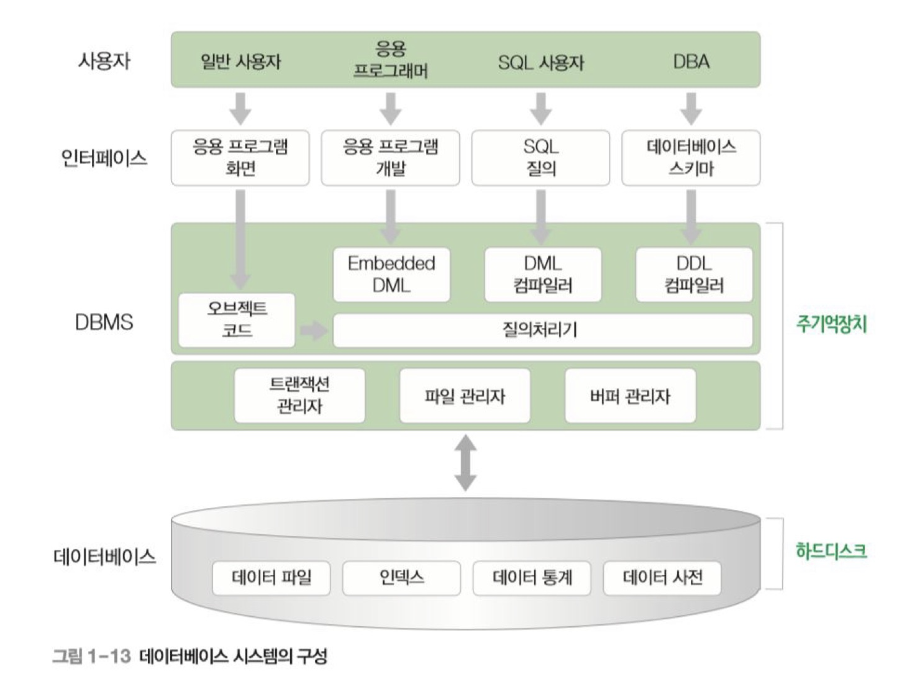
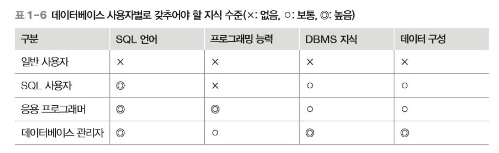

DB 정리

---

데이터:관찰의 결과로 나타난 실제 값

정보:데이터에 의미를 부여한 것

지식:사물이나 현상에 대한 이해

데이터베이스:필요한 정보를 얻기 위해 논리적으로 연관된 데이터를 모아 구조적으로 통합해 놓은 것

| 데이터베이스 시스템 |                                                  |
| ------------------- | ------------------------------------------------ |
| DBMS                | 사용자와 데이터베이스를 연결시켜 주는 소프트웨어 |
| 데이터베이스        | 데이터를 모아 둔 토대                            |
| 데이터 모델         | 데이터가 저장되는 기법에 관한 내용               |

DBMS가 설치되어 데이터를 가진 쪽을서버, 외부에서 데이터 요청하는 쪽을 클라이언트

Reference - **오라클로 배우는** **데이터베이스 개론과 실습** | 박우창, 남송휘, 이현룡 지음 | 한빛아카데미| 2020년 07월 30일 출간
