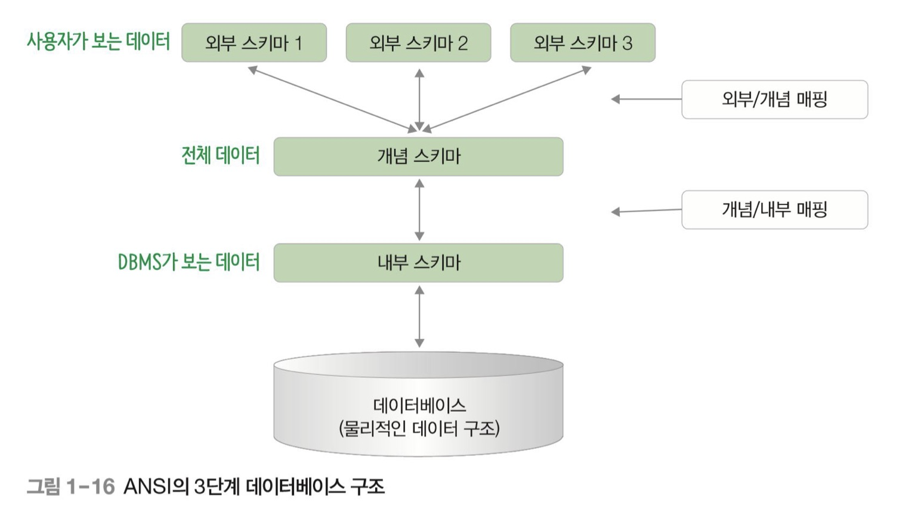

데이터베이스 언어

---

### SQL

DDL ( Data Definition Language ) 정의어

- CREATE, ALTER, DROP

DML ( Data Manipulation Language ) 조작어

- SELECT, INSERT, DELETE, UPDATE

DCL ( Date Control Language ) 제어어

- GRANT, REVOKE

### 데이터베이스 구조

외부 스키마 (exteranal schema)

- 일반 사용자나 응용 프로그래머가 접근하는 계층, 전체 데이터베이스중 하나의 논리적인 부분을 의미
- 여러 개의 외부 스키마가 있을 수 있음
- 서브 스키마 라고도 하며, 뷰(view)의 개념

개념 스키마 (conceptual schema)

- 전체 데이터베이스의 정의를 의미 (도메인을 가지고 있지 않음)
- 통합 조직별로 하나만 존재하며 DBA가 관리
- 하나의 데이터베이스에는 하나의 개념 스키마가 있음

내부 스키마 (intenal schema)

- 물리적 저장 장치에 데이터베이스가 실제로 저장되는 방법을 표현 (도메인을 가지고 있음)
- 내부 스키마는 하나
- 인덱스, 데이터 레코드의 배치 방법, 데이터 압축 등에 관한 사항이 포함됨

논리적 데이터 독립성 ( logical data independence)

- 외부 스키마와 개념 스키마 사이의 독립성
- 개념 스키마가 변경되어도 외부 스키마에는 영향을 미치지 않도록 지원
- 논리적 구조가 변경되어도 응용 프로그램에는 영향이 없도록 하는 개념
- 개념 스키마의 테이블을 생성하거나 변경하여도 외부 스키마가 직접 다루는 테이블이 아니면 영향이 없음

### 데이터 독립성

물리적 데이터 독립성(physical data independence)

- 개념 스키마와 내부 스키마 사이의 독립성
- 저장장치 구조 변경과 같이 내부 스카마가 변경되어도 개념 스키마에 영향을 미치지 않도록 지원
- 성능 개선을 위하여 물리적 저장 장치를 재구성할 경우 개념 스키마나 응용 프로그램 같은 외부 스키마에 영향이 없음
- 물리적 독립성은 논리적 독립성보다 구현하기 쉬움

Reference - **오라클로 배우는** **데이터베이스 개론과 실습** | 박우창, 남송휘, 이현룡 지음 | 한빛아카데미| 2020년 07월 30일 출간