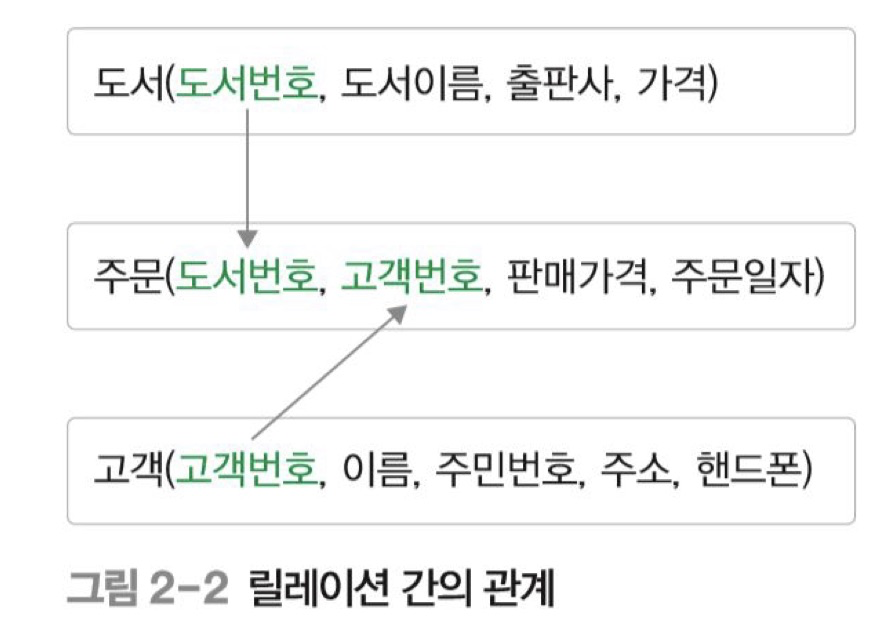
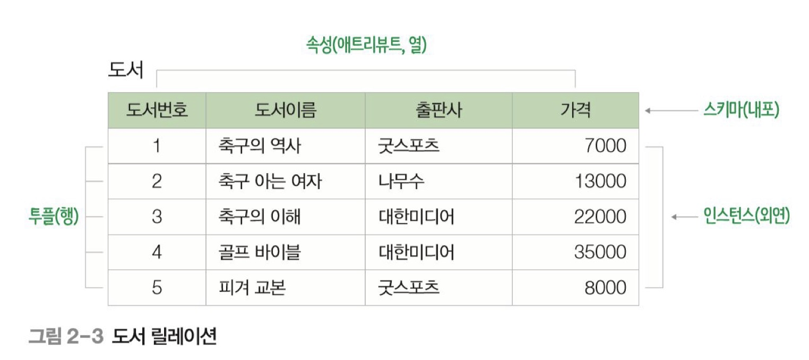
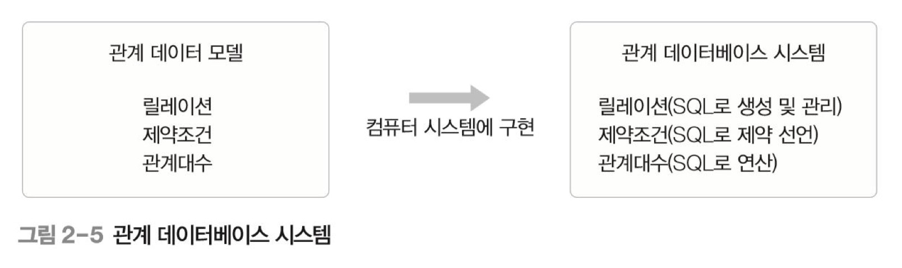

관계 데이터 모델

---

목차

[릴레이션](#릴레이션)

[릴레이션 스키마와 인스턴스](#릴레이션-스키마와-인스턴스)

[릴레이션 특징](#릴레이션-특징)

[관계 데이터 모델](#관계-데이터-모델)

## 릴레이션

### 릴레이션의 개념

릴레이션(relation) : 행과 열로 구성된 테이블

릴레이션 내에서 생성되는 관계(relationship) : 릴레이션 내 데이터들의 관계

릴레이션 간의 생성되는 관계(relationship) : 릴레이션 간의 관계

## 릴레이션 스키마와 인스턴스

릴레이션 스키마

- 속성(attribute) : 릴레이션 스키마의 열
- 도메인(domain) : 속성이 가질 수 있는 값의 집합
- 차수(degree) : 속성의 개수

스키마의 표현

- 릴레이션 이름(속성1 : 도메인1, 속성2 : 도메인2, 속성3 : 도메인3 ...)

릴레이션 인스턴스

- 투플(tuple) : 릴레이션의 행
- 카디날리티(carfinality) : 투플의 수

## 릴레이션 특징

- 속성은 단일 값을 가진다.
	- 각 속성의 값은 도메인에 정의된 값만을 가지며 그 값은 모두 단일 값이여야 한다.

- 속성은 서로 다른 이름을 가진다.
	- 속성은 한 릴레이션에서 서로 다른 이름을 가져야만 한다.

- 한 속성에 속한 열은 모두 그 속성에서 정의한 도메인 값만 가질 수 있다.
- 릴레이션 내의 중복된 투플은 허용하지 않는다.
- 속성의 순서는 상관없다.(순서가 달라도 릴레이션 스키마는 같다.)
- 투플의 순서는 상관없다.

## 관계 데이터 모델

2차원 테이블 형태인 릴레이션으로 표현

릴레이션에 대한 제약조건(constraints)과 관계 연산을 위한 관계대수(relational algebra)를 정의함

Reference - **오라클로 배우는** **데이터베이스 개론과 실습** | 박우창, 남송휘, 이현룡 지음 | 한빛아카데미| 2020년 07월 30일 출간