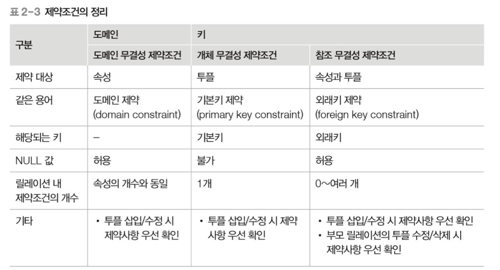
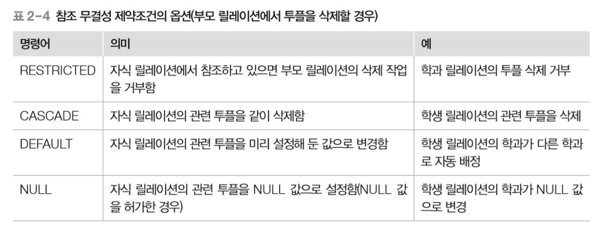

무결성 제약조건

---

목차

[키](#키)

[무결성 제약조건](#무결성-제약조건)

[무결성 제약조건의 수행](무결성-제약조건의-수행)

## 키

특정 투플을 식별할 때 사용하는 속성 혹은 속성의 집합

릴레이션은 중복된 투플을 허용하지 않기 때문에 각각의 투플에 포함된 속성들 중 어느 것은 값이 달라야 한다. 즉 키가 되는 속성, 집합은 반드시 값이 달라서 투플들을 서로 구별할 수 있어야 한다.

키는 릴레이션 간의 관계를 맺는 데도 사용된다.

### 슈퍼키

투플을 유일하게 식별할 수 있는 하나의 속성 혹은 속성의 집합 (식별할 수 있는 값은 모두 슈퍼키가 될 수 있다.)

### 후보키

투플을 유일하게 식별할 수 있는 속성의 최소 집합 (2개 이상의 속성으로 이루어진 키는 복합키라고 한다.)

### 기본키

여러 후보키 중 하나를 선정한 대표로 삼은 키 (후보키가 여러 개라면 릴레이션의 특성을 반영하여 하나를 선택)

- 고려사항
	- NULL 값은 허용하지 않는다.
	- 키값의 변동이 일어나지 않아야한다.
	- 최대한 적은 수의 속성은 가져야한다. (기본키는 후보키 중 선택)
	- 향후 키를 사용하는 데 있어서 문제 발생 소지가 없어야 한다.

### 대리키

기본키가 보안을 요하거나, 여러 개의 속성으로 구성되어 복잡하거나, 마땅한 기본키가 없을 때는 일련번호같은 가상의 속성을 만들어 기본키로 삼는 경우가 있다. 이러한 키를 대리키 혹은 인조키 라고 한다.

대리키는 임의로 생성하는 값으로 사용자가 직관적으로 그 값의 의미를 알 수 없다.

### 대체키

기본키로 선정되지 않은 후보키를 말한다.

### 외래키

다른 릴레이션의 기본키를 참조하는 속성을 말한다. (관계 데이터 모델의 특징인 릴레이션 간의 관계를 표현)

- 특징
	- 릴레이션 간의  관계를 표현한다.
	- 참조한 릴레이션의 기본키를 참조한 속성
	- 양쪽 릴레이션의 도메인은 서로 같아야한다.
	- 기본키 값이 변경되면 외래키 값도 변경된다.
	- NULL 값과 중복 값 등이 혀용된다.
	- 자기 자신의 기본키를 참조하는 외래키도 가능하다.
	- 외래키가 기본키의 일부가 될 수 있다.
	- 자기 자신의 기본키를 참조할 수도 있다.

## 무결성 제약조건

### 데이터 무결성

데이터베이스에 저장된 데이터의 일관성과 정확성을 지키는 것을 말한다.

### 도메인 무결성 제약조건 (도메인 제약)

릴레이션 내의 투플들이 각 속성이 도메인에 지정된 값만을 가져야 한다는 조건

### 개체 무결성 제약조건 (기본키 제약)

기본키는 NULL 값을 가져서는 안 되며 릴레이션 내에 오직 하나의 값만 존재해야한다는 조건

### 참조 무결성 제약조건 (외래키 제약)

자식 릴레이션의 외래키는 부모 릴레이션의 기본키와 도메인이 동일해야 하며, 자식 릴레이션의 값이 변경될 때 부모 릴레이션의 제약을 받는 것

## 무결성 제약조건의 수행

### 개체 무결성 제약조건

삽입 : 기본키 값이 같으면 삽입 금지

수정 : 기본키 값이 같거나 NULL 수정 금지

삭제 : 특별한 확인이 필요하지 않으며 즉시 수행

### 참조 무결성 제약조건

삽입 : 부모 릴레이션 - 투플 삽입한 후 수행하면 정상적으로 진행
		  자식 릴레이션 - 참조받는 테이블에 외래키 값이 없으면 삽입 금지

삭제 : 부모 릴레이션 - 참조하는 테이블을 같이 삭제할 수 있어서 금지하거나 다른 추가 작업이 필요하다.
(즉시 작업을 중지 -> 자식 릴레이션의 괄련 투플을 삭제 -> 초기에 설정된 다른 어떤 값으로 변경, NULL 값으로 설정)
		  자식 릴레이션 - 바로 삭제 가능

수정 :  삭제와 삽입 명령이 연속해서 수행된다.

Reference - **오라클로 배우는** **데이터베이스 개론과 실습** | 박우창, 남송휘, 이현룡 지음 | 한빛아카데미| 2020년 07월 30일 출간

