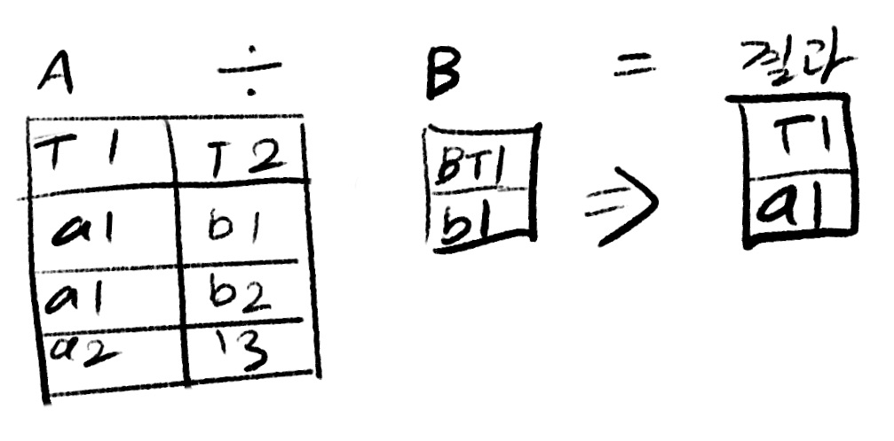

**오라클로 배우는** **데이터베이스 개론과 실습** | 박우창, 남송휘, 이현룡 지음 | 한빛아카데미| 2020년 07월 30일 출간된 책을 통해 개념을 정리한 글 (문제시 삭제 하겠습니다.)

관계대수

---

[관계대수](#관계대수)

[셀렉션과 프로젝션](#셀렉션과 프로젝션)

[집합연산](#집합연산)

[조인](#조인)

[디비전](#디비전)

[관계대수 예제](#관계대수 예제)

## 관계대수

### 관계대수 relational algebra

릴레이션에서 원하는 결과를 얻기 위해 수학의 대수와 같은 연산을 이용하여 질의하는 방법을 기술하는 언어

### 관계대수와 관계해석

관계대수 : 어떤 데이터를 어떻게 찾는지에 대한 처리 절차를 명시하는 절차적인 언어이며, DBMS 내부의 처리 언어로 사용된다

관계해석 : 어떤 데이터를 찾는지 명시하는 선언적인 언어로 관계대수와 함께 관계 DBMS 의 표준 언어인 SQL 의 이론적인 기반을 제공한다

-> 관계대수와 관계해석은 모두 관계 데이터 모델의 중요한 언어이며 실제 동일한 표현 능력을 가지고 있다.

관계대수식 : 대상이 되는 릴레이션과 연산자로 구성되며, 결과는 릴레이션으로 반환된다. 반환된 릴레이션은 릴레이션의 모든 특징을 따른다.

## 셀렉션과 프로젝션

셀렉션 : σ<조건>(R) R은 릴레이션

프로젝션 : π<조건>(R) 

## 집합연산

A U B 합집합 : 두 개의 릴레이션을 합하여 하나의 릴레이션을 반환함. 이 때 두개의 릴레이션은 서로 같은 속성 순서와 도메인을 가져야 한다 

A ∩ B 교집합 : 합병가능한 두 릴레이션을 대상으로 하며, 두 릴레이션이 공통으로 가지고 있는 투플을 반환한다.

A - B 차집합 : 첫 번째 릴레이션에는 속하고 두 번째 릴레이션에는 속하지 않는 투플을 반환한다.

A x B 카티전 프로덕트(cartesian product) : 두 릴레이션을 연결시켜 하나로 합칠 때 사용한다. 첫 번째 릴레이션의 오른쪽에 두 번째 릴레이션의 모든 투플을 순서대로 배열하여 반환한다. 차수는 두 릴레이션의 차수의 합이며, 카디날리티(투플의 수)는 두 카디날리티의 곱이다.

## 조인

두 릴레이션의 공통 속성을 기준으로 속성 값이 같은 투플을 수평으로 결합하는 연산이다. 조인을 수행하기 위해서는 두 릴레이션의 조인에 참여하는 송성이 서로 동일한 도메인으로 구성되어야 한다. 조인 연산의 결과는 공통 속성의 속성 값이 동일한 투플만을 반환한다.

### 세타조인 ⋈

조인에 참여하는 두 릴레이션의 속성 값을 비교하여 조건을 만족하는 투플만 반환된다. 조건은 { =, !=, <=, >=, <, >}중 하나

### 동등조인

세타조인에서 = 연산자를 사용한 조인을 말한다.

### 자연조인

동등조인에서 조인에 참여한 속성이 두 번 나오지 않도록 두 번째 속성을 제거한 결과

### 외부 조인

자연조인 시 조인에 실패한 투플을 모두 보여주되 값이 없는 대응 속성에는 NULL 값을 채워서 반환한다. left ⟕, right ⟖, full ⟗ 외부 조인으로 나뉜다.

### 세미조인

자연조인을 한 후 두 릴레이션 중 한쪽 릴레이션의 겨로가만 반환하여 , 기호에서 닫힌 쪽 릴레이션의 투플만 반환한다. left ⋉, right ⋊

## 디비전

A ÷ B 릴레이션의 속성 값의 집합으로 연산을 수행

