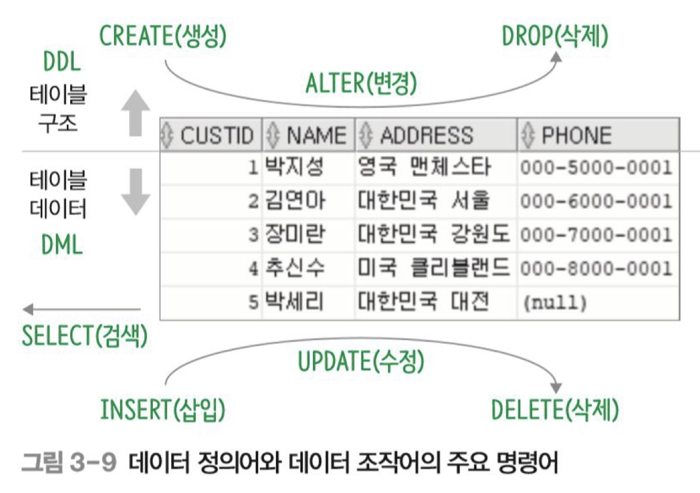

SQL 기능에 따른 분류

---

### SQL 기능에 따른 분류

- [DDL](#DDL) (데이터 정의어) CREATE, ALTER, DROP
	- 테이블이나 관계의 구조를 생성, 변경, 제거

- [DML](#DML)(데이터 조작어) SELECT, INSERT, DELETE, UPDATE
	- 테이블에 데이터를 검색, 삽입, 삭제, 수정

- [DCL](#DCL)(데이터 제어어) GRANT, REVOKE
	- 데이터의 사용 권한을 관리

Reference - **오라클로 배우는** **데이터베이스 개론과 실습** | 박우창, 남송휘, 이현룡 지음 | 한빛아카데미| 2020년 07월 30일 출간