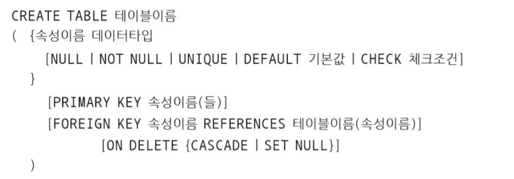
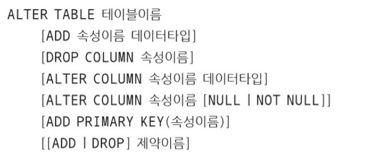

### CREATE TABLE

테이블을 구성하고, 속성과 속성에 관한 제약을 정의하며, 기본키 및 외래키를 정의하는 명령
PRIMARY KEY는 기본키, FOREIGN KEY 는 외래키

기본 문법

외래키 제약조건을 명시할 때는 반드시 참조되는 테이블(기본키)이 존재해야 한다

ON UPDATE, ON DELETE 는 외래키 속성의 수정과 투플 삭제 시 동작을 나타낸다

### ALTER TABLE

생성된 테이브르이 속성과 속성에 관한 제약을 변경하며, 기본키 및 외래키를 변경한다.

ADD, DROP은 속성을 추가하거나 제거할 때 사용

MODIFY 는 속성의 기본값을 설정하거나 삭제할 때 사용

ADD <제약이름>, DROP<제약이름>은 제약사항을 추가하거나 삭제할 때 사용

기본 문법

### DROP TABLE

테이블을 삭제하는 명령(테이블의 구조와 데이터 모두 삭제하므로 주의)

기본 문법

DROP TABLE 테이블이름;

Reference - **오라클로 배우는** **데이터베이스 개론과 실습** | 박우창, 남송휘, 이현룡 지음 | 한빛아카데미| 2020년 07월 30일 출간