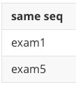

## 부속질의

하나의 SQL 문 안에 다른 SQL 문이 중첩된 질의

SELECT *(price) <- 주 질의
FROM Table1
WHERE seq = (SELECT *(seq)  <- 부속 질의
							FROM Table2
							WHERE name='example')

### 부속질의 종류

#### 중첩질의 - WHERE절에 술어와 같이 사용되며 결과를 한정시키기 위해 사용

SELECT *(price) <- 주 질의
FROM Table1
WHERE seq = (SELECT *(seq)  <- 부속 질의
							FROM Table2
							WHERE name='example')

#### 스칼라 부속질의 - SELECT절에 위치하며 단일 값을 반환

SELECT (SELECT exam  <- 부속 질의
							FROM Table2
							WHERE Table1.seq=Table2.seq) "same seq"
FROM Table1
WHERE Table1.seq;

#### 인라인 뷰 - FROM절에 위치하며 결과를 view(뷰) 형태로 반환

SELECT Tabble1.seq
FROM (SELECT seq, name  <- 인라인 뷰
				FROM Table2
				WHERE seq <= 3)
WHERE Tabble1.seq = Tabble2.seq;

