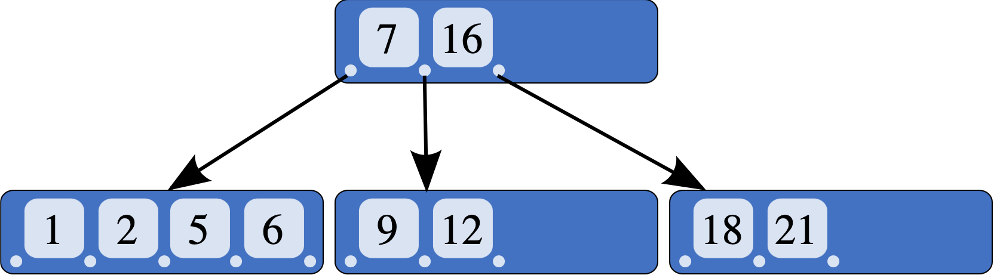

### 문법

CREATE INDEX [인덱스 이름] ON 테이블이름(컬럼, ...);

#### 재구성

ALTER INDEX 인덱스이름 [ON {ONLY} 테이블이름 (컬럼, ...)] REBUILD;

#### 삭제

DROP INDEX 인덱스 이름;

### 특징

색인이나 사전과 같이 데이터를 쉽고 빠르게 찾게 도움을 주는 데이터 구조

순서대로 정렬된 속성과 데이터의 위치만 보유해 테이블보다 작은 공간을 차지

빠른 검색과 효율적인 레코드 접근 가능

저장된 값들은 테이블의 부분집합

일반적으로 Binary-tree 구조를 가진다

데이터의 변경이 발생하면 인덱스도 재구성이 필요

B-tree 구조

Reference - https://en.wikipedia.org/wiki/B-tree

### 고려사항

인덱스는 WHERE 절, JOIN 에 자주 사용되는 속성

단일 테이블에 인덱스가 많으면 인덱스를 한 큰 의미가 없어진다. 테이블당 5개 정도 권장

수정이 빈번하지 않는 값이 유리하다

