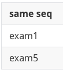
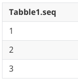
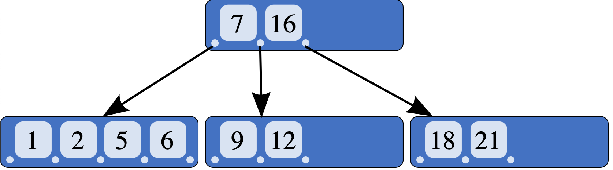

#### 오라클로 배우는 데이터베이스 개론과 실습 | 박우창, 남송휘, 이현룡 지음 | 한빛아카데미| 2020년 07월 30일 출간된 책을 통해 개념을 정리한 글 (문제시 삭제 하겠습니다.)

------

SQL 고급 정리

---

## NULL 값 처리

NULL값은 아직 지정되지 않은 값으로 0, ' ' 등과 다른 특별한 값

그래서 비교 연산자로 비교가 불가능.

- 집계 함수 사용시 주의점
	- NULL + 숫자 = NULL
	- 집계 함수 계산시 NULL이 포함된 행을 예외
- NULL 값을 확인하는 방법 - IS NULL, IS NOT NULL
	- where <속성> IS NULL;
- NVL(속성,값) : NULL 을 다른 값으로 대치 혹은 연산 후 다른 **'값'**으로 출력 (AS와 비슷)

## ROWNUM

오라클 내부적으로 생성되는 가상 컬럼으로 SQL 조회 결과의 순번을 나타낸다.

## 부속질의

하나의 SQL 문 안에 다른 SQL 문이 중첩된 질의

SELECT *(price) <- 주 질의
FROM Table1
WHERE seq = (SELECT *(seq)  <- 부속 질의
							FROM Table2
							WHERE name='example')

### 부속질의 종류

#### 중첩질의 - WHERE절에 술어와 같이 사용되며 결과를 한정시키기 위해 사용

SELECT *(price) <- 주 질의
FROM Table1
WHERE seq = (SELECT *(seq)  <- 부속 질의
							FROM Table2
							WHERE name='example')

#### 스칼라 부속질의 - SELECT절에 위치하며 단일 값을 반환

SELECT (SELECT exam  <- 부속 질의
							FROM Table2
							WHERE Table1.seq=Table2.seq) "same seq"
FROM Table1
WHERE Table1.seq;

#### 인라인 뷰 - FROM절에 위치하며 결과를 view(뷰) 형태로 반환

SELECT Tabble1.seq
FROM (SELECT seq, name  <- 인라인 뷰
				FROM Table2
				WHERE seq <= 3)
WHERE Tabble1.seq = Tabble2.seq;

## 뷰

하나 이상의 테이블을 합한 가상의 테이블, 편리하고 재사용에 용의하고 보안에 좋으며 논리적독립성을 제공

원본 테이블의 데이터 값이 변경되면 같이 변경되며 독립적인 인덱스 생성이 어렵다.

연산에 많은 제약이 따른다. 가상 테이블로 값을 가져오는 용도에 적합

#### 뷰 생성

CREATE VIEW vm_examTable
AS SELECT *
		FROM table
		WHRER seq = 3;

#### 뷰 수정

CREATE OR REPLACE VIEW vm_examTableAS SELECT *
		FROM table
		WHRER seq = 5;

#### 뷰 삭제

DROP VIEW vm_examTable;

## 인덱스

### 문법

CREATE INDEX [인덱스 이름] ON 테이블이름(컬럼, ...);

#### 재구성

ALTER INDEX 인덱스이름 [ON {ONLY} 테이블이름 (컬럼, ...)] REBUILD;

#### 삭제

DROP INDEX 인덱스 이름;

### 특징

색인이나 사전과 같이 데이터를 쉽고 빠르게 찾게 도움을 주는 데이터 구조

순서대로 정렬된 속성과 데이터의 위치만 보유해 테이블보다 작은 공간을 차지

빠른 검색과 효율적인 레코드 접근 가능

저장된 값들은 테이블의 부분집합

일반적으로 Binary-tree 구조를 가진다x

데이터의 변경이 발생하면 인덱스도 재구성이 필요

B-tree 구조

Reference - https://en.wikipedia.org/wiki/B-tree

### 고려사항

인덱스는 WHERE 절, JOIN 에 자주 사용되는 속성

단일 테이블에 인덱스가 많으면 인덱스를 한 큰 의미가 없어진다. 테이블당 5개 정도 권장

수정이 빈번하지 않는 값이 유리하다
