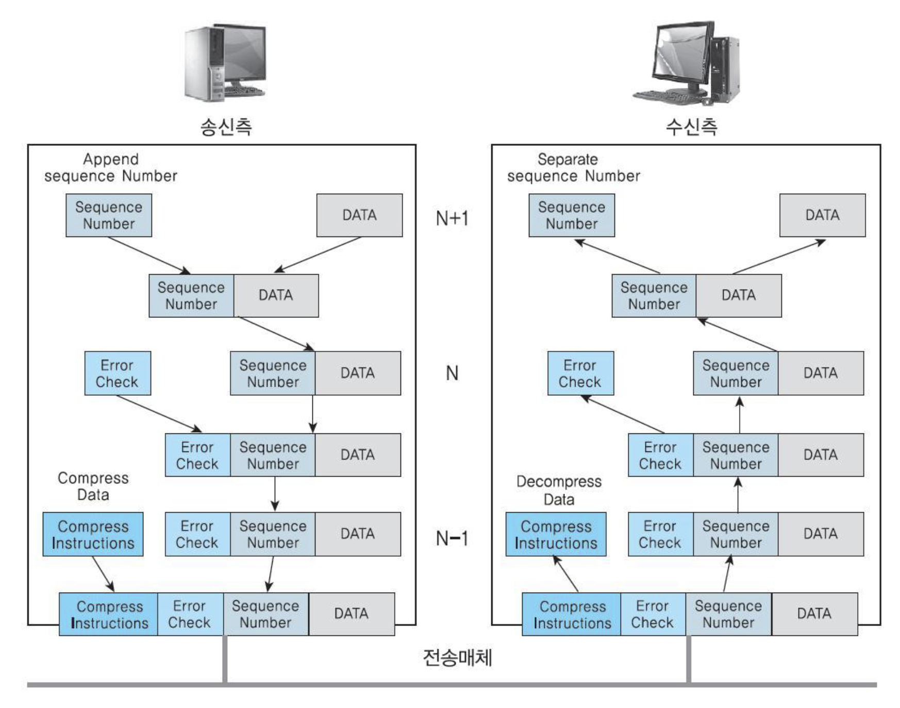

## OSI 참조모델

국제표준기구 ISO에서 1980년 말경에 정보교환을 위해 필효한 최소한의 네트워크 구조를 제공하는 OSI 기본 참조모델을 제안, 1983년에 국제표준(ISO 7498)으로 제정되었다. 네트워크를 이해하기 위해서 공부해야한다...

ISO에서는 OSI(Open System Interconnection:개방형 시스템 간 상호접속)을 위해 이기종 간 상호접속을 위한 가이드라인을 제시하고자 했다.

### OSI 참조모델의 목표

1. 시스템 간의 통신을 위한 표준 제공과 통신을 방해하는 기술적인 문제들이 제거
2. 단일 시스템 간의 정보교환을 하기 위한 상호접속점을 정의
3. 제품 간의 번거로운 변환 없이 통신할 수 있는 능력을 향상시키기 위해 선택사앙을 축소
4. OSI 참조모델 표준이 모든 요구를 만족하지 못할시, 다른 방법을 사용하는 것에 대한 이유를 제공

### 독립적으로 7계층 구조로 이루어진 OSI 참조모델 목적 

계층 간 명확한 인터페이스 정의는 계층 간 독립성을 제공, 독립성을 유지하며 한 모듈(변경)이 다른 모듈에 미치는 영향을 최소화

### PDU(Protocol Data Unit)

네트워크 구조에서 정보를 실어 나르는 기본 단위

OSI 참조모델의 독립적인 7계층은 PDU의 이름도 독립적이다.

| 계층              | PDU                  | 기능                                                         |
| ----------------- | -------------------- | ------------------------------------------------------------ |
| 7.응용계층        | Message or User data | 사용자에게 서비스 제공, SMTP, FTP, HTTP 등 사용자가 원하는 최종 목표 |
| 6.표현계층        | High-level message   | 데이터 변환, 압축, 암호화                                    |
| 5.세션계층        | Session message      | 통신하는 프로세스 사이의 대화제어 및 동기화  세션의 설정 및 유지 종료 |
| 4.전송계층        | Segment, Datagram    | 네트워크계층에서 패킷을 종단까지 전달한다면 전송층은 종단 내에서 최종 수신 프로세스로 전달을 담당  분할/재조립, 연결/흐름제어, 오류제어 포트 번호 |
| 3.네트워크 계층   | Packet, Datagram     | 소신 측에서 최종목적지까지 패킷 전달 송수신 측의 논리주소 지정 및 최종 목적지에 도달하도록 라우팅 패킷 단편화 IP주소 |
| 2.데이터링크 계층 | Frame                | 노드와 노드 사이의 데이터 전달 신뢰성을 더하기 위한 흐름제어, 오류제어 MAC 두 개의 서브레이어로 구성 |
| 1.물리계층        | Bits                 | 통신 물리매체를 통해 bit 흐름전송 물리적 링크 설정, 유지, 해제 |

#### 동등 계층 간의 통신(peer-to-peer)

임의 계층에서 상대와 동일 계층 모듈과 통신하는 프로세스

OSI 참조모델의 N번째 계층에서 다른 시스템의 N번째 계층과 통신하기 위해서는 상위계층의 메시지와 더불어 PCI(Protocol Control Information : 프로토콜 제어정보)를 이용하며 동등계층 간 통신을 위해 각 계층은 헤더 형식으로 해당 계층에 필요한 정보를 전달(테이터링크 계층은 헤더+트레일러)

*헤더 : 데이터 캡술화할 때 데이터 앞에 붙여지는 부가정보( 송수신자의 주소와 연결제어, 에러제어 ,흐름제어를 위한 정보)

*트레일러 : 데이터 캡술화할 때 데이터 뒤에 붙여지는 제어정보(오류검사를 위한 정보)

### 상하 계층 간의 통신

송신장치의 응용계층으로부터 물리계층까지 데이터가 각 계층을 따라 전달되고, 전달된 데이터는 수신장치의 물리계층으로부터 응용계층까지 거슬러 올라간다.

표준용어로 표시한 상하 계층 간의 통신

| 용어                               | 기능                                                         |
| ---------------------------------- | ------------------------------------------------------------ |
| SUD(Service Data Unit)             | N+1 계층에 의해서 N계층과  N-1계층으로 내용변동 없이 전달되는 사용자 데이트 |
| PCI(Protocol Control information)  | 네트워크의 다른 지역에 있는 같은 동등 계층에게 보내지는 정보, 그 계층에게 어떤 서비스 기능을 수행하도록 지시하는 헤더 |
| PDU(Protocol Data Unit)            | SUD + PCI                                                    |
| ICI(Interface Data Unit)           | 서비스 기능을 호출하기 위해서 N과 N-1계층 사이에서 전달되는 임시 매개 변수 |
| IDU(Interface Control Information) | PCI, SDU, ICI를 포함하는 계층 경계를 통과하여 전달되는 정보의 전체 단위 |

N+1 계층에서 갈라져 나온 ICI는 계층 간의 전달 메시지, 필요한 기능 수행 후 제거

N계층의 PDU는 상대편 N계층에 전달할 PCI와 사용자 데이터인 SDU를 결합하고 하위 계층인 N-1계층으로 전달한 ICI를 덧붙여 N-1 계층에 IDU로 전달

위[PDU](#PDU(Protocol Data Unit))에서
네트워크계층에서 Datagram은 전송계층으로부터 받은 SDU+PCI
데이터계층에서의 Frame은 네트워크 계층으로부터 받은 SDU+PCI

IDU -> SDU, ICI(계층 간의 메시지) -> SDU+PCI(헤더) -> PDU + ICI(계층 간의 메시지) -> IDU -> ...

쉽게 이해하기위해 책의 그림을 가져왔다.

출처 : 데이터 통신 - 데이터 통신의 다양한 주제를 알기 쉽게 설명한 기본서저자 : 정진욱, 한정수 출판사: 생능출판 출간일: 2017년 11월 30일 출간

위 그림과 같이 계층을 통과할 때마다 해당 계층의 해더가 덧 붙여지고, 이것을 다음 계층에선 사용자 데이터(SUD) 단위가 된다.

Error Check 필드를 추가해 오류 없이 도착했음을 보장하는데 사용

### 물리계층(Physical layer)

---

물리적 매체를 통해 비트(0,1) 스트림을 전송 매체를 통해 전송하기 위해 요구되는 기능 조정

물리적 링크를 설정, 유지, 해제하기 위한 물리적, 전기적, 기능적 그리고 절차적 특성을 규정

물리적 매체 - 케이블, 허브, 리피터

물리적 - DTE와 DCE 사이의 물리적 연결에 관한 사항

전기적 - 전압 레벨과 전압 변화의 타이밍(클럭)에 관련되는 특성

기능적 - 물리적으로 접속되는 두 장치(DTE, DCE) 간의 상호작요에 쓰이는 각 회선에 의미를 부여함으로써 수행하는 기능을 규정하며. 기능은 데이터, 제어, 타이밍, 전기적 접지 등으로 크게 분류

절차적 - 인터페이스의 기능적인 특징을 사용하여 데이터를 전송시키기 위한 사건의 순서를 규정

### 데이터링크 계층(Data link layer)

---

노드간 데이터 전송(hop-by-hop)을 물리적인 링크를 통하며 신뢰성 있는 정보를 전송하는 기능과 동기화, 에러제어, 흐름 제어 기능을 담당

물리적 매체 - 스위치, 브릿지

헤더 부분 : 데이터의 시작을 나타내는 표시와 목적지 주소 등을 포함

트레일러 부분 : 데이터에 발생한 전송에러를 검출하기 위한 에러 검출코드 등 포함

접근제어 : 데이터를 전송할 수 있는지를 결정

동기화 : 비트의 지속시간을 알기 위해 필요한 패턴 제공

에러제어 : 에러가 발생한 프레임을 검출하고 재전송/복원 하는 방법

흐름제어 : 노드가 처리할 수 있는 양보다 많아지거나 너무 적은 양의 패킷이 전달되는 것을 막아주는 기능

### 네트워크 계층(Network layer)

---

시스템 사이에서 네트워크의 연결을 관리, 유지, 해제, 경로 배정(스위칭, 라우팅), 네트워크 단위로 교환

물리적 매체 : 라우터, 스위치

스위칭 :물리 링크들을 임시적으로 연결해 더 긴 링크를 만드는 것

라우팅 : 여러 네트워크 경로를 거처 수신측 노드까지 안전하게 전송하는 기능

스위치은 정해진 방향으로 전송, 라우터는 라우팅 테이블을 찾아 알고리즘으로 최단 경로를 계산 후 선택

라우팅과 수위칭은 헤더에 송신지와 수신지 주소(논리 주소)를 포함

### 전송 계층(Transport layer)

---

종단 간 메시지 전달의 신뢰성 보장, 오류가 발생한 세그먼트 처리, 흐름제어, 포트 주소 지정, 연결 제어 

물리적 매체 : 게이트웨이

분하과 재조합 과정을 통해 데이터를 송신 가능한 크기고 나누고 (Segmentation) 각 에그먼트에 순서번호를 첨부해 목적지 전송계층에서 데이터를 순서대로 재조합하고, 누락된 Segmentation 을 발견하면 재전송을 할 수 있게 하는 기능 제공

세션 계층 부터 전송 단위는 데이터/메세지 라고 부르며, 소프트웨어를 통해 구현

### 세션계층(Session layer)

---

특정한 프로세스들 사이에서 세션이라 불리는 가상연결을 확립하고 유지하며 동기화 기능

사용자와 전성계층 간의 인터페이스 역할을 하면서 사용자 간 데이터 교솬을 조직화시키는 수단을 제공

동기화 기능 : 전송계층으로 전송하기 위한 순서를 결정, 중간 정검 및 복구를 위한 동기점 제공

반이중 대화 혹은 전이중 대화 등을 경정

원활한 종료를 위해 데이터 교환이 세션을 종료하기 전에 적절한 때에 완료되는 것을 보장

데이터 전송방식 : 단방향(Simplex), 전이중(Full-Duplex, 양방향), 반이중(Half-Duplex 한번에 한쪽 방향으로만)

### 표현 계층(Pressentation layer)

---

송수신자가 공통으로 이해할 수 있도록 데이터 표현 방식을 변환, 암호화, 압축, 보안

암호화 : 복호화를 통하여 데이터의 보안성 제공

압축 : 전송률을 높이고자 수신축에서는 압축해제를 통해 데이터 이용

ex: JPG,JPEG

### 응용 계층(Application layer)

---

최상위 계층으로 사용자나 응용 프로세스가 네트워크 환경에 접근할 수 있도록 헤준다.(인퍼페이스 역할)

원격으로 파일을 관리, 제어함으로써 효율적인 파일 접근 가능

파일전송, 원격입력, 자원할당, 전자우편 서비스 제공

