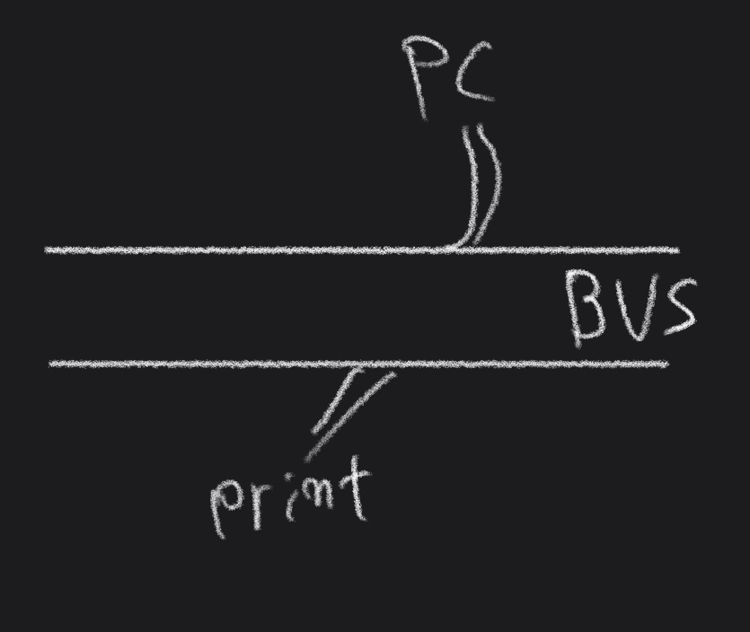

### 토폴로지(Topology)

네트워크에서 컴퓨터의 위치나 컴퓨터 간의 케이블 연결 등과 같은 물리적인 배치를 의미

#### 버스(Bus)

공통배선을 모든 노드가 공유하는 방식으로 근거리통신망(LAN)에서 일반적으로 사용하는 방식
버스 형태에서는 모든 노드들이 프레임을 수신할 수 있기 때문에 DTE 간의 트래픽 흐름제어가 비교적 간단
*DTE(Data Terminal Equipment ) : 통신망에서 네트워크의 끝에 붙은 장비들을 총칭. 일반적으로 컴퓨터를 지칭하지만 프린터, 단말기 등을 통틀어 부른다.
통신 속도도 비교적 빠르고 케이블링에 소요되는 비용 최소화 가능

#####  장점

네트워크 구성이 간단하며 관리가 용이(노드의 추가삭제 용이)

작은 네트워크에 유용

##### 단점

버스 고장 시 네트워크 전체에 피해

네트워크 트래픽이 많을 경우 효울이 떨어짐

브로드캐스팅으로 인한 잦은 인터럽트로 호스트의 성능을 떨어트리고 네트워크 대역폭을 낭비할 수 있다.

#### 링(Ring)

원과 같은 형태로 구성

데이터를 수신한 노드는 자신에게 전달된 데이터만 처리, 그렇지 않은 경우 다음 노드로 중계
수신지를 찾을 때 까지 지속, 만일 다른 호스트가 메시지를 수신하지 못하여 송신자에게 패킷이 다시 돌아온 경우 해당 패킷을 제거

#####  장점

병목 현상이 적다

분산 제어와 검사, 회복 등이 쉽다

##### 단점

네트워크 확장이나 구조의 변경이 어렵다

어떤 노드라도 문제가 발생하면 네트워크 전체가 통신 불능상태( 다중 링 으로 구성하여 보안)

#### 스타(Star)

통신 제어노드가 중앙에 위치하여 모든 제어에대한 권한과 책임을 가지고 있다. 중앙 제어노드는 일반적 컴퓨터이며 자신에게 접속되어 있는 DTE들에 대해 책임을 지고 제어한다. 분산처리는 트리 방식에서

#####  장점

고장의 발견과 대처가 쉽다.

노드 증설, 이전이 쉽다.

##### 단점

병목현상이 발생할 가능성이 있으며 통신 제어노드의 고장에 취약(통신 제어노드에 문제가 발생 네트워크 전체가 통신 불능상태)

#### 트리(Tree)

버스 방식이 변화한 것으로 다수의 허브(스위치)를 이용하여 연결하는 방식

제어와 오류 해결을 각각의 허브에서 수행하며 네트워크를 제어해 비교적 간단.

다른 스위치에 속한 네트워크와 독립적으로 통신할 수 있기 때문에 분산 처리 방식 구현 가능

#####  장점

간편한 제어, 관리 및 확장이 용이

##### 단점

중앙 지점에서 병목현상이 발생할 수 있다

중앙 지점에서 문제가 발생 네트워크 전체가 통신 불능상태

#### 메쉬(Mash)

중앙 제어노드를 통한 중계 대신에 노드 간에 점대점 방식으로 직접 연결하는 방식의 구성형태. 각 노드의 연결 상태에 따라 완전 매쉬와 부분 메쉬로 구분. 특정 통신회선에 장애가 발생하더라도 다른 결로를 통하여 데이터를 전송할 수 있다. 네트워크 백본을 구성하는 방식으로 사용

#####  장점

고장의 발견과 대처가 쉽다.

다른 트래픽에 미치는 영향을 최소화할 수 있다.

##### 단점

선로 구축이 오래걸리며 어렵기 때문에 구축비용이 많이 든다

