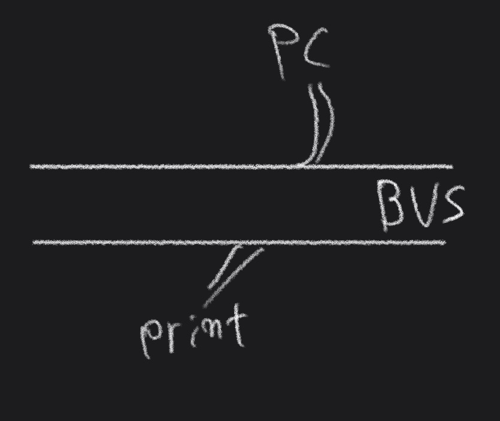
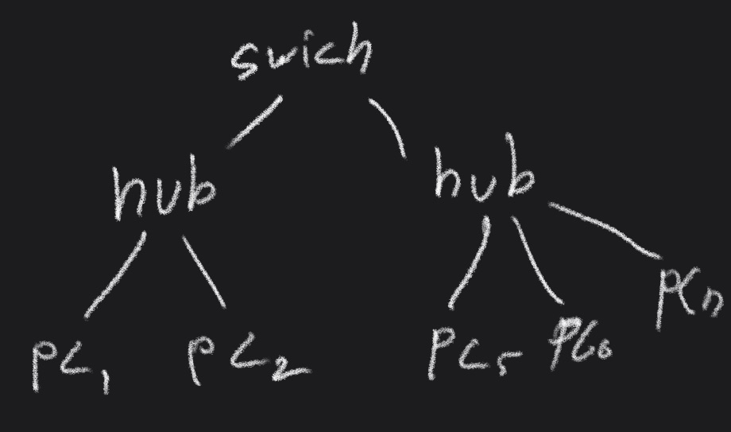

## 데이터 통신 시스템들 간의 회선 열결 방식

### 회선 연결 방식

- point to point 점대점
- multi point 다중점
- switching 교환
	- 회선교환방식
	- 패킷교환방식

### point to point 점대점

중앙 컴퓨터와 여러 개의 터미널이 독립적인 회선을 이용하여 1:1로 연결되는 단순한 방식.

TCP/IP의 Point to Protocol(PPP프로토콜)을 사용하여 두 노드간의 1:1로 연결된 경우가 point to point 에 해당한다.

### multi point 다중점

하나의 장치에 다수개의 장치가 연결하여 정보를 송수신하는 방식

하나의 장치 즉 제어용 컴퓨터, 서버가 되고, 다수개의 장치는 클라이언트가 된다.

다중점 방식은 컴퓨터가 폴링하는 시스템에서만 사용이 가능하다. 연결된 터미널에 블록 형태의 데이터를 전송하여 모든 고유 주소와 터미널 자신의 주소를 비교하여 주소가 일치된 경우에만 데이터를 수신한다. 따라서 다중점 방식에서 터미널은 주소 판단 기능과 데이터를 일시적으로 저장할 수 있는 버퍼를 가지고 있어야한다.

회선을 공유하기 때문에 비용이 줄어들고 버퍼를 갖고 있어야하기 때문에 데이터양이 적을 때 효과적이다. 

### switching 교환

교환망을 통하여 데이터를 송수신하는 빙식

1. 회선교환 방식
	상대방을 호출하여 물리적으로 연결해 사용하며 두 사람 사이에만 이용이 가능하다. (점대점 방식)
	고정적인 대역폭을 사용하며 속도나 코드의 변환이 불가능
	주로 전화 교환기가 취하고 있는 기본적인 방식
2. 패킷교환 방식
	패킷마다 송신지와 수신지의 주소를 넣어 전송하면 패킷 교환기는 해당 주소에 근거하며 최종 목적지까지 패킷을 전달하는 교환 방식
	전송하고자 하는 정보를 패킷이라는 정보 단위로 분할하여 사용
	다수의 패킷들이 공유해 전송효율이 높다.(다중점 방식)
	네트워크가 버퍼 기능을 수행, 다른 통신기기들 간에도 정보전송이 가능
	패킷에 우선순위를 적용할 수 있다.
	1. 데이터그램 방식(Datagram)
		컴퓨터 통신의 기본 단위로 모든 것을 완비한 하나의 독립된 메세지. 패킷마다 주소를 삽입, 이전 패킷의 처리형태와 무관하게 독립적으로 취급. 즉 송신한 순서와 다르게 패킷이 도착할 수도 있다.
		데이터그램은 연결 설정 절차가 필요하지 않아 적은 양의 패킷을 전송할 경우 빨라 효율적이다.
		하지만 패킷 교환기에서 대기 중인 패킷이 손실될경우 송신지나 수신지가 감지하고 복구를 해야한다.
	2. 가상회선 방식(Virtual circuit, 연결형 서비스) 
		정보전송을 위해 두 지점 사이에 논리적인 경로 설정을 하고 송수신자의 네트워크 주소 대싱네 설정된 논리적 전성로의 번호만으로 교환. 이러한 경로 설정 ( 가상회선 ) 회선교환 방식과 유사한 효과를 제공
		패킷은 데이터 정보뿐만 아니라 논리적인 전송경로를 표시하기 위해 가상회선 식별자를 포함
		데이터그램 방식에 비해 많은 양의 데이터를 연속으로 보낼 수 있으며 빠르다.

### 아날로그 및 디지털 전송

#### 직렬 및 병렬 전송

##### 직렬 전송

한번에 한 비트씩 순서대로 데이터를 전송 병렬신호를 직렬신호로 변환하여 전홍하고 수신측에서 직렬신호를 병렬신호로 변환해서 사용 직렬전송의 경우 데이터를 연속해서 보내므로 문자와 문자 또는 비트와 비트 각각을 구별할 수 있는 방법을 필요로 한다.

##### 병렬 전송

여러 개의 비트를 묶어 한 번에 전송 데이터를 전송하기 위한 비트 외에 패리티 또는 제어비트를 전송하기 위해 추가적인 전송로가 필요 병렬 전송의 속도는 걸이가 멀어지면 전송 비용이 커져 컴퓨터 내부나 주변기기의 데이터 전송에 주로 이용

#### 비동기 및 동기 전송

##### 비동기식 전송방식 ( Asynchronous Transmission )

짧은 비트열을 전송하여 송수신 타이밍 문제가 발생하지 않도록 하는 것. 즉, 동기화는 각 전송 비트열의 내부에서만 수행. 각 문자열 내부의 타이밍은 송수신기의 타이머를 이용하며 비트열 전후에 시작비트(ST)와 정지비느(SP)를 추가 전송 (이용효율 20% 저하)

전송할 비트가 없을 때 휴지상태를(1상태) 유지, 전송할 데이터가 있을 경우 시작비트 (0상태)를 전송하여 쇠선에서 1에서 0 상태로 만든다

##### 동기식 전송방식

회선 이용효율을 증가시키기 위해서 문자 또는 비트들의 집합인 데이터 블록 단위로 송수신한다. 아울러 데이터블록의 전후에는 특정한 제어정보를 삽입. 데이터블록의 앞부분에 삽입되는 제어정보 프리앰블(preamble), 뒤에 첨부되는 제어정보 포스트앰블(postamble). 데이터 + 제어정보 = 프레임(frame)

전송효율과 전송속도가 상대적으로 높고, 프레임 형태는 문자 위주인지 또는 비트 위주인지에 따라 구분

- 문자 위주

	- 전송 데이터 블록을 일련의 문자들로 구성 (보통 8비트 문자). 모든 제어정보도 문자 형태로 구성
	- 한 개 이상의 동기화 문자(SYN)를 갖고, 블록의 시작 STX(Start of TeXt), 끝 ETX(End of TeXt)

- 비트 위주

	- 플레그를 사용하여 식별하는 방식, 데이터블록은 일련의 비트들로 구성.  플레그는 데이터블록의 전후에 추가되어 시작과 끝을 표시하는 특별한 패턴 -> |플래그|데이터|플래그|

		

### 토폴로지(Topology)

네트워크에서 컴퓨터의 위치나 컴퓨터 간의 케이블 연결 등과 같은 물리적인 배치를 의미

#### 버스(Bus)

공통배선을 모든 노드가 공유하는 방식으로 근거리통신망(LAN)에서 일반적으로 사용하는 방식
버스 형태에서는 모든 노드들이 프레임을 수신할 수 있기 때문에 DTE 간의 트래픽 흐름제어가 비교적 간단
*DTE(Data Terminal Equipment ) : 통신망에서 네트워크의 끝에 붙은 장비들을 총칭. 일반적으로 컴퓨터를 지칭하지만 프린터, 단말기 등을 통틀어 부른다.
통신 속도도 비교적 빠르고 케이블링에 소요되는 비용 최소화 가능

#####  장점

네트워크 구성이 간단하며 관리가 용이(노드의 추가삭제 용이)

작은 네트워크에 유용

##### 단점

버스 고장 시 네트워크 전체에 피해

네트워크 트래픽이 많을 경우 효울이 떨어짐

브로드캐스팅으로 인한 잦은 인터럽트로 호스트의 성능을 떨어트리고 네트워크 대역폭을 낭비할 수 있다.

#### 링(Ring)

원과 같은 형태로 구성

데이터를 수신한 노드는 자신에게 전달된 데이터만 처리, 그렇지 않은 경우 다음 노드로 중계
수신지를 찾을 때 까지 지속, 만일 다른 호스트가 메시지를 수신하지 못하여 송신자에게 패킷이 다시 돌아온 경우 해당 패킷을 제거

#####  장점

병목 현상이 적다

분산 제어와 검사, 회복 등이 쉽다

##### 단점

네트워크 확장이나 구조의 변경이 어렵다

어떤 노드라도 문제가 발생하면 네트워크 전체가 통신 불능상태( 다중 링 으로 구성하여 보안)

#### 스타(Star)

통신 제어노드가 중앙에 위치하여 모든 제어에대한 권한과 책임을 가지고 있다. 중앙 제어노드는 일반적 컴퓨터이며 자신에게 접속되어 있는 DTE들에 대해 책임을 지고 제어한다. 분산처리는 트리 방식에서

#####  장점

고장의 발견과 대처가 쉽다.

노드 증설, 이전이 쉽다.

##### 단점

병목현상이 발생할 가능성이 있으며 통신 제어노드의 고장에 취약(통신 제어노드에 문제가 발생 네트워크 전체가 통신 불능상태)

#### 트리(Tree)

버스 방식이 변화한 것으로 다수의 허브(스위치)를 이용하여 연결하는 방식

제어와 오류 해결을 각각의 허브에서 수행하며 네트워크를 제어해 비교적 간단.

다른 스위치에 속한 네트워크와 독립적으로 통신할 수 있기 때문에 분산 처리 방식 구현 가능

#####  장점

간편한 제어, 관리 및 확장이 용이

##### 단점

중앙 지점에서 병목현상이 발생할 수 있다

중앙 지점에서 문제가 발생 네트워크 전체가 통신 불능상태

#### 메쉬(Mash)

중앙 제어노드를 통한 중계 대신에 노드 간에 점대점 방식으로 직접 연결하는 방식의 구성형태. 각 노드의 연결 상태에 따라 완전 매쉬와 부분 메쉬로 구분. 특정 통신회선에 장애가 발생하더라도 다른 결로를 통하여 데이터를 전송할 수 있다. 네트워크 백본을 구성하는 방식으로 사용

#####  장점

고장의 발견과 대처가 쉽다.

다른 트래픽에 미치는 영향을 최소화할 수 있다.

##### 단점

선로 구축이 오래걸리며 어렵기 때문에 구축비용이 많이 든다

### 네트워크란

지역적으로 분산된 다수의 기기들을 결합시켜 상호 간의 정보전달을 가능케 하는 전달매체로 노드와 링크의 집합이다. 

### 네트워크 구성요소

#### 하드웨어

- 네트워크 케이블

	- 트위스티드페어, 동축케이블, 광섬유, 무선

- 인터페이스 카드(NIC:Network Interface Card)

	- 이터넷, 토큰링

- 인터네트워킹 장비

	- 허브

		노드들을 연결시켜주는 장비. 노드들은 주로 UTP 케이블을 통해 연결하며 연결된 장치들은 하나의 버스에 접속된 것처럼 동작한다. OSI 계층의 물리계층에서 동작하는 장비이며 리피터와 같이 신호증폭기능도 수행한다.

	- 리피터

		신호를 수신하고 증폭하여, 매체의 다음 구간으로 재전송시키는 장치. 전자기장 확산이나 케이블 특성으로 인한 신호감쇄를 최소화하고 여러 대의 피리터들을 연결하여 신호를 먼 거리 까지 연장하는 것이 가능. OSI 계층에서 물리계층에서 네트워크를 연결하는 장비

	- 브리지

		네트워크를 확장하기 위해 나오는 충돌 도메인을 나누는 장비. OSI 계층에서 데이터링크 계층에서 네트워크를 연결하는 장비

	- 라우터

		OSI 계층에서 네트워크 계층에서 동작하는 장비로 서로 다른 네트워크 간 연결을 위해서 사용하는 장비. 경로를 검사하여 어떤 경로를 경유하는 것이 적절한지를 판단하는 경로결정의 기능을 수행하며 결정후 해당 경로로 데이터를 보낸다. 특히 브리지와 달리 라우터는 네트워크 세그먼트 내부에서 발생하는 브로드캐스트 패킷을 모두 차단하여 브로드캐스트 패킷이 다른 네트워크 세그먼트로 전달되는 것을 방지

	- 게이트웨이

		2개 이상의 다른 종류 또는 같은 종류의 네트워크를 상호접속하여 정보를 주고받을 수 있도록 하는 장비. 라우터와 달리 프로토콜 구조가 다른 네트워크 환경도 동작이 가능하며 여러 계층의 프로토콜 변환기능 때문에 PSTN과 데이터 네트워크처럼 전혀 다른 네트워크의 연동을 가능하게 하지만 졍목현상을 일으키는 지점이 될 수도 있다. OSI 참조모델의 모든 계층에 걸쳐 동작할 수 있다.

#### 소프트웨어

- 네트워크 운영체제(NOS : Network Operating System)

	네트워크를 관리하고 제어하도록 만든 시스템 소프트웨어로서 기존 OS에서 통신망 관리에 관한 기능을 특화하고 보강한 것

	하나 이상의 업체가 만든 H/W 환경에서 동작 가능하며 이종의 H/W LAN이라도 동일한 NOS 하에 연결 가능

	네트워크 보안기능과 사용자의 파일 접근권한을 괸리.다수 서버를 지원 사용자가 접속한 서버의 정류와 무관할 수 있는 투명성있는 환경 제공

### 네트워크 구성 방식

peer to peer, Client server

### 네트워크 분류

근거리 통신망 (LAN)

1개 기업, 1개 빌딩 

도시권통신망(MAN:Metropolitan Area Network)

1개 도시

광역통신망(WAN: Wide Area Nerwork)

지방과 지방, 국가와 국가, 대륙과 대륙

### 인터네트워크(Internetwork)

두 개 이상의 네트워크가 연결된 네트워크들의 네트워크