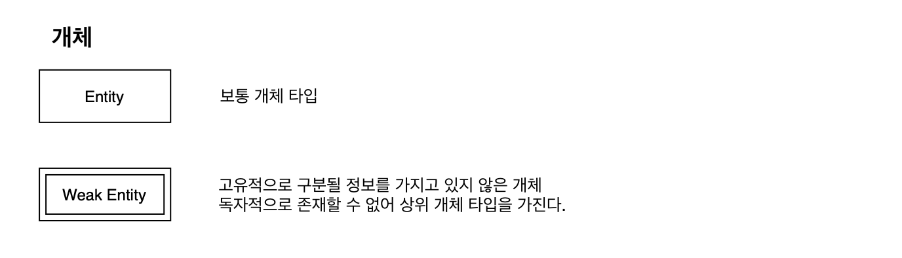
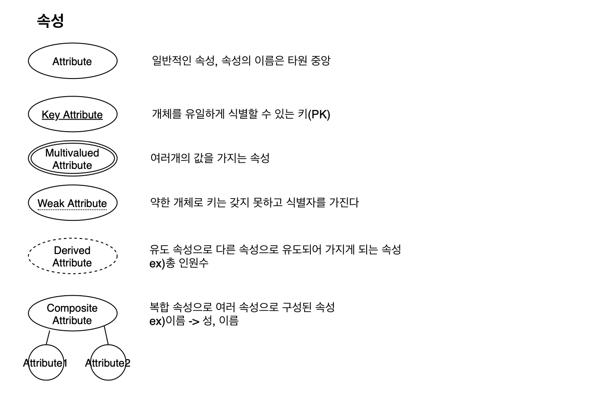
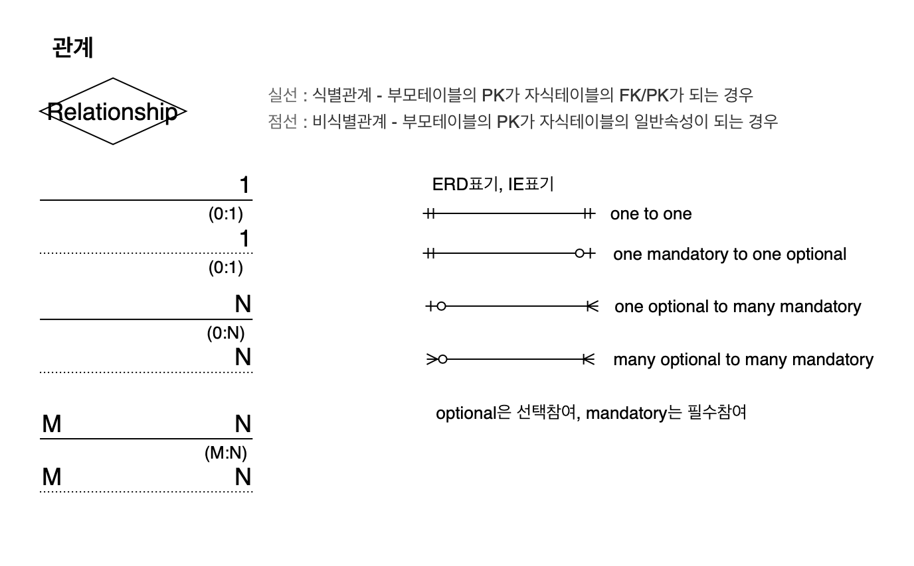
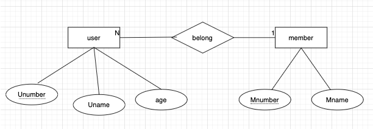
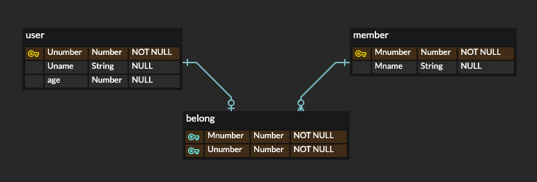
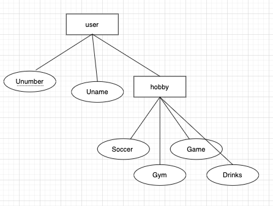

ER 다이어그램

---

데이터 모델링에서 개념적 모델링 단계에서 사용되는 다이어그램으로 개체(Entity)와 속성(Attribute)의 관계를 표현한다.

ER -> ERD(IE)

### ER 모델을 관계 데이터 모델로

#### 개체 타입

약한 개체 타입에 강한 개체 타입의 기본키를 외래키로

#### 관계 타입

- 1:1관계
	-  개체가 가진 유형에 따라 다른 개체의 기본키를 외래키로
- 1:N관계
	- N위치 개체에 1위치 개체의 기본키를 외래키로
- N:M관계
	- 별도의 릴레이션으로 생성해 N위치 개체, M위치 개체의 각각의 기본키를 외래키로
- 모델의 차수가 3개 이상인 관계
	- 별도의 릴레이션으로 생성해 각각의 기본키를 외래키로 가져와 복합키로 사용

#### 다중값 속성

user 의 hobby 처럼 여러개의 속성을 가지면 그 속성을 따로 독립적인 릴레이션을 만들어 저장

