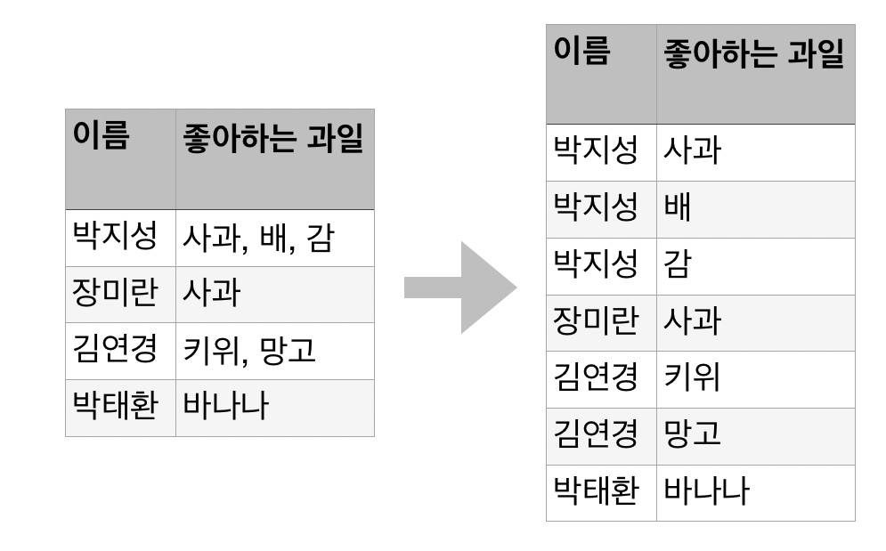
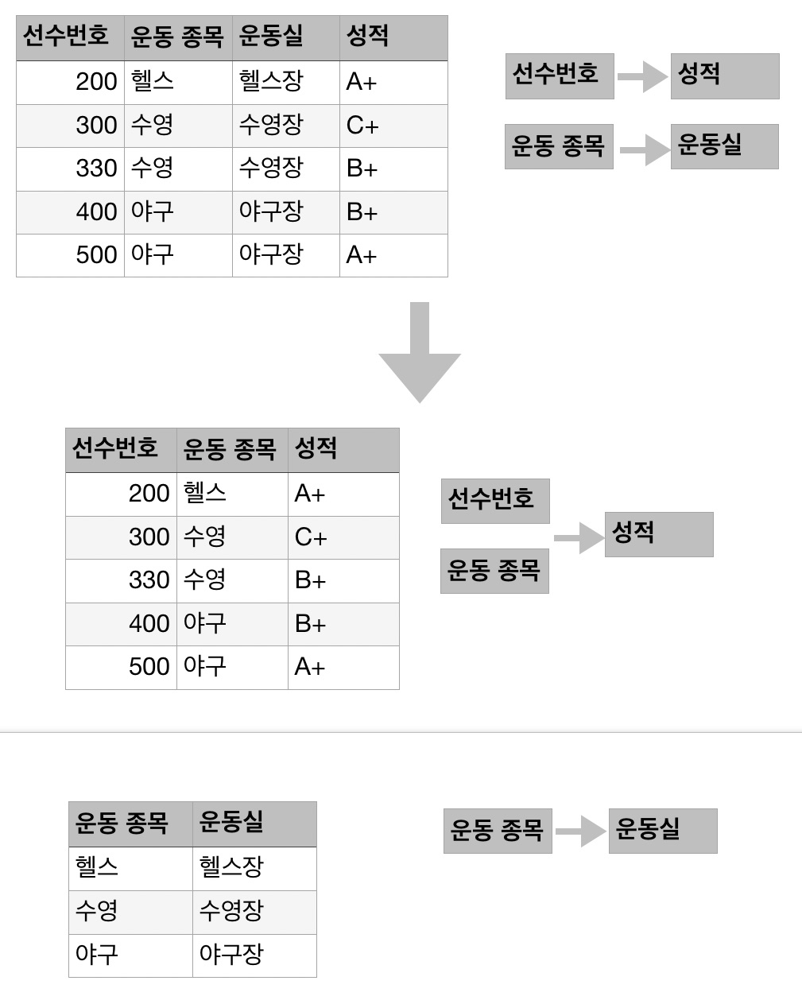
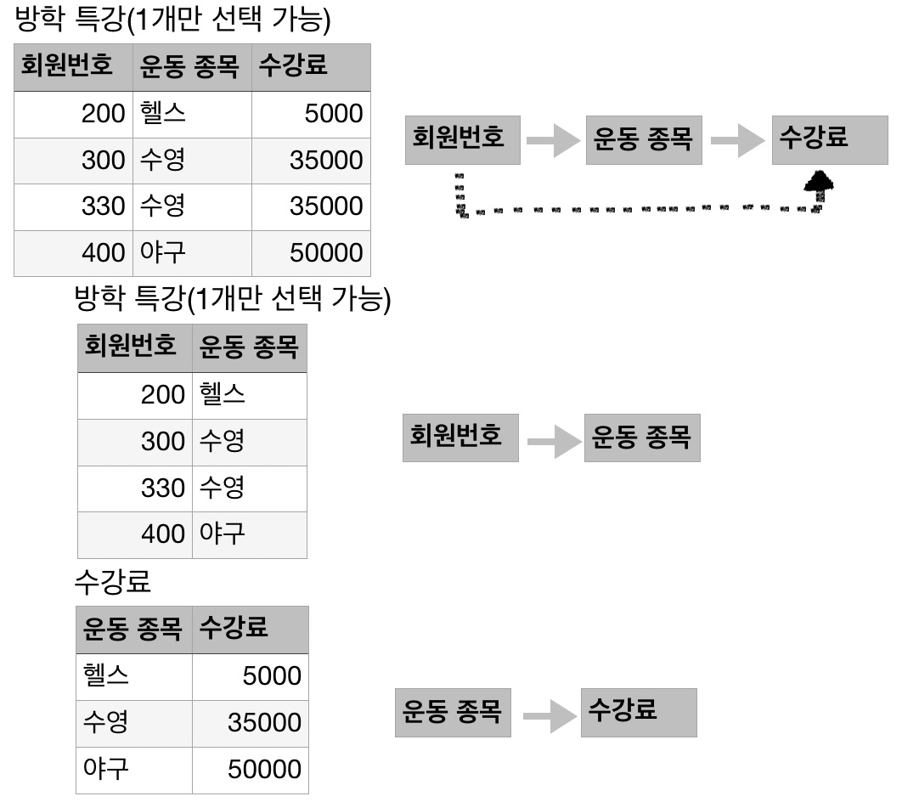
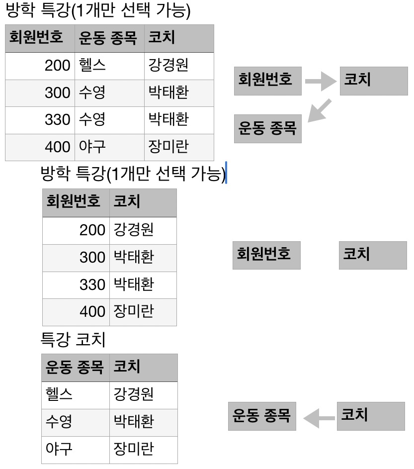

정규화(normalization)

---

## 정규화

이상현상이 발생하는 테이블을 수정하여 이상현상을 최소화로 만드는 과정

정규화를 하기 위해 테이블의 기본키와 함수 종속성을 파악해야 한다.

## 이상현상의 개념

잘못 설계된 테이블로 삽입, 삭제, 수정 같은 데이터 조작을 하면 이상현상이 일어난다. 테이블을 독립적으로 나누지 않고 하나의 큰 테이블로 작성시 일어나는 이상현상이다.

#### 삭제이상(Delectoin anomaly)

투플 삭제 시 같이 저장된 다른 정보가지 연쇄적으로 삭제되는 현상 -> 연쇄삭제 문제발생

#### 삽입이상(insertion anomaly)

투플 사입 시 특정 속성에 해당하는 값이 없어 NULL 값을 입력해야 하는 션상 -> NULL 값 문제 발생

#### 수정이상(update anomaly)

투플 수정시 중복으로 저장된 뎅터 일부만 수정되어 데이터의 불일치 문제가 일어나는 현상 -> 불일치 문제 발생

## 정규화(normalization) 개념

이상현상의 원인은 여러 가지가 있는데, 대부분 두 가지 이상의 정보가 한 릴레이션에 저장되어 있어 발생된다. 이상현상을 제거하기 위해 릴레이션을 분해한다. 분해된 릴레이션에 이상현상이 남아있다면 이상현상이 없어질 때까지 분해해 이상현상을 제거한다. 이러한 과정을 정규화라 한다.

## 정규화 과정

이상현상이 있는 릴레이션은 이상현상을 일으키는 함수 종속성의 유현에 따라 등급을 구분할 수 있다. 릴레이션은 정규형이라는 개념으로 구분하며 정규형이 높을수록 이상현상은 줄어든다.

### 제1정규형

릴레이션의 모든 속성값이 원자값이어야 한다는 조건

- 과정 및 예

	

박지성 {사과, 배, 감} -> {사과}, {배}, {감}

### '제2정규형

릴레이션이 제1정규형이고 기본키가 아닌 속성이 기본키에 완전 함수 종속일 때

즉, 릴레이션의 기본키가 복합키일 때, 복합키의 일부분이 다른 속성의 기본키인지 아닌지를 판단하는 것

- 과정 및 예

- 이상현상
	- 삭제이상
		- 200번 선수를 특강 취소하면 헬스에 대한 운동실이 사라진다.
	- 삽입이상
		- 새로운 운동 양궁이 개설되어 양궁,양궁장을 삽입하였으나, 사용하는 선수가 없어 순수번호와 성적에 NULL값이 들어간다.
	- 수정이상
		- 운동실의 정보를 변경할 경우 데이터 불일치가 발생할 가능성이 있다.

### 제3정규형

릴레이션이 제 2규형이고 기본키가 아닌 속성이 기본키에 비이행적으로 종속할 때 제3정규형이라고 하며, 이행적 종속이란 A->B,B->C 가 성립할 때 A->C가 성립되는 함수 종속성을 뜻함

- 과정 및 예

- 이상현상

	- 삭제이상
		- 200번 선수를 특강 취소하면 헬스에 대한 수강료가 사라진다.

	- 삽입이상
		- 새로운 특강이 개설되어 운동 종목과 수강료를 삽입하였으나, 사용하는 회원이 없어 회원번호에 NULL값이 들어간다.

	- 수정이상

		- 수강료의 정보를 변경할 경우 데이터 불일치가 발생할 가능성이 있다.

		

### BCNF

릴레이션에서 함수 종속성 X->Y가 성립할 때 모든 결정자 X가 후보키인 경우

- 과정 및 예 (코치는 하나의 운동종목을 개설 가능하다고 가정)

코치만 하나의 운동종목을 개설 가능하기 때문에 코치만 특강 코치 릴레이션의 기본키가 된다. 

- 이상현상

	- 삭제이상
		- 200번 선수를 특강을 취소하면 코치에 대한 정보가 사라진다.

	- 삽입이상
		- 새로운 특강이 개설되어 운동 종목과 수강료를 삽입하였으나, 사용하는 회원이 없어 회원번호에 NULL값이 들어간다.

	- 수정이상
		- 강경원 코치의 운동 종목의 정보를 변경할 경우 데이터 불일치가 발생할 가능성이 있다.
