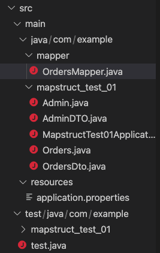
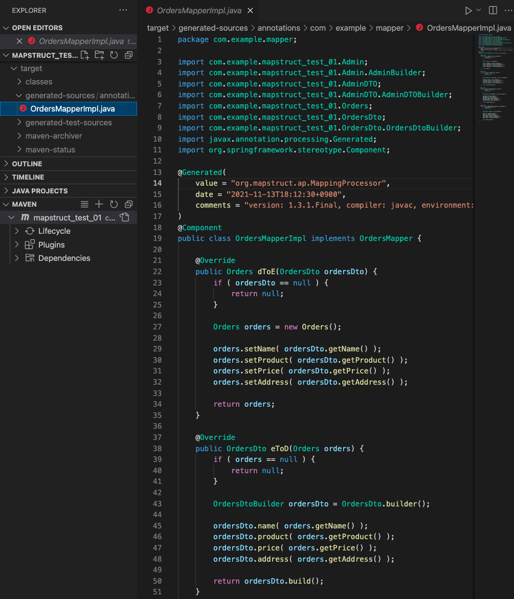

### 의존성 설정

pom.xml

``` xml
<?xml version="1.0" encoding="UTF-8"?>
<project xmlns="http://maven.apache.org/POM/4.0.0" xmlns:xsi="http://www.w3.org/2001/XMLSchema-instance"
	xsi:schemaLocation="http://maven.apache.org/POM/4.0.0 https://maven.apache.org/xsd/maven-4.0.0.xsd">
	<modelVersion>4.0.0</modelVersion>
	<parent>
		<groupId>org.springframework.boot</groupId>
		<artifactId>spring-boot-starter-parent</artifactId>
		<version>2.5.6</version>
		<relativePath/> <!-- lookup parent from repository -->
	</parent>
	<groupId>com.example</groupId>
	<artifactId>mapstruct_test_01</artifactId>
	<version>0.0.1-SNAPSHOT</version>
	<name>mapstruct_test_01</name>
	<description>Demo project for Spring Boot</description>
	<properties>
		<java.version>11</java.version>
		<org.mapstruct.version>1.3.1.Final</org.mapstruct.version>
		<org.projectlombok.version>1.18.12</org.projectlombok.version>
	</properties>
	
	  <dependencies>
		<dependency>
		  <groupId>org.springframework.boot</groupId>
		  <artifactId>spring-boot-starter-data-jpa</artifactId>
		</dependency>
		<dependency>
		  <groupId>org.springframework.boot</groupId>
		  <artifactId>spring-boot-starter-web</artifactId>
		</dependency>
	
		<dependency>
		  <groupId>org.springframework.boot</groupId>
		  <artifactId>spring-boot-devtools</artifactId>
		  <scope>runtime</scope>
		  <optional>true</optional>
		</dependency>
	
		<dependency>
		  <groupId>org.mapstruct</groupId>
		  <artifactId>mapstruct</artifactId>
		  <version>${org.mapstruct.version}</version>
		</dependency>
	
		<dependency>
		  <groupId>com.h2database</groupId>
		  <artifactId>h2</artifactId>
		  <scope>runtime</scope>
		</dependency>
		<dependency>
		  <groupId>org.projectlombok</groupId>
		  <artifactId>lombok</artifactId>
		  <version>${org.projectlombok.version}</version>
		</dependency>
		<dependency>
		  <groupId>org.springframework.boot</groupId>
		  <artifactId>spring-boot-starter-test</artifactId>
		  <scope>test</scope>
		  <exclusions>
			<!-- test 를  위한 junit-->
			<exclusion>
			  <groupId>org.junit.vintage</groupId>
			  <artifactId>junit-vintage-engine</artifactId>
			</exclusion>
		  </exclusions>
		</dependency>
	  </dependencies>
	
	  <build>
		<plugins>
		  <plugin>
			<groupId>org.springframework.boot</groupId>
			<artifactId>spring-boot-maven-plugin</artifactId>
		  </plugin>
		  <plugin>
			<groupId>org.apache.maven.plugins</groupId>
			<artifactId>maven-compiler-plugin</artifactId>
			<version>3.5.1</version>
			<configuration>
			  <!-- java 버전을 따름-->
			  <source>11</source>
			  <target>11</target>
			  <annotationProcessorPaths>
				<!-- mapstruct 를 호출시 lombok 과 충돌 발생. 그래서 mapstruct와  lombok 에 대한 path 추가(mapstruct가 항상 lombok보다 우선 -->
				<path>
				  <groupId>org.mapstruct</groupId>
				  <artifactId>mapstruct-processor</artifactId>
				  <version>${org.mapstruct.version}</version>
				</path>
				<path>
				  <groupId>org.projectlombok</groupId>
				  <artifactId>lombok</artifactId>
				  <version>${org.projectlombok.version}</version>
				</path>
			  </annotationProcessorPaths>
			  <compilerArgs>
				<!-- 아래와 같이 의존성을 추가하면 매번 mapper에 @Mapper(componentModel = "spring")를 지정하지 안아도 된다. -->
				<compilerArg>
					-Amapstruct.defaultComponentModel=spring
				</compilerArg>
			  </compilerArgs>
			</configuration>
		  </plugin>
		</plugins>
	  </build>
	
	</project>
```

의존선 선언 부분은 21-11-13 충돌 확인.


### 파일 구조




### Orders Entity

``` java
package com.example.mapstruct_test_01;

import javax.persistence.Entity;
import javax.persistence.GeneratedValue;
import javax.persistence.GenerationType;
import javax.persistence.Id;

// import lombok.Builder;
import lombok.Data;

@Data
// @Builder
@Entity
public class Orders {
    @Id
    @GeneratedValue(strategy =GenerationType.IDENTITY)
    private Integer name;

    private String product;

    private Integer price;

    private String address;
}
```

### Orders DTO

``` java
package com.example.mapstruct_test_01;


import lombok.Builder;
import lombok.Data;

@Data
@Builder
public class OrdersDto {

    private Integer name;

    private String product;

    private Integer price;

    private String address;
}
```

### Mapper

```java
package com.example.mapper;

import com.example.mapstruct_test_01.Admin;
import com.example.mapstruct_test_01.AdminDTO;
import com.example.mapstruct_test_01.Orders;
import com.example.mapstruct_test_01.OrdersDto;

import org.mapstruct.Mapper;
import org.mapstruct.factory.Mappers;

@Mapper // 1
public interface OrdersMapper{
    OrdersMapper INSTANCE = Mappers.getMapper(OrdersMapper.class); // 2
    
    Orders dToE(OrdersDto ordersDto); 
    OrdersDto eToD(Orders orders);

    AdminDTO adminToDto(Admin admin);
    Admin adminDTOToEntity(AdminDTO adminDto);
}
```

### maven clean -> install : mapperImpl 생성



### Test

```java
package com.example;

import static org.junit.jupiter.api.Assertions.assertEquals;
import static org.junit.jupiter.api.Assertions.assertNotNull;

import com.example.mapper.OrdersMapper;
import com.example.mapstruct_test_01.Orders;
import com.example.mapstruct_test_01.OrdersDto;

import org.junit.jupiter.api.BeforeEach;
import org.junit.jupiter.api.Test;

public class test {
    @BeforeEach
    public void setup() {

    }
  
    @Test
    public void eToD(){
        Orders orders = new Orders();
        orders.setName(1);
        orders.setAddress("address");
        orders.setPrice(2000);
        orders.setProduct("product");

        OrdersDto ordersDto = OrdersMapper.INSTANCE.eToD(orders);

        assertEquals(1, ordersDto.getName());
        assertEquals("address", orders.getAddress());
        assertEquals(2000, orders.getPrice());
        assertEquals("product", orders.getProduct());
        System.out.println("Entity to Dto all pass");
    }
    @Test
    void DtoE() {
        /*given*/
        final OrdersDto ordersDto = OrdersDto.builder()
                .name(1)
                .product("product")
                .price(1000)
                .address("address")
                .build();
        /* when */
        final Orders orders = OrdersMapper.INSTANCE.dToE(ordersDto);
        /*then */
        assertNotNull(orders);
        assertEquals(1, ordersDto.getName());
        assertEquals("address", orders.getAddress());
        assertEquals(1000, ordersDto.getPrice());
        assertEquals("product", ordersDto.getProduct());
        System.out.println("Dto to Entity all pass");
    }
}
```


