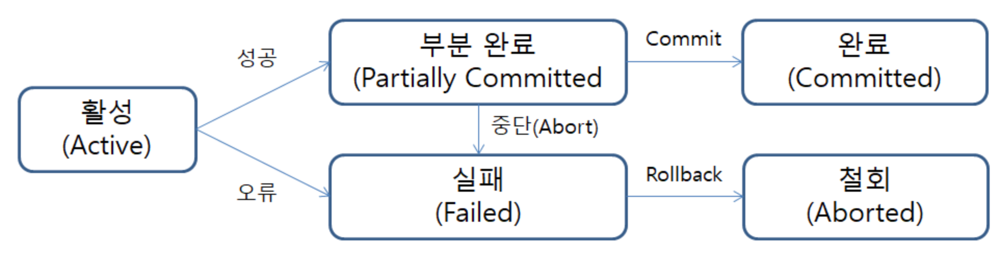
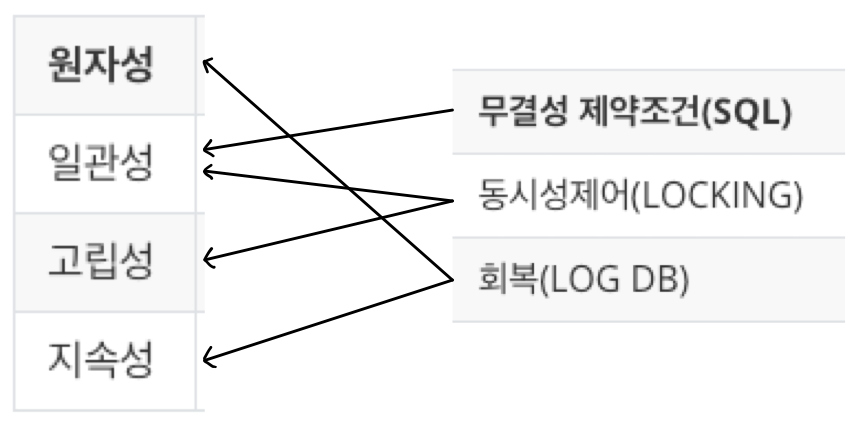

## 트랜잭션

### 트랜잭션

DBMS에서 데이터를 다루는 논리적인 작업의 단위(데이터를 읽거나 쓰는 프로세스)

Reference : https://itwiki.kr/w/%ED%8A%B8%EB%9E%9C%EC%9E%AD%EC%85%98

### 트랜잭션 특징 ( ACID 성질)

트랜잭션은 데이터베이스의 무결성을 유지하기 위해 원자성, 일관성, 고립성, 지속성을 갖는다.

- Atomicity 원자성

	- all or nothing 트랜잭션에 포함된 작업은 전부 수행되거나 아니면 전부 수행되지 않아야 한다.

	- 트랜잭션이 원자처럼 더는 쪼개지지 않는 하나의 단위처럼 동작해야 한다.

- Cinsistency 일관성
	- 트랜잭션을 수행하기 전이나 수행한 후나 데이터베이스는 항상 일관된 상채를 유지해야 한다.

- Isolation 고립성

	- 수행 중인 트랜잭션에 다른 트랜잭션이 끼어들어 변경중인 데이터 값을 훼손하는 일이 없어야 한다.

	- 다른 트랜잭션의 방해를 받지 않고 독립적으로 수행

- Durability 지속성
	- 수행을 성공적으로 완료한 트랜잭션은 변경한 데이터를 영구 저장해야 한다.
	- 저장 후 어느 때나 발생할 수 있는 정전, 장애, 오류에 영향을 받지 않아야 한다.
	- DBMA  복구 시스템은 트랜잭션이 작업한 내용을 수시로 log 데이터베이스에 기록, 문제 발생시 log file을 이용하여 복구

### 데이터베이스에서 트랜잭션의 단위란

데이터베이스에서 데이터를 다룰 때 장애가 일어나는 경우 트랜잭션은 데이터를 복구하는 작업의 단위

데이터베이스에서 여러 작업이 동시에 같은 데이터를 다룰 때 트랜잭션은 이 작업을 서로 분리하는 단위

### 트랜잭션 수행 과정

| 시작 | ->   | ->수행 | ->   | 부분완료 | ->   | 버퍼내용기록 | ->   | 완료 |
| ---- | ---- | ------ | ---- | -------- | ---- | ------------ | ---- | ---- |

부분 완료 후 버퍼내용을 기록하는 이유는 데이터베이스에 기록하는 과정이 시간이 많이 소요되고, 다른 트랜잭션이 같은 테이블을 필요로 할 수 있기 때문이다. 또한 DBMS가 동시에 많은 트랙잭션을 수행할 때, 각각의 트랜잭션이 하드디스크에 개별 접근하는 것을 피하고 DBMS가 일괄적으로 하드디스크에 접근하여 처리함으로 사용자에게 빠른 응답성을 보장하기 위함이다.

### 트랜잭션 성질

트랜잭션은 일반 프로그램과 달리 데이터베이스에 저장된 데이터를 다루며 DBMS에 의해 처리

### 트랜잭션과 프로그램의 차이

| 트랜잭션 |      | 프로그램 |
| -------- | ---- | -------- |
| DBMS     |      |          |
| Database |      | file     |

### 트랜잭션 제어 명령어 오라클 기준

| 문법                        | 설명                   | 표준 명령어       |
| --------------------------- | ---------------------- | ----------------- |
| SET TRANSACTION NAME <name> | 트랜잭션의 시작        | START TRANSACTION |
| COMMIT                      | 트랜잭션의 종료        | COMMIT            |
| ROLLBACK {TO <savepoint>}   | <savepoint>까지 무효화 | ROLLBACK          |
| SAVEPOINT<savepoint>        | <savepoint>를 만듦     | SAVE              |

### 트랜잭션과 DBMS의 기능 관계

### 동시성 제어

두 개 이상의 트랜잭션이 동시에 수행될 때 일관성을 해치지 않도록 트랜잭션의 데이터 접근을 제어하는 DBMS의 기능

| T1   | T2   | 발생 문제                                   | 동시 접근           |
| ---- | ---- | ------------------------------------------- | ------------------- |
| 읽기 | 읽기 | 없음(읽기만 하면 아무 문제 없다)            | 허용                |
| 쓰기 | 쓰기 | 갱신손실                                    | 허용불가(LOCK 이용) |
| 읽기 | 쓰기 | 오손 읽기, 반복불가능 읽기, 유령데이터 읽기 | 허용/불가 중 선택   |

### 갱신손실 문제 ( 절대 허용 X )

| T1   | T2   | 발생 문제 | 동시 접근           |
| ---- | ---- | --------- | ------------------- |
| 쓰기 | 쓰기 | 갱신손실  | 허용불가(LOCK 이용) |

두 개의 트랜잭션이 한 개의 데이터를 동시에 갱신할 때 발생

트랜잭션 T1, 트랜잭션 T2 가 동시에 한 개의 데이터를 동시에 갱신할 때, T2가 T1이 갱신 준비중인 값을 가져와 갱신했을때 갱신이 동시에 발생하는 문제

### 갱신손실 해결

#### 락

자신이 데이터를 수정중이라는 사실을 알리는 방법으로 데이터를 사용하는 동안 잠금장치를 걸어두는 기능

락은 두 가지 유형을 가지고 있다.

- shared lock LS 공유락
	- 읽기를 할 때 사용하는 락
- exclusive lock LX 배타락
	- 읽고 쓰기를 할 때 사용하는 락

일기만 하면 LS 요청, 읽거나 쓰기를 하면 LX 요청

|        | LS상태 | LX상태 |
| ------ | ------ | ------ |
| LS요청 | 허용   | 대기   |
| LX요청 | 대기   | 대기   |

#### 2단계 락킹 - 2 phase locking

확장단계 - 필요한 락을 획득하는 단계, 이미 획득한 락을 해제하지 않는다. 

수축단계 - 락을 해제하는 단계로, 새로운 락을 획득하지 않는다.

ex) 트랜잭션이 데이터를 A,B를 둘 다 사용할 경우 LX(A) 의 락을 미리 해제하면 안 된다.

| T1                                   | T2                  |
| ------------------------------------ | ------------------- |
| LX(A) ...                       |                     |
|                                      | LX(A) 대기상태 |
| LX(B) ... UN(A) UN(B) |                     |
|                                      | LX(A) ...      |

#### 데드락

2단계 락킹 기법을 사용할 때 두 개 이상의 트랜잭션이 각각 자신의 데이터에 대하여 락을 획득하고 상대방 데이터에 대하여 락을 요청하면 무한 대기에 빠진 생태

##### 데드락 해결

DMBS가 T1 혹은 T2의 작업 중 하나를 강제로 중지. 중지시킨 트랜잭션이 변경한 값은 원래 상태로 바꾸어 놓는다.

### 트랜잭션 동시 실행 문제

| T1   | T2   | 발생 문제                                   | 동시 접근         |
| ---- | ---- | ------------------------------------------- | ----------------- |
| 읽기 | 쓰기 | 오손 읽기, 반복불가능 읽기, 유령데이터 읽기 | 허용/불가 중 선택 |

T1에서 읽기만 하므로 갱신손실 같은 심각한 문제는 발생하지 않는다. 그러나 오손 읽기, 반복불가능 읽기, 유령데이터 읽기 문제 등이 발생할 수 있다.

#### 오손 읽기

T2가 작업하는 중간 데이터를 T1이 읽기 때문에 생기는 문제로, T2가 작업을 철회 할 경우 T1는 무효가 된 데이터를 읽게 되는 잘못된 결과를 도출

##### 오손 읽기 해결

COMMIT 을 하지 않은 데이터는 다른 드랜잭션이 읽지 못하도록 한다.

#### 반복불가능 읽기

T1이 데이터를 읽고 작업한는 중 T2가 데이터를 갱신, T1은 변경한 데이터를 다시 읽을 때 값이 다른 현상. 같은 SQL문에 다른 결과 도출

#### 유령데이터 읽기

T1이 데이터를 읽고 T2가 데이터를 INSERT, T1이 다시 한 번 데이터를 읽을 때 생기는 문제. T1이 읽기 작업을 다시 한 번 반복할 경우 이전에 없던 데이터가 나타나는 현상. 같은 SQL문에 다른 결과 도출

### 트랜잭션 고립 수준 명령어

DBMS에서 락보다 완화된 방법으로 문제를 해결하는 명령어를 제공한다.

명령어를 사용하면 사용자가 어느 정도 선택하여 트랜잭션을 제어할 수 있다.

| 고립수준         | 오손 읽기 | 반복불가능 읽기 | 유령데이터 읽기 | Level |
| ---------------- | --------- | --------------- | --------------- | ----- |
| READ UNCOMMITTED | 가능      | 가능            | 가능            | 0     |
| READ COMMITTED   | 불가능    | 가능            | 가능            | 1     |
| REPEATABLE READ  | 불가능    | 불가능          | 가능            | 2     |
| SERIALIZABLE     | 불가능    | 불가능          | 불가능          | 3     |

#### READ UNCOMMITTED

- **LOCK**

	- SELECT - 공유락LS 걸지 않음

	- UPDATE - 배타락LX 설정

	- 다른 트랜잭션의 공유락과 베타락이 걸린 데이터를 읽음

- **SQL**

	- SET TRACSACTION ISOLATION LEVEL READ UNCOMMITTED

- **문제점**

	- 오손 읽기, 반복불가능 읽기, 유령데이터 읽기

#### READ COMMITTED

- **LOCK**

	- SELECT - 공유락LS 걸고 끝나면 바로 해지

	- UPDATE - 배타락LX 설정

	- 다른 트랜잭션이 설정한 공유락은 읽지만 베타락은 읽지 못함

- **SQL**

	- SET TRACSACTION ISOLATION LEVEL READ COMMITTED

- **문제점**

	- 반복불가능 읽기, 유령데이터 읽기

#### REPEATABLE READ

- **LOCK**

	- SELECT - 공유락LS 걸고 트랜잭션 끝까지 유지

	- UPDATE - 배타락LX 설정

	- 다른 트랜잭션이 설정한 공유락은 읽지만 베타락은 읽지 못함

- **SQL**

	- SET TRACSACTION ISOLATION LEVEL REPEATABLE READ

- **문제점**

	- 유령데이터 읽기

#### SERIALIZABLE

- **LOCK**

	- SELECT - 공유락LS 걸고 트랜잭션 끝까지 유지

	- UPDATE - 배타락LX 설정

	- 다른 트랜잭션이 설정한 공유락은 읽지만 배타락은 읽지 못함
	- 인덱스에 공유락을 설정하여 다른 트랜잭션의 INSERT 문 금지

- **SQL**

	- SET TRACSACTION ISOLATION LEVEL SERIALIZABLE

- **문제점**

	- 없음

### 회복

데이터베이스에 장애가 발생했을 때 데이터베이스를 일관성 있는 상태로 되돌리는 DBMS기능 으로 장애 발생시 DBMS의 회복 관리자는 트랜잭션의 ACID 성질 중 원자성과 지속성을 보장하여 장애로부터 데이터베이스를 보호한다.

원자성 - 변경 내용을 모두 반영 아니면 아예 반영하지 않는 방법과

지속성 - COMMIT하면 로그를 이용해 반드시 데이터베이스에 기록

트랜잭션은 데이터의 변경 내용을 한순간에 기록하지 않는다. 일단 변경한 내용(버퍼)을 로그(임시 디스크)에 기록 후 데이터베이스에 반영

- 시스템 충돌
	- H/W or S/W 오류로 주기억장치가 손실되는 것
- 미디어 장애
	- 헤드 충돌이나 읽기 장애로 보조기억장치가 손실되는 것
- 응용 소프트웨어 오류
	- 데이터베이스에 접근하는 S/W 논리적인 오류로 트랜잭션 수행 실패하는 것
- 자연재해
	- 화재, 홍수, 지진, 정전 등에 의한 컴퓨터 시스템 손상되는 것
- 부주의 혹은 태업
	- 운영자나 사용자의 부주의로 데이터 손실 혹은 의도적인 손상을 입는 것

### 로그파일

ACID 에서 지속성에서 사용되는 로그를 뜻하며, 트랜잭션이 반영한 모든 데이터의 변경사항을 데이터베이스에 기록하기 전에 미리 기록하는 별도의 데이터. 하드디스크에 저장된다. <트랜잭션번호, 로그 타입, 데이터 항목 이름, 수정 전 값, 수정 후 값> 형식으로 저장

### 로그 파일을 이용한 회복

#### REDO

시작과 종료가 있는 경우. (COMMIT 연산이 완료) 다만 변경 내용이 버퍼에서 데이터베이스에 기록되지 않았을 경우, 로그를 보면서 트랜잭션이 변경한 내용을 데이터베이스에 다시 기록하는 과정

#### UNDO

시작만 있고 종료가 없는 경우 (COMMIT 연산 X) 트랜잭션이 완료되지 않았기 때문에 트랜잭션이 한 일을 모두 취소
즉 버퍼에 변경 내용이 데이터베이스에 기록되어 있을 가능성이 있으므로 로그를 보면서 원상복구 시키는 과정

### 로그 파일 기록 방법

#### 즉시갱신

버퍼 -> 로그파일, 버퍼 -> 데이터베이스 작업이 부분완료 전에 동시에 진행될 수 있으며, 버퍼의 일부 내용이 실제 데이터베이스에 반영 될 수 있는 상태

- 시스템 운영 시 데이터베이스에 입출력 연산이 증가하는 단점

#### 지연갱신

버퍼 -> 로그파일 이 모두 끝난 후 부분완료를 하고 이후 버퍼 -> 데이터베이스 작업을 진행하는 방법. 부분완료 전에는 실제 데이터베이스에 반영이 되지 않는 상태

- 로그에 시작만 기록된 작업은 UNDO 작업을 할 필요가 없는 장점

- 시스템 복구 시 복구시간이 좀 더 걸리는 단점

### 체크포인트

로그를 이용한 회복은 시스템에 장애가 일어났을 때 어느 시점까지 되돌아가는지 기록하는 포인트로 트랜잭션 로그 파일을 동기화한 후 동기화한 시점을 로그 파일에 기록해 두는 방법 혹은 그 시점

회복 시 많은 양의 로그를 검색하고 갱신하는 시간을 줄이기 위하여 몇십 분 단위로 기록하며 트랜잭션이 많은 응용의 경우 하루 이상 되돌아가서 복구하는 것은 사실상 불가능하다.

#### 체크포인트가 하는 일

- 주기억장치의 로그 레코드를 모두 하드디스크의 로그 파일에 저장
- 버퍼에 있는 내용을 하드디스크의 데이터베이스에 저장(즉시 갱신)
- 체크포인트를 로그 파일에 표시

#### 체크포인트 있는 로그를 이용한 회복 방법

- 체크포인트 이전에 COMMIT 기록이 있는 트랜잭션의 경우
	- 아무 작업이 필요 없다. 
- 체크포인트 이후에 COMMIT 기록이 있는 트랜잭션의 경우
	- 체크포인트 이후에 변경된 내용이 데이터베이스에 방영되지 않았을 가능성이 있으므로 REDO를 진행한다.(즉시갱신, 지연갱신)
- 체크포인트 이후에 COMMIT 기록이 없는 트랜잭션의 경우
	- 즉시갱신 - 버퍼의 내용이 반영됐을 수 있기 때문에 원상복구 UNDO를 시켜야 한다. 
	- 지연갱신 - 아무것도 할 필요가 없다. COMMIT 이전의 버퍼 내용 반영하지 않았기 때문