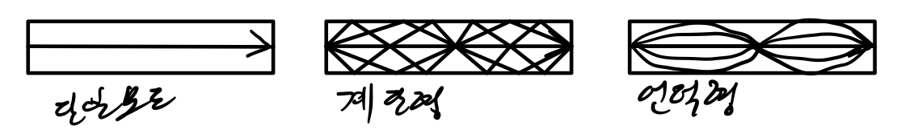

### 전송매체

전기신호의 전송을 위한 전송회선. 실제로 전송하는 물리적인 통로

물리적 도체 기반인 전자기적 또는 관학적 신호를 전송하는 유선매체와 특별한 도채 없이도 전자기적 신호를 송수신하는 무선매체로 나뉜다.

### 유선매체

장비 간 연결 통로를 제공하는 선 현태의 전송수단

물리적 특성에 따라 트위스티드 페어 케이블, 동축 케이블, 광케이블로 구분된다

#### 트위스티드 페어 케이블

**구조**

두개 이상의 구리 도선이 꼬아진 모양, 접지선과 신호선을 구분하기 위해 특정 색깔의 플래스틱으로 절연하고 있다.

**전송 특성**

서로 근접해 있는 두 가닥의 도선에 전기가 통할 경유 전자기적 간섭이 잘생한다. 두 도선을 평행상태로 위치하면 한 선에 흐르는 신호는 다른 선에 간섭을 일으키게 된다. 하지만 두 선이 직각으로 위치하게 되면 두 선이 서로 간섭에 대한 영향을 거의 받지 않게 된다. 이런 이유로 두 선을 가능한 직교 상태로 위치시키기 위해 두 가닥씩 꼬게 된 것(한 선에서 방출된 파장과 서로 엇갈리게 되어 파장을 상쇄), 또한 각 쌍은 1인치당 꼬인 횟수가 서로 다르도록 구성되 전자기적 간섭을 최소화 한다.

**종류**

외부 전계, 자계로부를 차단하기 위한 얇은 금속 박막으로 둘러싸있는 유무에 따라 STP(Shielded TP), UTP(Unshieded TP)

- STP는 초기 LAN선 UTP는 최근 LAN선

내부 케이블을 은박이 감싸고 있는 FTP(Foiled TP) 

#### 동축 케이블

동축 케이블은 디지털 신호와 아날로그 신호를 모두 전송할 수 있으며 트위스티드 페어 케이블보다 높은 전송용량을 갖는다.

**구조**

중앙의 도선을 절연체가 감싸고 있으며 외부의 전류로부터 보호하기 위하여 싸고 있는 외부구리망 위에 최종적으로 절연체가 덮고 있는 구조를 이룬다. 중앙 내부 도선을 외부 구리망이 감싸고 있기 때문에 외부의 건기적 간섭을 적게 받고, 전력손실이 적으며 넓은 대역폭과 빠른 전송 특성으로 인해 고속 통신선로로 많이 이용된다. 위와같은 특성을 가지고 있어 바다 밑이나 땅속에 묻어도 그 성능에 큰 지장이 없다.

**특성**

전력손실과 외부와의 차폐성이 좋아 간섭 현상이 적다

트위스티드 페어보다 뛰어난 주파수 특성으로 인해 높은 주파수에서 빠른 데이터 전송 가능

BNC커넥터 사용

수백 Mbps의 고속 전송 가능 

#### 광케이블

광섬유(매우 얇은 유리섬유)를 몇 백 가닥씩 묶어 케이블로 만든 것으로 빛을 이용해 정보를 보내기 때문에 전기적인 간섭을 받지 않는다.

**구성**

코어, 클래딩, 코팅으로 구성

코어 - 높은 굴절률의 투명한 유리(빛이 통과하는 통로)

클래딩 - 코어를 감싸며 거울과 같은 역할을 수행

코팅 - 피복

**특성**

보통 100MHz 이상의 대역폭을 갖는 네트워크나 LAN과 LAN을 연결, 전화 네트워크나 대도시 네트워크 백본 전송용으로 사용

**종류**

빛의 모드 수에 따라 단일 모드와 다중모드로 나뉜다. 다중모드는 광섬유 코어의 굴절률 변화 모야에 따라 계단형 모드(SI:Step Index)와 언덕형 모드(GI:Graded Index)로 분류된다.

**분류**

| 종류                  | 단일모드                           | 계단형 다중모드                | 언덕형 다중모드     |
| --------------------- | ---------------------------------- | ------------------------------ | ------------------- |
| 코어 재료             | 석영                               | 석영                           | 석영                |
| 클래딩 재료           | 석영                               | 석영                           | 석영                |
| 코어 직경(마이크론)   | 9~10                               | 50                             | 50                  |
| 클래딩 직경(마이크론) | 125                                | 125                            | 125                 |
| 전송대역폭            | 10GHz/km                           | 수십 MHz/Km                    | 수백 MHz~ 수 GHz/km |
| 용도                  | 대용량(100Mbps 이상),장거리 공중망 | 고속 장거리 LAN, 데이터 링크용 | LAN, 데이터 링크용  |

**단일모드**

코어의 지름을 줄이고 코어와 클래딩 간의 굴절률을 줄여 직진하는 빛만 지나가도록 한다. 데이터 손실이 다중모드에 비해 적어 장거리 신호전송에 사용. 지름이 작으면 광섬유의 접속에 고도의 기술이 필요하다.

**다중모드**

하나의 코어 내에 약간씩 다른 반사각을 갖는 광선을 동시 전송할 수 있도록 설계된 것. 30MHz/km

**계단형 다중모드**

코어 내의 굴절률 분포가 일정하게 재조된 강섬유로 경계면에서 전반사된 빛이 계단 모양으로 진행. 제조가 용이해 가격이 저렴하며 근거리 단파장용으로 사용. 입사된 빛의 입사각 조건에 따라 각 모드 간의 지연 시간 차가 생기는 특성을 가지고 있다. 이 특성을 모드 분산이라고 하며 이로인해 전송속도가 제한된다.

**언덕형 다중모드**

계단형 특성인 분산의 영향을 줄이기 위해 클래딩쪽으로 갈수록 굴절률을 감소하게 만든 광섬유로 입사각이 달라지더라도 시간차가 거의 없다.

**특징**

넓은 대역폭을 갖는다. 3.3GHz, 낮은 전송 에러율(빛의 펄스 형태)

외부 간섭에 전혀 영향을 받지 않고 태핑이 어려워 보안적인 측면에 강점을 제공

케이블의 크기가 상대적 작고 가볍다

설치,유지,보수가 어렵다는 단점

광송신기는 DTE에서 사용되는 정상적인 전기신호를 광신호로 변환하고 광수신기는 역으로 변환

###  무선매체

특별한 도체 없이도 공기 중의 전파를 이용하여 정보를 전송하는 매체. 무선 라디오, 지상 마이크로파, 위성 마이크로파 등

**방송용 무선 라디오파**

FM, AM 등

고출력 단일 주파수의 경우 저출력에 비해 원거리 전송이 가능하며 감쇄 정도가 적다

전송률이 비교적 낮다

**지상 마이크로파**

케이블 TV 

장거리에 대해 수십 Mbps의 데이터 전송속도를 제공

지구 대기를 통한 가시거리 마이크로웨이브 통신은 50Km 이상 가능

대기를 통해 통신이 이루어지므로 높은 구조물이나 기상 조건에 영향을 받는다.

**위성 마이크로파**

장거리 전화, TV방송 등에 사용

2개 이상의 지상 송신국과 쉰국이 서로 중계역할을 하는 위성을 거쳐 데이터를 주고받는 형태

높은 대역폭 지원 500MHz

전송지연으로 음성 전송에는 부적합

