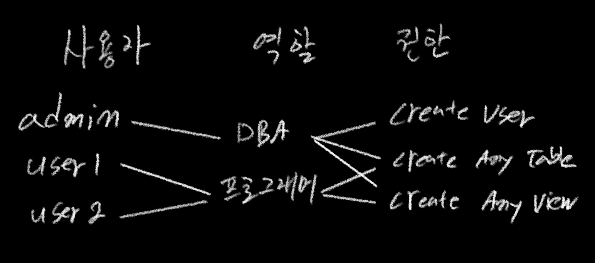

### 역할 - ROLE




권한을 역할에 부여해 사용자의 역할에 따라 사용할 수 있는 권한을 저장해 둔 집합

사용자의 업무가 변경되거나 추가되어도 사용자별 열할을 부여하면 되어 관리가 편하다.

역할별 권한이 변경될 경우 각 역할의 권한만 수정한다면 사용자도 역할도 바로 적용된다.

역할 생성

``` 
CREATE ROLE 역할이름
```

역할 제거

```
DROP ROLE 역할이름
```

역할 권한 부여

```
GRANT 권한 [ON 객체] TO 역할이름
```

역할 권한 회수

```
REVOKE 권한 [ON 객체] FROM 역할이름
```


사용자에게 역할 부여

```
GRANT 역할이름 TO 사용자
```

해당 유저는 부여받은 롤을 모두 사용

```
SET ROLE ALL
```