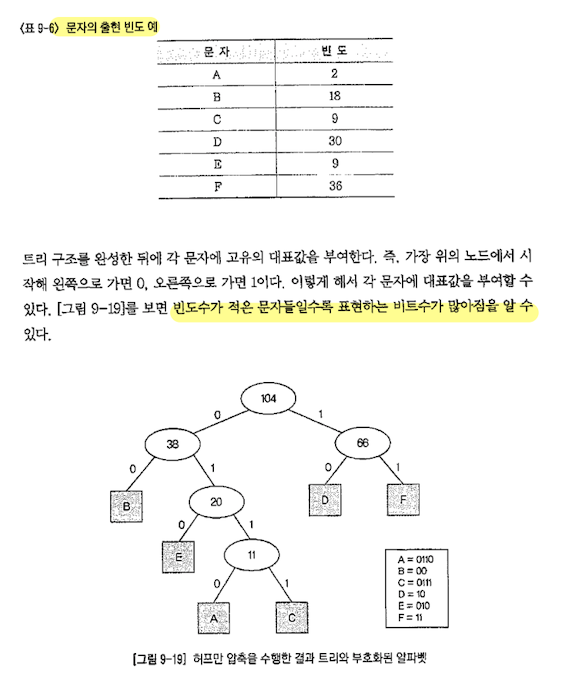
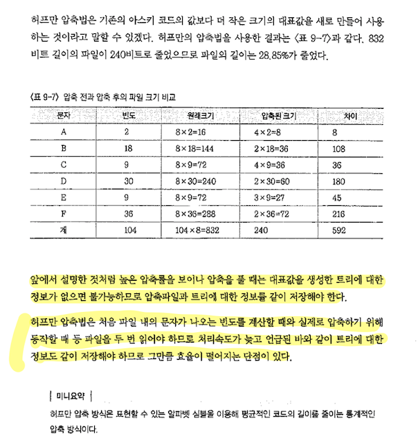

데이터를 전송하고자 할 때 소요되는 비용을 최소화 하고자 하는 문제는 일반 공학에서 추구하는 경재성의 문제와 동일하다. 따라서 주어진 통신자원을 이용하여 데이터 전송효율을 극대화하고 데이터를 압축하여 전송량과 전송시간을 단축하는 것이 매우 중효하다. 이러한 경제성 실현하는 기술로 다중화와 데이터 압축 기술은 중요한 의미를 갖는다.

데이터 전송에 있어 링크의 전송용량보다 데이터의 전송용량이 작은 경우, 링크의 이용효율을 높이기 위한 목적으로 다중화를 통해 자원의 이용효율을 높일 수 있다. 또한 여러 가지 압축 기법을 사용하여 전송시간을 줄이고 전송효율을 높일 수 있다.

### 다중화 기법

다수의 저속 신호 채널들을 결합하여 하나의 고속 통신회선을 통하여 전송하고, 이를 수신측에서 다시 본래의 신호 채널로 분리하여 전달하는 기술

**주파수 분할 다중화(FDM)**

하나의 회선을 다수의 주파수 대역으로 분할. 아날로그 음성 전송을 위해 개발, 동축 케이블, 광케이블 전송 등에 이용

**시분할 다중화(TDM)**

하나의 회선을 다수의 짧은 시간 간격으로 분할. 디지털 전송을 위해 개발, 디지털화 한 음성이나 데이터 전송에 이용

**코드분할 다중화(CDM)**

FDM과 TDM을 복합한 방식. 일종의 확산대역을 이용한 다중화. 디지털 이동통신을 위해 개발 CDMA 방식의 기본 개념

#### 역다중화(Inverse Multiplexing)

고속 데이터 스트림을 여러 개의 저속 데이터 스트림으로 변환, 저속 데이터 스트림들을 합하여 본래의 고속 데이터 스트림으로 재구성 하는 방식

### 다중화 응용(디지털 서비스의 계층구조)

전화 서비스 제공을 위한 가장 기본적인 통신기술

초기 전화망은 아날로그 네트워크를 기반으로 서비스를 제공하였지만 디지털 기술의 발전으로 인해 디지털 네트워크 환경에서 디지털 서비스를 제공한다.

역사적으로 디지털 음성전송을 실현한 것은 1960년대 미국 벨 사에서 주도한 T급 시스템으로 T1(1.544Mbps),T2,T3,T4(274.175Mbps)로 분류된다. 유럽에선 E급 회선시스템을 도입해 지금까지 사용

#### 디지털 서비스 계층구조

디지털 네트워크는 네트워크의 종단에서부터 여러 가입자를 연결하기 위해 일정 규격을 각기 다른 대역폭의 회선을 사용하게 되는데 종단 가입자에 연결된 64Kbps 서비스(DS-0)부터 274.176Mbps 서비스(DS-4)까지 5가지 등급의 서비스를 제공.

신호 정보는 여섯 번째와 열두 번째 슬롯의 첫 비트를 사용하여 전송되며, 이로 인해 해당 슬롯의사용자 정보는 7비트만 사용한다. 각 프레임은 하나의 프레임 비트에 의해 동기화되므로 전송률은 (24time slots*8bit+1 framing bit)bit / 125(micro sec) = 1.544Mbps가 되고 이것이 T1의 전송 속도가 된다. 즉, T1은 DS-1 신호를 전송하는 것

#### SONET(북미)/SDH(전 세계 표준)

광통신 네트워크로 진화하는 과정에서 광대역 종합정보정보통신망의 표준화가 진행되면서 기존의 E 회선, T 회선과 광통신 선로가 함께 네트워크를 구성하게 되는데, 이때 동기식 전송방식으로의 전환에 대한 필요성이 제기되어 1980년대 중반 범세계적이고 융통성 있는 광통신 네트워크를 실현하기 위해 미국과 유럽에서 각 SONET(Synchronous Optical Betwork)와 SDH(Synchronous Digital Hierarchy)라는 이름으로 광통신 전송에 대한 표준화를 시작하였다.

SONET는 광통신 시스템에 의한 네트워크 구축을 가능하게 하기 위한 동기식 광 통신망 접속 방식으로 북미에서 표준화로 채택되었으며, SDH는 E1, T1, DS3 및 기타 저속 신호를 고속의 광신호로 동기식 시분할 다중화하여 전송하는 방식의 전 세계표준이다.

SONET의 기본 전송단위는 STS-1이라고 하는 프레임으로 기본적으로 가로 90바이트 세로 9바이트의 형태를 가지며 전송 오버헤드와 사용자 데이터 영역으로 두 부분으로 구성된다. 356p

SDH는 가상 콘테이너라는 하위 단계 신호들의 집합을 규정해 다양한 속도의 하위 신호들이 전송할 수 있도록 설계되어 있다. STM이라고 하는 기본 단위를 N(1,4,16, ... )개씩 묶어서 하나의 프레임을 이루며 가장 기초 프레임인 STM-1은 가로 270 세로 9의 2430바이트 크기를 가지며, 각 행의 처음 9바이트들로 구성된 81바이트는 색션 오버헤드를 위해 사용되며 나머지 부분은 Administrative Unit(AU)라고 하며 261*9인2349바이트의 사용자 데이터로 구성된다.

#### 파장 분할 다중화(WDM:Wavelength Division Multiplexing)

WDM은 손실이 적은 주파수 대역을 이용하여 파장이 다른 복수의 광신호를 한 가닥의 광섬유에 다중화시킨 것

WDM은 저 손실 파장대를 이용하여 파장이 다른 복수의 광신호를 한 가닥의 광섬유에 다중화시킨 것으로 전자적인 신호는 레이저와 같은 소자로 이루어진 송신기에 의해 광신호로 변환된다.

**특징**

WDM은 양방향 전송이 가능하며 다른 파장을 갖는 신호를 동시에 전송할 수 있다. 단일 모드, 다중 모드에 모두 사용되며, 광케이블의 증설 없이 회선 증설이 용이하고,대용량화가 가능하다.

#### 데이터 압축

##### 압축 기법

암축한 데이터의 복원성에 따른 분류

압축한 데이터를 복원하였을 때 복원 결과가 원래 데이터와 비교하였을 때 손실 유무에 따른 무손실 기법과 손실 기법으로 나눈다.

- 손실 기법 
	- 음향, 비디오 동영상 를 압축하는떼 적당하다. 영상은 1/30까지 압축이 가능, 음성의 경우 1/6로 압축할 수 있다.

##### 데이터 압축 기법

1. Packed decimat 압축 기법

	숫자로만 구성된 데이터의 경우 2바이트로 한 문자를 전송하게 되는 SCII코드 대신 이진법으로 표시된 십진수 코드인 BCD를 사용하여 한 바이트를 사용하여 두 문자를 전송하는 압축효과를 낼 수 있는 기법

2. Relative Encoding 압축 기법

	차이가 크지 않은 숫자들을 전송할 경우 특정 기준값과의 차이만을 전송하여 그 크기를 줄일 수 있는 압축 기법

3. Chearacter suppression 압축 기법

	연속적으로 반복되는 문자들을 문자와 그 길이로 대체하는 방법을 사용하는 방식

4. Huffman(허프만) 방식

	표한할 수 있는 알파뱃 심볼을 이용해 평균적인 코드의 길이를 줄이는 통계적인 압축 방식

	1. 먼저 압축할 파일을 읽어 각 문자의 출현 빈도수를 수한다. 즉 압축할 파일의 문자를 분석해 전체적으로 각 문자가 몇 개가 들어있는지 파악

	2. 읽어 들인 각 문자들 중에서 출현 빈도가 가장 적은 문자들끼리 연결해 2진 트리를 만든다. 여기서 만든 2진 트리로부터 각 문자들을 대표할 수 있는 대표 값을 얻는다.

	3. 파일의 문자들은 대표값으로 압축파일을 만든다.

		

		

Reference - 데이터통신(생능출판사)

5. LZW 압축 기법

	파일을 읽어 들이면서 연속된 문자열들에 대한 표를 만들고 다음에 같은 문자열이 발견되면 이 표를 참조하는 압축 기법

	장점
	파일을 한 번 읽어서 압축할 수 있어 속도가 빠르다

	단점
	파일 크기가 작을 때는 효율이 떨어짐
	연속된 두 개의 문자열이 파일의 다른 부분에 존재하지 않을 때는 압축할 수 없다. 

#### 정지/동영상 압축 기법

##### JPEG

제정한 정지화상을 합축하는 데 사용되는 기술, .jpg확장자 

##### M-JPED

동영상 압축방식, 국제 표준으로 사용 X, MPEG에 비하여 효능 및 화질 면에서 떨어짐

##### MPEG 1988년 

MPEG-1 : CD-ROM

MPEG-2 : DVD

MPEG-4 : 인터넷 유선망과 이동통신망 등 무선망

MPEG-7 : 그림이나 영화의 한 장면 또는 특정 음악의 일부 등 검색 용도 (1996년도)

MPEG-21 : 디지털 콘텐츠의 제작 및 유통, 보안 등의 모든 과정을 관리할 수 있게 하는 기술 