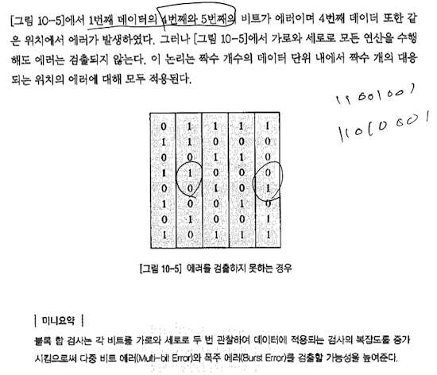

### 에러 제어(Error Control)

전기 신호는 매체를 따라 흐를 때 열이나 자기장 등의 간섭을 받아 신호의 변화가 생길 수 있다. '0'의 신호가 '1'로 바뀔 수 있다.

수신된 정보로부터 올바른 의미를 전달 받기 위해서는 수신정보 내에 포함된 에러를 찾아내고, 더 나아가 이를 수정하는 절차 즉 에러 제어 기술이 필요. 이러한 기술에는 에러 검출 기법과 에러 복구 기법 및 에러 정정 기법이 있다. 전송되는 데이터는 에러 제어 방법에 따라 재구성 된다. 

에러 제어에는 검출, 복구, 전진에러수정이 있다. 에러 검출 후 재전송을 하는 방법을 수신측에서 에러 검출 방법을 이용하여 에러를 검출하고 에러가 검출도면 복구의 방법으로 송신측에서 재전송을 요청한다. 반면 전진에러수정은 수신측에서 에러를 검출하면 에러의 수정과정도 함께 수행한다. 

#### 에러 검출 (Error Detection)

수신된 정보 내에 에러가 포함되어 있는지 여부를 검사하기 위해서 송신측과 수신측에서는 다음과 같은 방법을 수행한다.

- 송신측에서 보내고자 하는 원래의 정보 이외에 별도로 잉여 데이터를 추가
- 수신측에서 이 잉여 데이터를 검사함으로써 에러 검출이 가능

1. 패리티 검사(Parity Check)

	짝수 패리티 : 1의 전체 개수가 짝수가 되게 하는 방법

	홀수 패리티 : 1의 전체 개수가 홀수가 되게 하는 방법

	##### 단점

	에러가 짝수 개 발생하게 되면 검출이 불가

2. 블록 합 검사(Block Sum Check)

	블록의 각 비트를 가로와 세로로 두 번 관찰하여 데이터에 적용되는 검사의 복잡도를 증가시킴으로써 다중 비트 에러와 집단 에러를 검출할 가능성을 높여준다.

	##### 단점

	패리티 검사에 비해 다중비트 에러와 폭주에러를 검출할 확률을 증가시켰지만 블록 합 검사로도 검출하지 못하는 패턴이 있다. 

	

3. CRC(Cyclic Redundancy Check)
	CRC는 현재 컴퓨터 네트워크에서 널리 사용되는 있는 에러 검출 방법으로 다향식코드로도 알려져 있다. 