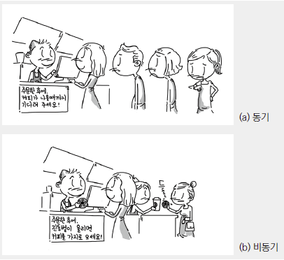
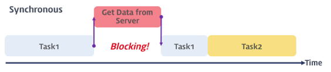
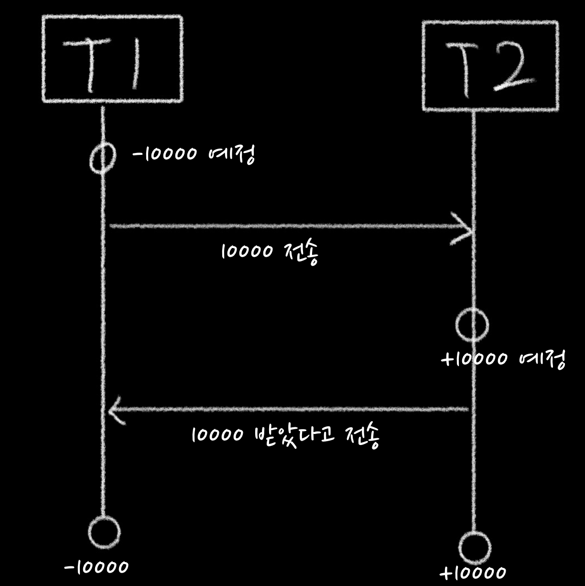
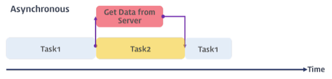
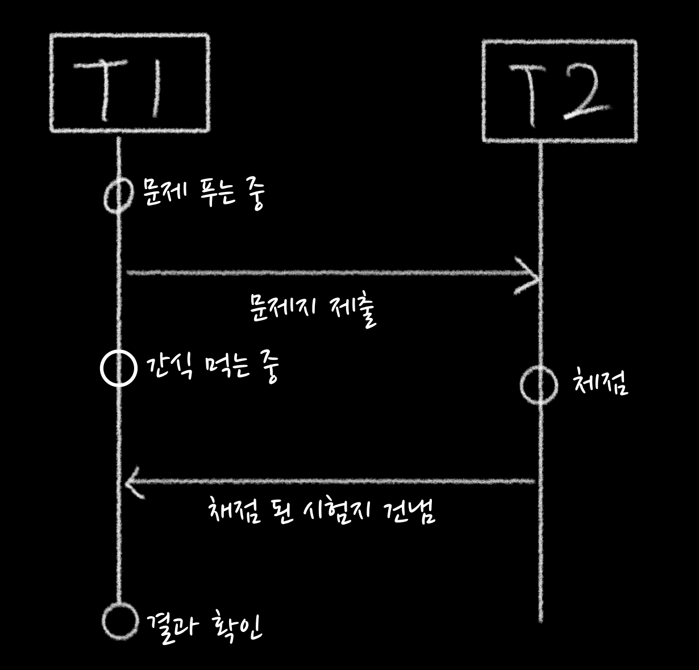

Reference - https://poiemaweb.com/js-async

### 동기 비동기 차이

동기는 요청 후 결과를 받을 때까지 다른 일을 하지 못한다.

비동기는 요청 후 결과를 받을 때까지 다른 일(다른 요청)을 할 수 있다.

### 동기(Synchronous) - 블록킹(Blocking)방식

동기식 처리는 직렬 적으로 태스크(task)를 수행한다.

즉, 태스크는 순차적으로 실행되며 어떤 작업이 수행 중이면 다음 작업은 블로킹(blocking, 작업 중단) 된다.

T1, T2 트렌젝션의 단위를 동시에 맞춘다.

동기식 처리는 T1, T2의 -10000, +10000이 동시에 일어나기 위한 것으로, T1의 전송, T2의 결과 전송 후 동시에 진행 되어야 한다.

트랜젝션을 이용한 동시성 제어를  하기때문에 설계가 쉽다. 대기하는 시간이 생기는 단점이 있다.

### 비동기(Asynchronous) - 논블록킹(Non-Blocking)방식

비동기식 처리는  병렬적으로 태스크(task)를 수행한다. 

즉, 태스크가 종료되지 않은 상태라 하더라도 대기하지 않고 다음 태스크를 실행한다

T1, T2 트렌젝션의 단위를 동시에 맞추지않아도 된다.

비동기식 처리는 T1의 문제지 결과를 T2에게 요청 후 결과가 오기 전에 다른 작업(간식 먹는 중)을 할 수 있는 처리방식이다.

비동시성 말 그대로 동시에 일어나지 않는다는 뜻으로, 요청과 결과가 따로 작동된다.

동기보다 설계가 복잡하며 대기하는 시간이 없어 효율적인 장점이 있다.

### 정리

각각의 장단점이 있어 동기 비동기를 이해하고 목적에 맞게 사용하면 좋을 것 이다.

동기 비동기를 목적에 맞게 사용하려면 각각의 특징을 인지하고 상황에 맞는 설계가 필요하다.
