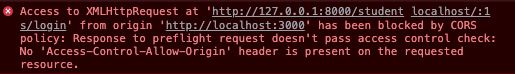

Spring-boot로 rest형식의 api를 구현하였고, React로 구현된 Client와 연결하는 작업중에 발생한 이슈이다.



구글링해서 찾은 3가지 방법 시도 (급하신 분들은 3번만 확인하세요)

### 1. spirn-boot에서 CORS 설정 -> 값 주고 받기 성공

### (session 값은 가져오지 못한다.)


#### **(Cross-Origin Resource Sharing,CORS)**

다른 출처의 자원을 공유할 수 있도록 설정하는 권한 체제

즉, CORS 를 설정하지 않거나 잘못 설정하는 경우, 리소스를 공유하지 못한다.


config.WebConfig.java 설정

```java 
package com.example.booking_service_01.config;

import org.springframework.context.annotation.Configuration;
import org.springframework.web.servlet.config.annotation.CorsRegistry;
import org.springframework.web.servlet.config.annotation.WebMvcConfigurer;

@Configuration
    public class WebConfig implements WebMvcConfigurer {
        @Override
        public void addCorsMappings(CorsRegistry registry) {
            registry.addMapping("/**")
                    .allowedOrigins("http://localhost:3000")
                    .allowedMethods("GET","POST","DELETE","PUT")
                    .allowCredentials(true);
        }
}
```

.allowedOrigins("http://localhost:3000") : react가 사용하는 포트 3000번


### 2. react에서 withCredentials=true 설정 -> 값 주고 받기 성공 (session 값은 가져오지 못한다.)

#### before

```js
  requestLogin() {  
    const url = "http://localhost:3000/students/login"
    const header = {"Content-type":"application/json"}
    const data = {
      sid : this.state.id,
      pw : this.state.pw
    }
    axios.post(url, data, header)
    .then(response => console.log(response.status))
    .catch(err => console.log(`Error Occured : ${err}`))
  }
```

#### After

``` js
  requestLogin() {  
    const url = "http://localhost:3000/students/login"
    const header = {"Content-type":"application/json"}
    const crossOriginIsolated = {withCredentials: true}
    const data = {
      sid : this.state.id,
      pw : this.state.pw
    }
    axios.post(url, data, header, crossOriginIsolated)
    .then(response => console.log(crossOriginIsolated))
    .catch(err => console.log(`Error Occured : ${err}`))
  }
```


값을 주고받는 것 확인. 

이제 세션을 유지한체로 로그인후 예약 하는 기능 테스트 했는데 실패

일단 TanlendAPI Tester 나 HTTP Test시 세션 발급 및 유지 확인.

react에서 세션값을 받아오지 못한다고 판단...


### Reference

[[React] 로컬 쿠키가 브라우저에 저장되지 않을 때](https://velog.io/@rosa/React-%EB%A1%9C%EC%BB%AC-%EC%BF%A0%ED%82%A4%EA%B0%80-%EB%B8%8C%EB%9D%BC%EC%9A%B0%EC%A0%80%EC%97%90-%EC%A0%80%EC%9E%A5%EB%90%98%EC%A7%80-%EC%95%8A%EC%9D%84-%EB%95%8C)

[Spring Boot CORS 설정하기](https://dev-pengun.tistory.com/entry/Spring-Boot-CORS-설정하기)
