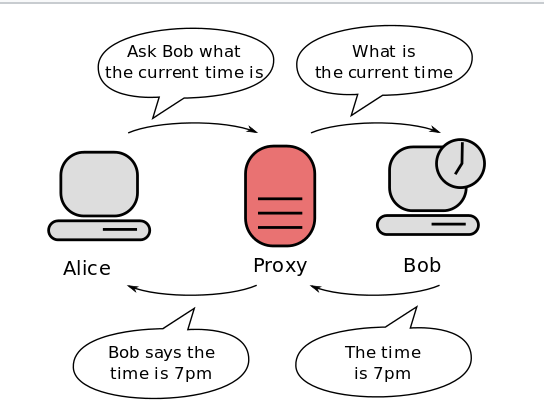

### 3. react에서 Proxy 설정 -> 값 주고 받기 성공

### (session 값도 주고 받기 성공)

#### Proxy란

대리 라는 의미로, 네트워크 기술에서는 프로토콜에 있어 대리 응답 하는 개념. 보안 분야에서는 주로 보안상의 이유로 직접 통신할 수 없는 두 점 사이에서 통신을 할 경우 그 사이에 대리로 통신을 수행(프록시 서버)



Reference : https://en.wikipedia.org/wiki/Proxy_server


#### Proxy 를 설정

- 2가지 변경

- package.json 파일 내에 "proxy": "http://http://127.0.0.1:8000" 선언

- Axios url의 값을 http://127.0.0.1:8000/students/login -> /students/login 로 변경 

	```js
	  requestLogin() {  
	    const url = "http://127.0.0.1:8000/students/login"
	    const header = {"Content-type":"application/json"}
	    const data = {
	      sid : this.state.id,
	      pw : this.state.pw
	    }
	    axios.post(url, data, header)
	    .then(response => console.log(response.status))
	    .catch(err => console.log(`Error Occured : ${err}`))
	  }
	```

	```js
	  requestLogin() {  
	    const url = "/students/login"
	    const header = {"Content-type":"application/json"}
	    const data = {
	      sid : this.state.id,
	      pw : this.state.pw
	    }
	    axios.post(url, data, header)
	    .then(response => console.log(response.status))
	    .catch(err => console.log(`Error Occured : ${err}`))
	  }
	```

위에서 설정한 {withCredentials: true}는 따로 넣지 않아도 작동이 잘 된다.


### Reference

[React 웹 소켓 및 proxy 설정](https://velog.io/@tw4204/React-%EA%B0%9C%EB%B0%9C%ED%99%98%EA%B2%BD%EC%97%90%EC%84%9C%EC%9D%98-CORS%EB%A5%BC-%EC%9C%84%ED%95%9C-proxy-%EC%84%A4%EC%A0%95)

[[React] 로컬 쿠키가 브라우저에 저장되지 않을 때](https://velog.io/@rosa/React-%EB%A1%9C%EC%BB%AC-%EC%BF%A0%ED%82%A4%EA%B0%80-%EB%B8%8C%EB%9D%BC%EC%9A%B0%EC%A0%80%EC%97%90-%EC%A0%80%EC%9E%A5%EB%90%98%EC%A7%80-%EC%95%8A%EC%9D%84-%EB%95%8C)
