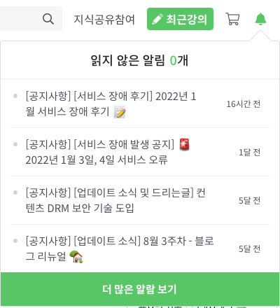

최근에 인프런 강의를 듣다 인프런 알림이 와 있어 확인해보니 장애 후기를 남겼다는 알림이 있었다. 

장애가 일어난 이유는 100% 할인 이벤트를 진행했기 때문이다. 난 몰라서 신청하진 못 했지만. :)

장애 부검에 더 대한 궁금한 사람은 아래 링크를 참고하길 바란다.

>### 2022년 1월 100% 할인 이벤트 장애 부검
>
>posted by **향로(HyangLo)**, February 01, 2022
>
>https://tech.inflab.com/202201-event-postmortem/

이런 회고를 사용자에게 제공한다는 것은 신선한 경험이었기에 나도 공유하고 싶어 이렇게 공유해봅니다.

회고를 보고 느낀 점은 인프런에 합류해 같이 개발문화를 만들며 서비스를 개선하고 싶은 생각이 들었다. 스프링을 공부하고 있지만 접어두고 node.js 를 공부하러 떠나야 하나 잠시 고민했다. 

고민만 하다 궁금한 게 한가득 생겼다.

실제 경험하지 못한 실무에서 오는 장애 및 해결을 살짝만 맛봤는데도 부족한 게 이렇게나 많다니..  배울게 끊이질 않아서 행복하다...

- node.js 왜 사용하는가 (왜 그렇게 핫 한가)

- postqresql 을 왜 사용하는가  (기업 입장에서)

	- DB 인덱스 활용법

	- Promise.all 로 분할처리

	- 쿼리 타임아웃 설정 (5초) 법

	- 쿼리 추상화란

	- MVCC (Multi Version Concurrency Control)

	- DB 분산 -> 읽기DB, 쓰기DB

- Redis는 무엇이고 왜 사용하는가  ( 메모리 nosql 인건 알겠는데 좀더 심도있게.. 사용도 해볼 것 )

차근차근 하나씩 포스팅 해보자. 