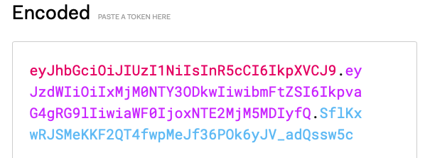
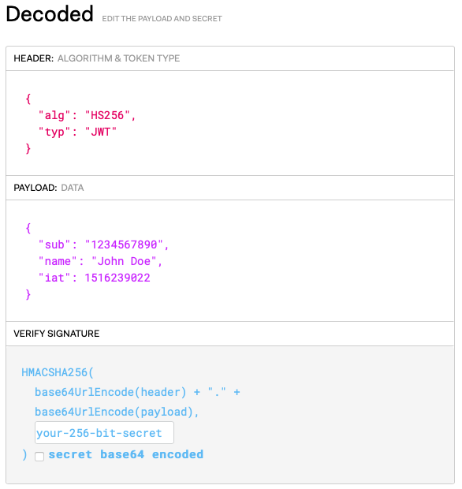
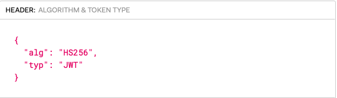
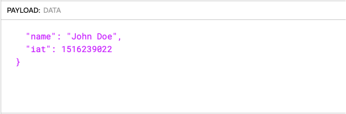
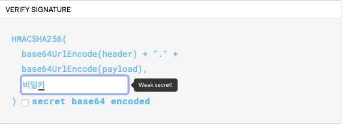

### JWT 구조

위와 같이 ( `.` ) 을 기준으로 3가지로 나눠지는데 이 3가지 부분을 각각 JOSE 헤더(JSON Object Signing and Encryption), JWT Claim Set, Signature라고 부른다.

Reference : https://jwt.io

**JOSE 헤더**는 JWT 토큰을 어떻게 해석해야 하는지를 명시한 부분

alg = HS256 이란 알고리즘을 사용한 JWT

**JWT Claim Set**은 실제 토큰의 바디로 토큰에 포함할 내용

아래 목록이 등록된 공개 클레임 이름인데 모두 선택사항이다.

공개 클레임은 충돌을 방지를 위해서 정의된 것

- `iss`: 토큰을 발급한 발급자(Issuer)
- `sub`: Claim의 주제(Subject)로 토큰이 갖는 문맥을 의미
- `aud`: 이 토큰을 사용할 수신자(Audience)
- `exp`: 만료시간(Expiration Time)은 만료시간이 지난 토큰은 거절
- `nbf`: Not Before의 의미로 이 시간 이전에는 토큰을 처리하지 않아야 함을 의미
- `iat`: 토큰이 발급된 시간(Issued At)
- `jti`: JWT ID로 토큰에 대한 식별자

비밀 클레임이름은 서버와 클라이언트가 협의로 사용하는 이름을 의미

**Signature** 부분은 JOSE 헤더와 JWT Claim Set가 위변조되었는지를 검증하기 위한 부분

JOSE 헤더와 JWT Claim Set을 ( `.` )로 이어 붙익고 JOSE헤더에 있는 알고리즘으로 비밀키와 함께 HMAC 암호화를 한다.

비밀키는 외부에 노출되면 안 된다.

JWT는 생각보다 간단하다.

이제 Spring Security 를 이용한 JWT 발급, 인증, 인가 서버를 만들어 보자.