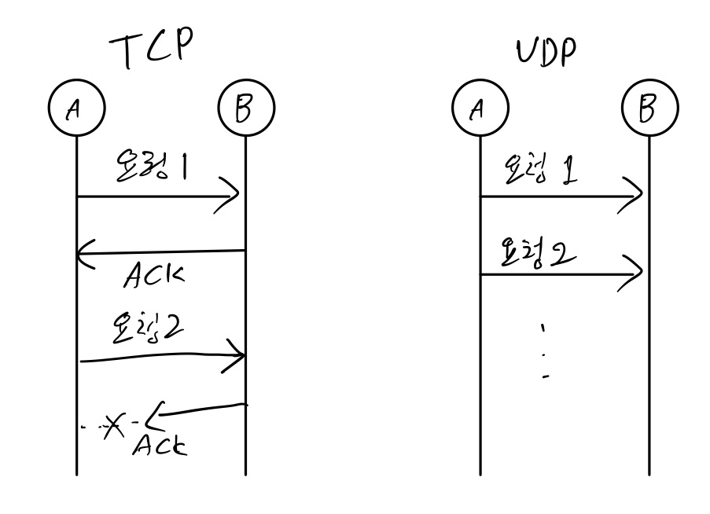

TCP 는 통신 OSI 7계층 전송 계층(트랜스 포트) 계층에서 나오는 개념으로 데이터(요청)를 전송하는 방식 중 하나이다.

### OSI 7계층

응용 계층 : 무엇을

표현 계층 : 암호화

세션 계층 : 인증 체크

전송 계층(트랜스 포트) : TCP / UDP

네트워크 계층 : IP

데이터 링크 계층 : Port

물리 계층 : LAN, WIFI

### TCP / UDP

#### TCP 

A가 B에게 요청 1을 보내면 B는 잘 받았다고 ACK를 보낸다.

B가 ACK를 보낼 때 ACK가 유실 또는 통신의 불안정으로 ACK가 A에게 가지 않을 수 있다.

ACK를 받지 못한 A는 한번 더 요청을 보냅니다. ACK를 받은 경우에만 다음 요청을 보내게 됩니다.

그래서 신뢰성을 가지고 있는 통신 기법중 하나이다.

#### UDP

A가 B에게 요청(데이터)을 보낼 때 B에서 ACK를 받지 않고 그냥 다음 요청을 계속 보낸다.

그래서 신뢰성이 없지만 속도가 빠른 장점을 가지고 있다.

중간에 살짝 끊겨도 되는 통신에 주로 쓰인다. ex) 통화, 영상 스트리밍 등

