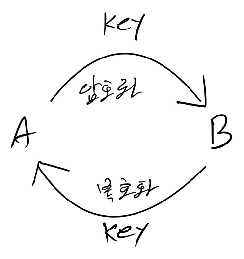
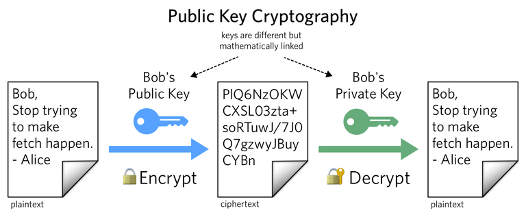

#### RSA암호화를 알기전에 RSA란 비대칭키 알고리즘의 대표적인 알고리즘이다.즉, RSA 암호화는 RSA 알고리즘을 이용한 암호화이다

#### 대칭키 암호화

위 이미지와 같이 같은 key로 암호화 복호하 하는 것을 뜻한다.

#### 비대칭키 암호화 

비대칭키 암호화는 암호화하는 key와 복호하하는 key의 값이 다르다.

값이 다른데 어떻게 암호화,복호화가 가능한지는 [RSA 알고리즘](https://playground10.tistory.com/192)을 이해하면 된다. 

RSA 알고리즘을 통해 Public Key (공개키), Private Key (개인키)를 사용해 암호화를 한다.

Reference : [Twilio](https://www.twilio.com/blog/what-is-public-key-cryptography)

## RSA 암호화를 사용하는 이유

#### 기밀성 (인가된 사용자 인가)

Bob's 공개키로 문서를 암호화 하면 Bob's 개인키로만 그 문서를 복호하 할 수 있다.

#### 무결성 (누가 보냈는가)

Bob's 개인키로 문서를 암호화하면 Bob's 공개키로 내용을 확인 할 수가 있다. 즉, Bob's 개인키는 Bob만이 가지고 있는 개인키 이기 때문에 Bob이 문서를 작성했다는 서명이 된다. 이를 전자 서명이라 한다. 

#### 즉, A가 B에게 문서를 보낼 때는

##### 문서를 B의 공개키로 암호화를 하고 (B만 열람 가능)

##### 암호화된 문서를 A의 개인키로 암호화 (A가 작성한 문서라는 전자 서명)

#### B가 A에게 문서를 받을 때는

##### 받은 문서를 A의 공개키로 복호화를 하고 (A가 보낸 문서가 맞는지 확인)

##### 복호화 실패시 무시, 성공시 B의 개인키로 복호화 하여 문서를 열람한다.

#### 서버에서 JWT RSA방식 발급 예시 (JWT는 암호화가 목적이 아닌 서명에 목적이 있다)

#### 서버 JWT 발급

##### 서버는 개인키로 header+payload 를 암호화해서 클라이언트에게 전달해준다.

##### 클라이언트는 발급 받은 JWT를 가지고 서버에게 요청을 한다.

#### 서버 JWT 서명 확인

##### 서버는 공개키로 JWT를 복호화해 서명을 확인한다.

또는

##### 서버는 요청받은 JWT의 header+payload를 개인키로 암호화해 Signature와 비교해 JWT의 서명을 확인한다.