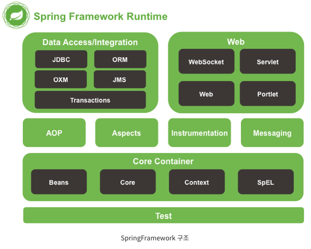

**1. Beans ** 

- Spring 프레임 워크의 근간이 되는 IOC/DI기능을 지원하는 담당
- BeanFactory를 기반으로 Bean 클래스들을 제어할 수 있는 기능을 지원
- 스프링 DI기능의 핵심인 bean Factory와 DI기능을 제공하는 모듈이며 bean의 meta data, bean리더, beanFactory의 구현과 Properti aditor가 포함

**2. Core**  

- Core는 스프링에서 사용하는 핵심모듈이며 주요 어노테이션, 컨버터, 상수, 유틸리티 클래스 등을 제공

	

**3. Context**  

- Core and Beans를 견고히(solid)한 모듈(Beans의 확장 버전)
	-  JNDI처럼, 프레임 워크 방식이고 객체에 접근하기 위한 방법 제공
- Beans모듈에 더하여 국제화, 이벤트 전판, 리소스 로딩, 투명한 Context 생성 등을 제공한다
- 대부분의 기능을 담고 있는데 bean스캐너 자바 코드 설정 기능, EJB지원, 포 메터, 로드 타임, 위빙, 표현식, JMX JNDI, 리모팅, 스케쥴링, 스크립트 언어 지원, 검증기 등

**4. spEL** 이름 그대로 **EL의 Spring 버전**

- **JSP의 EL을 스프링에 맞게 확장시킨 모듈**
	- querying - 객체 탐색
	- SpringEL/SpEL - 강력한 표현 언어를 제공
- 객체 속성에 대한 읽기 및 설정, 메서드 호출, 배열에 접근, Collection and indexrs, 논리 및 수리 연산, named variables, Spring의 IOC container로부터 이름에 의한 객체 검색 등 제공

*JSP 의 EL이란

- JSP 스크립트의 표현식을 대신하여 속성 값을 쉽게 출력하도록 고안된 언어

- 출력, 반복처리를 태그기반으로 제공 
- 기존 Expression Tag(<%= %>) 대체
