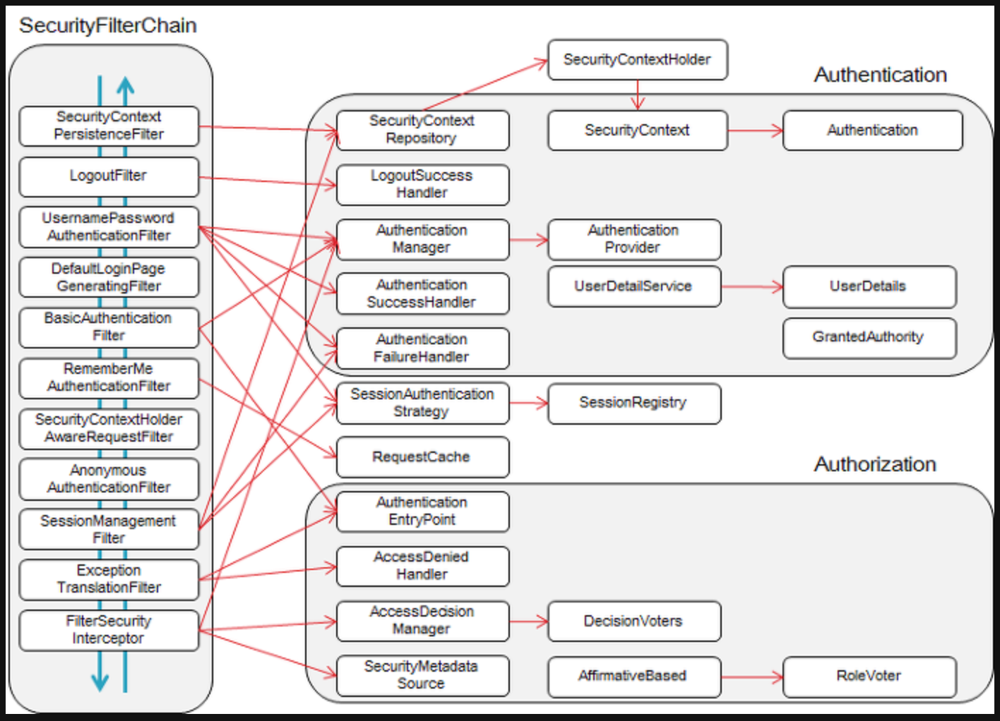

https://dotheright.tistory.com/355

https://codevang.tistory.com/275

https://velog.io/@sa833591/Spring-Security-5-Spring-Security-Filter-%EC%A0%81%EC%9A%A9

https://siyoon210.tistory.com/32

- SecurityContextPersistenceFilter - 요청(request)전에, SecurityContextRepository에서 받아온 정보를 SecurityContextHolder에 주입합니다.
- LogoutFilter - 주체(Principal)의 로그아웃을 진행합니다. 주체는 보통 유저를 말합니다.
- UsernamePasswordAuthenticationFilter - (로그인) 인증 과정을 진행합니다.
- DefaultLoginPageGeneratingFilter - 사용자가 별도의 로그인 페이지를 구현하지 않은 경우, 스프링에서 기본적으로 설정한 로그인 페이지를 처리합니다.
- BasicAuthenticationFilter - HTTP 요청의 (BASIC)인증 헤더를 처리하여 결과를 SecurityContextHolder에 저장합니다.
- RememberMeAuthenticationFilter - SecurityContext에 인증(Authentication) 객체가 있는지 확인하고RememberMeServices를 구현한 객체의 요청이 있을 경우, Remember-Me(ex 사용자가 바로 로그인을 하기 위해서 저장 한 아이디와 패스워드)를 인증 토큰으로 컨텍스트에 주입합니다.
- AnonymousAuthenticationFilter - SecurityContextHolder에 인증(Authentication) 객체가 있는지 확인하고, 필요한 경우 Authentication 객체를 주입합니다.
- SessionManagementFilter - 요청이 시작된 이 후 인증된 사용자 인지 확인하고, 인증된 사용자일 경우SessionAuthenticationStrategy를 호출하여 세션 고정 보호 메커니즘을 활성화하거나 여러 동시 로그인을 확인하는 것과 같은 세션 관련 활동을 수행합니다.
- ExceptionTranslationFilter - 필터 체인 내에서 발생(Throw)되는 모든 예외(AccessDeniedException, AuthenticationException)를 처리합니다.
- FilterSecurityInterceptor - HTTP 리소스의 보안 처리를 수행합니다.

