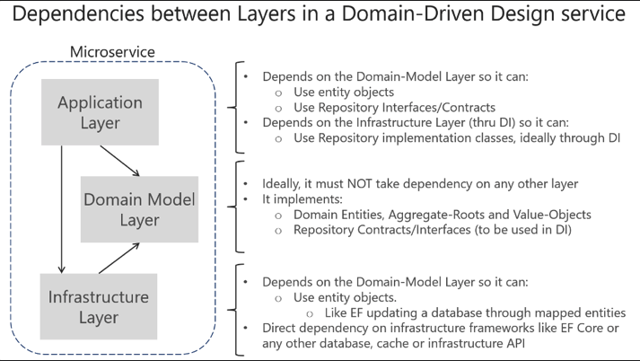

### 도메인이란

실세계에서 사건이 발생하는 집합

업무 작업 영역을 파악하고 범위를 규정해 정보시스템(비즈니스 도메인)을 구축하는데 필요한 개념적인 프레임워크를 제공하는것. 즉, 추상화된 개념을 체계화 하는 작업

### 설계 방식

a

- Application Layer - 도메인과 Repository 를 바탕으로 실제 서비스(API)를 제공하는 계층
- Domain Layer - Entoty, Aggregate-Roots, VO(Value-Object)를 활용한 로직이 진행되는 계층, DI
- Infrastructure Layer - ORM, DB 와의 외부 연결을 담당하는 계층

>Entity는 고유 식별자(primary Key)를 바탕으로 객체의 정체성을 부여
>
>VO(Value Object)는 값 자체로 같음을 판단한다. 불변 객체
>
>equals HashCode를 **고유 식별자로만 하면 Entity**, **상태에 대한 모든 정보로 하면 VO** 

[DDD 핵심만 빠르게 이해하기](https://happycloud-lee.tistory.com/94)

[프로젝트 계획(6-2) - 도메인 분석(Domain Analysis)](https://luv-n-interest.tistory.com/362)
