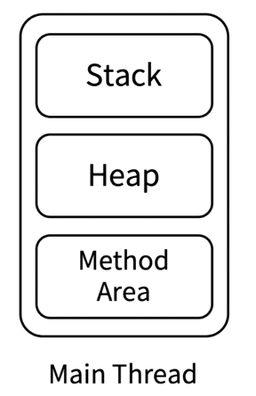
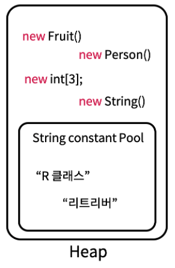

자바 메모리 구조는 크게 3가지로 나뉜다.

###  Stack - 메서드 단위로 생성된다고 보면 쉽다.

메서드의 매개변수도 별도의 메모리 공간을 가진 변수이다.

메서드 내부의 로컬 변수의 수명주기는 Stack Frame 단위이다.

Stack 메모리가 꽉차면 Stack Over Flow 이다.

- #### Stack

	- #### Stack Frame

		- #### Local Variables Array - 로컬 변수 저장 ( 컴파일시 길이 지정 )

		- #### Oprend Stack - 명령어의 중간 연상 결과를 일시적으로 저장하는 스택

		- #### Frema data - 메서드외 관련된 그 외 정보 저장

### Heap

#### 인스턴스나 문자열 상수를 Heap Memory 공간에 저장한다.

#### 참조되지 않은 인스턴스나 문자열 상수는 Garbage Collector 에 의해 메모리 공간에서 해제 한다.

### Method Area

자바 프로그램을 싱행시키기 위한 중요한 정보들이 저장된다.

- Run-time Constant Pool( 실행환경 상수 풀 )
- Symbolic Reference
- Class 정보
- Field ( 맴버 변수 ) 정보
- 메서드 정보, 정적 메서드 정보
- interface 정보
- 생성자 정보
- 정적 변수 ->  인스턴스 또는 문자열 상수와 다른 메모리 공간에 저장된다.

Reference - https://www.codelatte.io/courses/java_programming_basic/R842DJSB0BTCRLKM