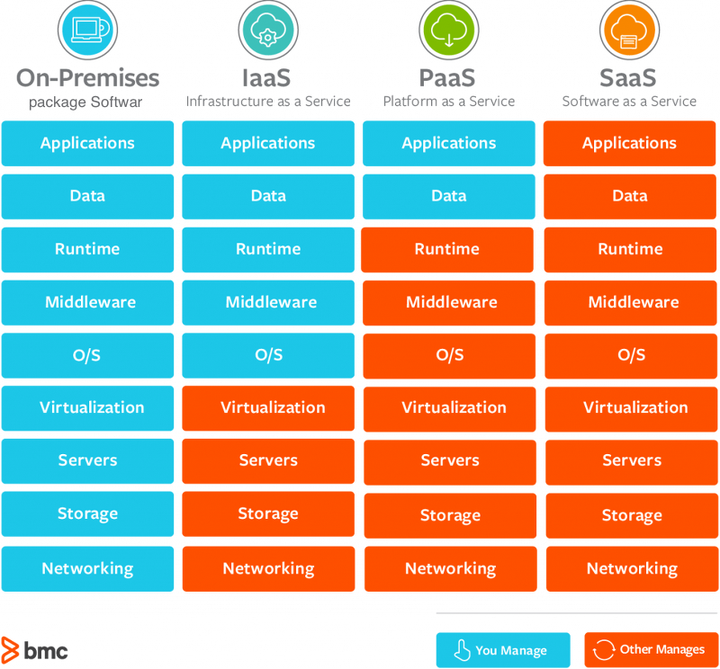

클라우드 서비스 이용 방식은 크게 세 가지로 분류할 수 있다.

1. IaaS(Infrastructure as a Services)
	- 물리적 서버 (CPU, Memory, OS), 네트워크, 스토리지를 가상화하여 다수의 고객을 대상으로 유연하게 제공하는 인프라 서비스
2. Paas(Platform as a Services)
	- Web 기반의 서비스 또는 애플리케이션 등의 개발 및 실행을 위한 표준 프랫폼 환경을 서비스 형태로 제송하는 서비스
3. Saas(Software as a Services)
	- 구글의 Gmail이나 한컴 스페이스 등과 같이 응용프로그램을 인터넷 및 웹 브라우저를 통해 제공하는 서비스

클라우드 서비스 이용 방식

)

출처 : https://www.bmc.com/blogs/saas-vs-paas-vs-iaas-whats-the-difference-and-how-to-choose/
