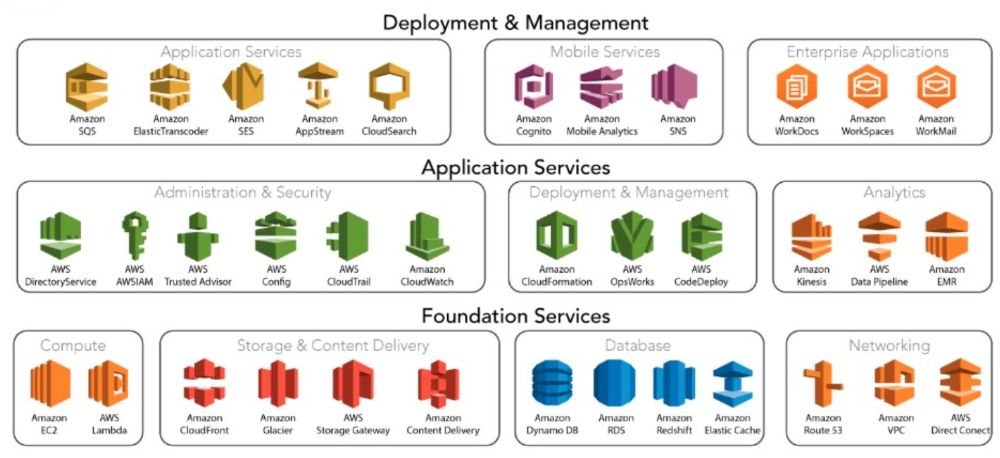

### Compute

- Amazon EC2(Elastic Compute Cloud) : 가상화 서버. 이는 다양한 형태의 타입과 서비스에 따라 적합한 사양을 선택할 수 있으며, 사용량만큼 비용을 지불하는 컴퓨팅 서비스
- Amazon Auto Scaling : 서버의 특정 조건에 따라 서버를 추가/삭제할 수 있게 해주는 서비스로 서버 사용량이 많은 경우 추가하고, 사용하지 않는 경우 서버를 자동으로 삭제할 수 있게 해주는 서비스
- Amazon Lightsail : 간단한 가상화 프라이빗 서버(Virtual Private Server, 이하 VPS)가 필요한 개발자에게 웹 사이트와 웹 어플리케이션을 배포하고 관리하는 기능과 컴퓨팅, 스토리지, 네트워크를 빠르고, 손쉬우며, 저렴한 비용으로 제공해주는 서비스
- Amazon WorkSpaces : 데스크톱 가상화 서비스로 사내 PC를 가상화로 구성하여, 문서 및 데이터를 개인 PC에 보관하지 않고 서버에서 보관 관리할 수 있도록 해주는 서비스
- AWS Lamda : AWS Lambda를 사용하면 서버를 프로비저닝하거나 관리할 필요 없이 코드를 실행할 수 있다. 사용한 컴퓨팅 시간만큼만 비용을 지불하고, 코드가 실행되지 않을 때는 요금이 부과되지 않는다.

### Networking

- Amazon Route 53 : 가용성과 확장성이 우수한 클라우드 기반의 Domain Name System(DNS) 웹 서비스로 사용자의 요청을 AWS에서 실행되는 다양한 인프라에 효과적으로 연결할 수 있다. 또한 사용자를 AWS 외부의 인프라로 전달하는 서비스도 Route 53을 사용할 수 있다.
- Amazon VPC(Virtual Private Cloud) : 가상 사설 네트워크 인프라를 클라우드 내에 생성/구성하고, 네트워크를 이용한 접근 제어(Security Group, NACL), DHCP 및 VPN 연결, 인터넷 게이트웨이(Internet Gateway) 등의 서비스 제공과 타 VPC와 다른 리전 간 VPC Peering 구성을 통해 보안성 및 안정성이 높은 네트워킹 서비스를 제공
- AWS Direct Connect : 기존 On-Premise의 인프라와 AWS를 연결하는 전용선을 구성하여, 낮은 지연시간으로 데이터 및 정보를 공유할 수 있게 하는 서비스를 제공. AWS-On-Premise를 연결하는 전용선 서비스로 이해하면 된다. 
- Amazon ELB(Elastic Load Balancer) : 웹 서버 및 각종 서버에 가용량과 접속자가 많은 경우 트래픽에 대한 부하 분산을 통해 네트워크 트래픽을 인스턴스로 전달한다. 기존에 사용하던 서비스 중 L4, Load Valance 서비스라고 생각하면 이해하기 쉽다.

### Storage

- Amazon S3(Simple Storage Services) : 여러 가지 용도로 사용할 수 있는 범용적인 스토리지 서비스로 데이터 보관 이외에도 정적 웹 사이트 호스팅 및 다양한 형태의 서비스로 활용 가능한 만능 스토리지 서비스
- Amazon Glacier : 사용 빈도가 높지 않는 데이터를 저렴한 비용으로 장기 보관할 수 있게 해주는 서비스로 가격이 저렴하고 무제한으로 데이터를 보관할 수 있는 장점을 가지고 있는 스토리지 서비스
- Amazon EBS(Elastic Block Storage) : 빠른 속도로 데이터를 저장 보관할 수 있는 서비스로 주로 서버에 디스크로 추가하여 데이터를 보관 제공할 수 있으며, 기본으로 SSD를 사용하여 데이터 입출력 속도가 매우 빠르고, 고성능의 서비스를 필요로 하는 스토리지 서비스에 적합한 서비스
- AWS Storage Gateway : On-Previse에 있는 데이터를 클라우드로 저장 보관하기 위해 연결 Gateway 서비스를 제공
- AWS Snowball : Import/Export 서비스를 통해 대량의 데이터를 AWS로 이전할 때 네트워크로 전송하지 않고 디스크나 스토리지에 저장하여 물리적으로 전달하고 이를 업로드해 주는 서비스로 대량의 데이터를 AWS로 업로드할 때 유용한 서비스

### Database

- Amazon RDS(Relational Datavase Services) : 관계형 데이터베이스 서비스인 MSSQL, Oracle, MySQL, MarinaDB, PostgreSQL 등 RDBMS 서비스를 사용자가 직접 관리하지 않고, Amazon에서 제공하는 서비스를 이용하여 데이터 베이스를 이용할 수 있도록 제공
- Amazon DynamoDB : NoSQL용 서비스로 대량의 데이터를 손쉽게 저장할 수 있고, 이렇게 저장된 데이터를 추가 분석 서비스와 연계 활용할 수 있도록 확장할 수 있는 서비스
- Amazon ElastiCache : In-Memory 기반의 Cache 서비스로 빠른 속도를 필요로 하는 서비스와 연계하여 높은 응답속도와 신뢰성을 필요로 하는 서비스에 적합한 서비스

### Analysis

- Amazon Kinesis : 대량의 데이터를 저장 분류할 수 있는 서비스. 다양한 규모의 스트리밍 데이터를 비용 효율적으로 처리할 수 있는 기능과 애플리케이션 요구사항에 따라 가장 적합한 도구를 선택할 수 있는 유연성을 제공한다. 또한 기계학습, 분석 및 기타 애플리케이션을 위해 비디오, 오디오, 애플리케이션 로그, 웹 사이트 크릭스트림 및 IoT 텔레메트리 데이터와 같은 실시간 데이터를 수집할 수 있다.
- Amazon Redshift : 데이터 웨어하우스와 데이터 레이크 전체에 걸쳐 간단하며, 효율적으로 비용 모든 데이터를 분석할 수 있는 빠르고 확장 가능한 데이터 웨어하우스. Redshitf는 기계학습, 대량 병렬 쿼리 실행, 고성능 디스크의 열 기반 스토리지를 사용하여 다른 데이터 웨어하우스보다 10배 빠른 성능을 제공
- Amazon EMR : 저장된 대량의 데이터를 분류하고 분석하여 필요한 정보를 뽑아낼 수 있도록 다양한 서비스를 제공

### Application

- Amazon CloudSerch : 검색 서비스이며, SWF는 워크플로우 서비스, SQS는 큐서비스를 활용한 대량의 데이터를 할 수 있도록 해주는 서비스. 손쉽게 중요 정보를 모바일로 전달할 수 있는 서비스
- Amazon SES(Simple Email Services) : 외부로 대량의 메일을 발송하는 서비스 
- Amazon Elastic Transcoder : 동영상을 인코딩할 수 있는 서비스

### 보안과 방화벽

- 보안(Security)
	- AWS IAM : 리소스에 대한 사용자 액세스 및 암호화 키 관리 서비스
	- Amazon GuardDuty : 관리형 위험 탐지 서비스
	- AWS Shield : DDos 보호
	- AWS WAF(Web Application Firewall) : 악성 웹 트래픽 필터링을 위한 서비스

- 방화벽 (Firewall)
	- Security Group
	- NACL
	- AWS WAF(Web Application Firewall)