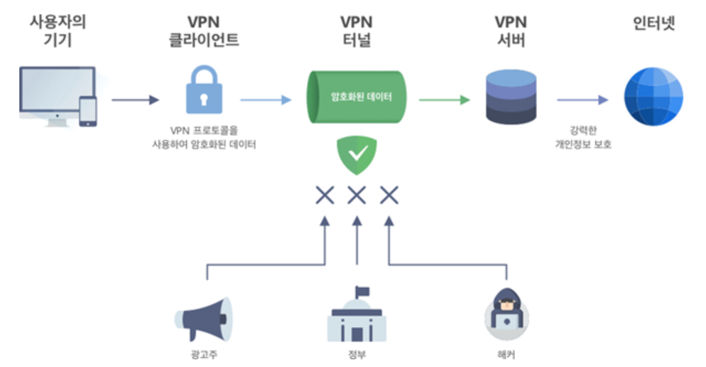
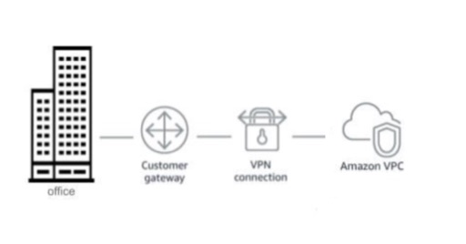

### VPN(Virtual Private Network)

큰 규모의 조직이 여러 곳에 분산되어 있는 컴퓨터들을 연결하는 보안성이 높은 사설 네트워크를 만들거나, 인터넷을 활용하여 원격지 간에 네트워크를 서로 연결하고 암호화 기술을 적용하여 보다 안정적이며, 보안성 높은 통신 서비스를 제공하는 서비스

출처 : https://adguard-vpn.com/ko/what-is-vpn/how-does-vpn-work.html

Amazon Web Service 는 VPC와 VPC Gateway를 통해 On-Premise의 VPN장비와 Amazon Web Services 간의 VPN을 연결할 수 있으며, 이를 통해 보안성 높은 하이브리드 클라우드 환경을 구현하여 원활한 클라우드 컴퓨팅 서비스를 지원할 수 있다.

### VPC(Virtual Private Cloud)

사용자의 AWS 계정 전용 가상 네트워크, AWS 클라우드에서 논리적으로 격리된 네트워크 공간을 할당하여 가상 네트워크에서 AWS 리소스를 이용할 수 있는 서비스이며 가상 네트워킹 환경을 완벽하게 제어할 수 있다.

보안 그룹 및 네트워크 제어 목록을 포함한 다중 보안 계층을 활용하여 각 서브넨에서 EC2 인스턴스에 대한 액세스를 제어할 수 있다.

