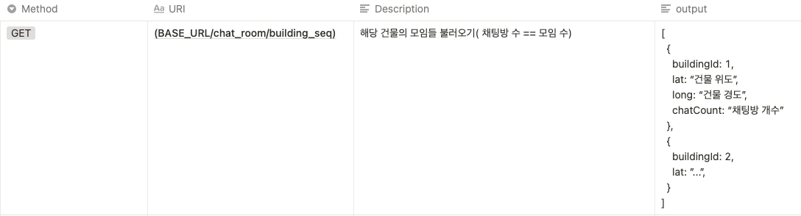

## 1주차

#### DB 설계 및 보완

- 사용자 액션에 따라 공동주문하는 챗에 대한 기본구성이 약함
- 주문시 메뉴와의 연결 고리가 약함

#### 이슈 관리 도구 선정

- 아래 4가지 중 선정

	- [Asana](https://asana.com/)

	- [Jira](https://ko.atlassian.com/software/jira)

	- [Trello](https://trello.com/)

	- [GitHub Issues & Projects ](https://devlog-wjdrbs96.tistory.com/227)

#### 공동 작업 형상 관리

- 공동 작업 용 git 생성

#### 형상 관리 규칙 정하기

- https://github.com/Mash-Up-MapC/MapC-backend/issues/17

- https://github.com/mash-up-kr/9tique-android/wiki/2.-Git

#### API 설계 원칙

- ##### 직렬화 포맷

	```json
	{
	    "title": "...",
	    "content": "..."
	}
	```

	``` json
	syntax = "test";
	
	message Post {
	  required string title = ...;
	  required string content = ...;
	}
	```

- https://developer.mozilla.org/ko/docs/Web/HTTP/Overview

- https://www.youtube.com/watch?v=t1UtCblLk_0


## 2주차

- 배포 자동화

	- CI/CD 선택 및 설정 ( 아래 5가지중 선택)
		- Travis-CI
		- [Jenkins](https://velog.io/@gahae37/Jenkins-%EC%82%AC%EC%9A%A9%EB%B2%95)
		- CircleCI
		- Amazon CodeBuild와 CodeDeploy를 함께 사용
		- Amazon CodeBuild만 사용

#### 스프린트 계획 작성

- 세부 기능 리스트 정리
- 스프린트 분배
- 도메인 단위로 우선순위 설정

#### 설계

- UML Diagram
	- [Class Diagram](https://gmlwjd9405.github.io/2018/07/04/class-diagram.html)

- 객체지향 설계[SOLID](https://limkydev.tistory.com/77)

#### API 설계 및 문서화

- 기능 API명세화

	- 예시

	


## 3주차

- 1~2주 못한 작업 마무리
- 2주차 스프린트 1 구현 시작

