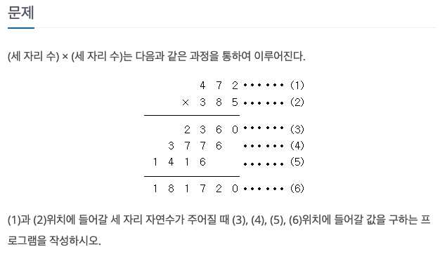
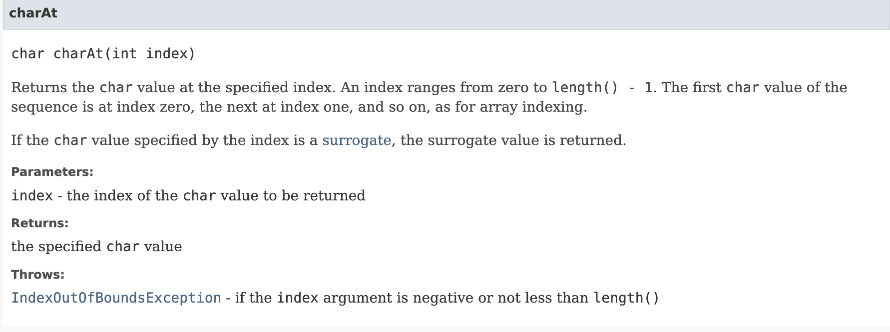
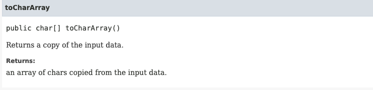

문제는 간단하다.

하지만 문제를 풀 수 있는 방법이 3가지가 있어서 따로 정리하게 되었다.

1. math
	나머지와 나눗셈 연산을 통해 1의 자릿수를 추출하는 방법
2. charAt()
	(2)를 String 으로 받아 charAt() 으로 각 자릿수를 추출하는 방법



String B = "abc";

| char  | a    | b    | c    |
| ----- | ---- | ---- | ---- |
| index | 0    | 1    | 2    |

B 에 문자열 abc 가 저장되어있을 때 문자열을 문자가 모인 배열이라고 보고 인덱스를 참조하여 해당 문자를 반환.

이때 반환되는 값은 문자(char, 아스키코드값)이다.

코드에서 정수로 사용하려면 char '0' 빼줘야 한다. [ 아스키코드 참고자료](https://namu.wiki/jump/VVSBeW7FWW%2FNtJ1rQnap3GcaGinfRchk8Hvm4M9YUgASBya7Bct86WpqpbhBEsmV%2F18XwZnVW1mWpsT6S2JkEt4VFgFxoQgZu7pyfjZbMUg%3D)

ex) (B.charAt(i) **- '0'**)


3. toCharArray() : 문자열을 char 배열 형태로 반환해주는 메소드
	문자열을 character 배열로 한 자리씩 넣어 자릿수를 추출하는 방법



문자열이 가변적으로 입력받을때 문자를 하나씩 참조할때 유용하다.


1번과 2,3번의 차이는 숫자 추출과 문자 추출의 차이가 있다.

#### 코드

```java
package com.example;

import java.util.Scanner;

public class Main {

    public static void main(String[] args) {
        Scanner scanner = new Scanner(System.in);
        Integer A = scanner.nextInt();
        String B = scanner.next();

        use_math(A,Integer.parseInt(B)); // 이 부분만 문자열이 아닌 integer 사용
        use_charAt(A,B);
        use_toCharArray(A,B);
    }

    private static void use_math(Integer A, Integer B) {
        int tmp = B;
        int b = 0;
        while( B > 0 ) {
            b = B % 10; // B값의 1의 자리수 추출
            B /= 10; // B값의 1의 자리수 제외한 값
            System.out.println(A * b);
        }
        System.out.println(A * tmp);
    }

    private static void use_charAt(Integer A, String B) {
        for( int i = B.length()-1 ; i>=0 ; i--) {
            System.out.println(A* (B.charAt(i)-'0')); // B의 자릿수 1부터 추출
        }
        System.out.println(A * Integer.parseInt(B));

    }

    private static void use_toCharArray(Integer A, String B) {
        char[] b = B.toCharArray(); // String B 값을 b[] 배열로

        for( int i = B.length()-1 ; i>=0 ; i--) {
            System.out.println(A* (b[i]-'0')); // b배열 자릿수 1부터 추출
        }
        System.out.println(A * Integer.parseInt(B));
    }
}

```


