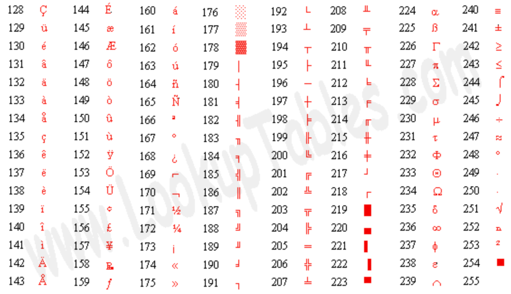

### ASCII Code

아스키 코드는 1963년 미국 [ANSI](https://namu.wiki/w/ANSI)에서 표준화한 정보교환용 7비트 부호체계이다.

최상위 비트는 0으로 고정되어있고, 7bit를 사용하여 1Byte로 구성되어있다.

영어 알파벳과 특정 문자에 대해서 숫자와 1:1 매핑을 시켜놓은 것으로 한글을 포함한 다른 언어를 나타낼 수 없다. 그래서 유니코드가 등장했다.

### Extended ASCII Code

ASCII 문자와 추가 문자를 포함하는 8 비트 부호체계이다. 2^8 = 256 개의 문자를 표현할 수 있다.

#### ASCII control charachets : code 00~31

주변 기기들을 제어할 때 사용. 

#### ASCII Printable characters : code 32~127

인쇄 가능한 문자로 문자, 숫자, 구두점, 기타 기호 등을 나타낸다.

#### Extended ASCII characters : code 128~255

ISO 8859-1dp를 따르며 ISO Lation-1로도 불린다. 128~159에는 Microsoft Windows Latin-1 확장문자가 포함되어 있다.

