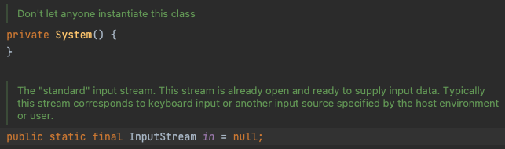
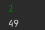
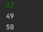

#### InputStream

##### InputStream 의 정의는

> This abstract class is the superclass of all classes representing an input stream of bytes.
>
> 이 추상 클래스는 바이트의 입력 스트림을 나타내는 모든 클래스의 슈퍼 클래스입니다.

여기서 중요한건 **"바이트 입력 스트림"**이다.

##### byte 란?

> 하나의 단위로서 다루는 비트(bit)의 모임. 8비트의 모임을 1바이트라고 한다.

##### Stream 이란?

> Stream in java
> A stream is a sequence of objects that supports various methods which can be pipelined to produce the desired result.
>
> 스트림(Stream)은 원하는 결과를 생성하기 위해 파이프라인화될 수 있는 다양한 방법을 지원하는 객체의 연속이다.

Stream은 데이터의 이동 통로라고 해석할 수 있다.

즉, InputStream 데이터를 byte 단위로 입력하는 통로이고 , OutputStream은 출력 통로이다.


##### InputStream (System.in) / System.in은 무엇인가?

```java
Scanner sc = new Scanner(System.in);
```

System Class의 in은 InputStream Type 이다. 즉, **System.in 이 InputStream 타입의 필드**이다.



*System 클래스 in 변수는 '표준 입력 스트림'이며 일반적으로 콘솔, 명령줄 인수 등을 통해 입력을 받다. 키보드, 터미널 등에서 입력을 넣어주는 것들을 System.in 을 통해 연결된다는 의미


테스트 해보자

```java
import java.io.IOException;
import java.io.InputStream;

public class Main {

    public static void main(String[] args) throws IOException {

        InputStream inputstream = System.in;
        int a = inputstream.read();
        System.out.println(a);

    }
}
```

1을 입력하면



12를 입력하면


결과가 49로 같은 값이 나온다.

이유는 InputStream은 1바이트 단위로 입력받는다. 그래서 1의 아스키코드 값인 49, 12에서 첫 1바이트 값인 1의 아스키코드 값인 49가 나오게 된다.

```java
import java.io.IOException;
import java.io.InputStream;

public class Main {

    public static void main(String[] args) throws IOException {

        InputStream inputstream = System.in;
        int a = inputstream.read();
        System.out.println(a);

        int b = inputstream.read();
        System.out.println(b);
    }
}
```

이렇게 b를 추가해 값을 읽어주면 



1,2 각각의 아스키코드값이 나온다.


만약 n개의 문자를 입력받고 싶으면 n개의 변수를 선언해야하나 싶겠지만, 바이트 타입 배열로 선언해 read()메소드에 넣어서 입력받는 방법도 있다.

```java
import java.io.IOException;
import java.io.InputStream;

public class Main {
    public static void main(String[] args) throws IOException {

        InputStream inputstream = System.in;

        byte[] a = new byte[2];
        inputstream.read(a);

        for(byte val : a){
            System.out.println(val);
        }
    }
}
```


결과는 위에 2개의 변수를 선언한 값과 같다.


#### Reference

https://www.geeksforgeeks.org/stream-in-java/#:~:text=A%20stream%20is%20a%20sequence,Arrays%20or%20I%2FO%20channels.