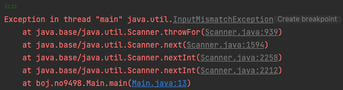
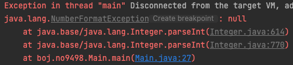

알고리즘 문제를 풀다보면 런타임에러가 발생하는데 , 종료 조건 없이 입력이 주어진 상황에서 EOF(End of File)때문에 에러가 발생한다.

즉, 데이터 소스로부터 더 이상 읽을 수 있는 데이터가 없어서 생기는 문제다.

대표적인 Scanner, BifferedReader 두 가지로 이를 처리하는 방법을 알아보자.


#### Scanner Class

Scanner에서 더이상 읽을 데이터가 없으면 NoSuchElementException 을 던져준다.


EOF 상황은 stop 'Main' 버튼을 누르거나, EOF를 입력해주거나, EOF 입력 같은 경우 윈도우의 경우는 "ctrl + z", 리눅스계열의 경우 "ctrl + d" 를 입력하거나


다른 타입을 입력해 InputMismatchException을 던져주거나




Scanner Class는 자체 EOF처리 메소드가 있다. 바로 hasNext() 메소드이다.

다른 방법은 try-catch 문으로 예외발생시 반복문 종료 처리도 가능하다.

```java
Scanner sc = new Scanner(System.in);
		
while (sc.hasNext()) {
  int a = sc.nextInt();
  System.out.println(a);
}
```


#### BufferedReader Class

BufferedReader Class 에서 더이상 읽을 데이터가 없으면 null 을 던져준다.



또한, BufferedReader class 는 내부 메소드가 없다.


그래서 예외 처리 방법은

```java
BufferedReader bf = new BufferedReader(new InputStreamReader(System.in));
String buf = "";

while((buf = bf.readLine()) != null) {
	System.out.println(buf);
}
```

