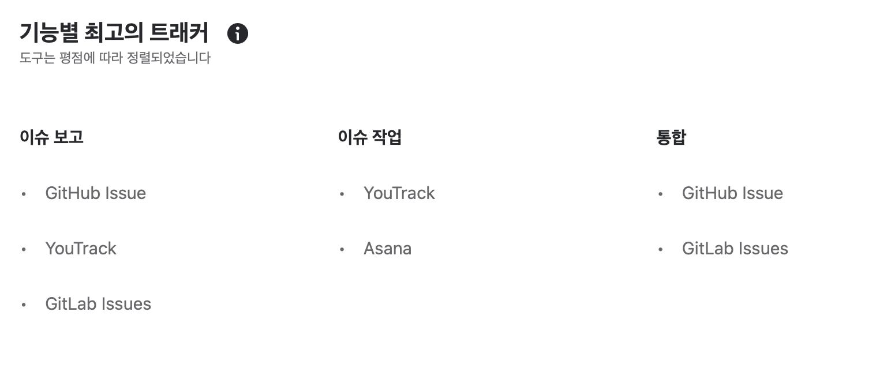
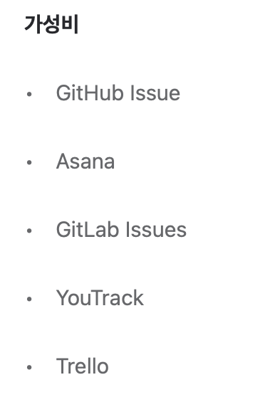
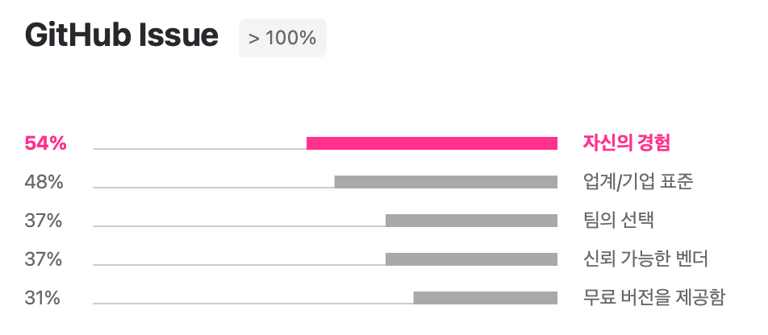

### GitHub Issues & Projects 특징

- 이슈 각각에 대해 작업자를 할당 할 수 있다.
- **이슈에 대해 커뮤니케이션**할 수 있다.
- 태그/라벨 등으로 **이슈의 종류를 구분**할 수 있다.
- **이슈의 상태(To do, In progress 등)를 구분**해서 **시각화**할 수 있다. 
- **projects**에 **issues** 기능을 연동해 이슈를 시각화 가능하며, projects의 **automation** 기능을 통해 **이슈 구분**과 **이슈 상태 자동 갱신**도 가능
- 커밋 메시지에 이슈번호를 명시해 두면 **자동으로 해당 이슈가 링크된다.**
- 번외, 머지할때 마일스톤으로 만들면 리뷰하기 좋다

---

협업을 하기 위해 이슈 보고 및 이슈 작업에 대한 트레커 툴이 필요했다.

찾아 보니까 다양한 트레커 툴이 있지만, 그중에 GitHub Issues & Projects를 선택한 이유에 대해 가볍게 적어볼까 한다.

아래 참고한 사이트를 보면 트래커 툴에 대한 각각의 특징 및 강점에 대해서 설명하고 있다.

그중에서 중점으로 생각한 부분을 가져왔다.

이슈 보고와 이슈 작업에서 통합적으로 GitHub Issues & Projects 이라고  나온다.

또한, 소규모 토이 프로젝트이기 때문에 가성비도 중요하게 생각했다.

업계/기업의 표준 인것도 선택한 이유중 하나이다. 

github를 통해서 협업을 한다고 널리 알려져있다. 그래서 이번 기회에 학습해보기로 했다.

#### Reference

https://www.jetbrains.com/ko-kr/lp/tracking-tools-review-2019/