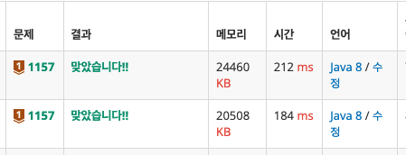

입력받을때 영어의 대문자 소문자를 구분하는데 2가지 방법이 있다.


```java
import java.io.BufferedReader;
import java.io.IOException;
import java.io.InputStreamReader;
import java.util.HashMap;
import java.util.Map;
import java.util.Set;

public class Main {
    public static void main(String[] args) throws IOException {
        BufferedReader bf = new BufferedReader(new InputStreamReader(System.in));

        int[] arr = new int[26];

        String s = bf.readLine();
        for (int i = 0; i < s.length(); i++) {
            if ('a' <= s.charAt(i) && s.charAt(i) <= 'z') {
                arr[s.charAt(i) - 97]++;
            } else {
                arr[s.charAt(i) - 65]++;
            }
        }

        int max = -1;
        char ch = '?';
        for (int i = 0; i < 26; i++) {
            if (arr[i] > max) {
                max = arr[i];
                ch = (char) (i + 65);
            }
            else if (arr[i] == max) {
                ch = '?';
            }
        }
        System.out.print(ch);
    }
}
```


```java
import java.io.BufferedReader;
import java.io.IOException;
import java.io.InputStreamReader;
import java.util.HashMap;
import java.util.Map;
import java.util.Set;

public class Main {
    public static void main(String[] args) throws IOException {
        BufferedReader bf = new BufferedReader(new InputStreamReader(System.in));

        int[] arr = new int[26];

        String s = bf.readLine().toUpperCase();

        for (int i = 0; i < s.length(); i++) {
            arr[s.charAt(i) - 65]++;
        }
      
        int max = -1;
        char ch = '?';
        for (int i = 0; i < 26; i++) {
            if (arr[i] > max) {
                max = arr[i];
                ch = (char) (i + 65);
            }
            else if (arr[i] == max) {
                ch = '?';
            }
        }
        System.out.print(ch);
    }
}
```


내장 함수 사용를 사용하는거보다 ASCII코드를 이용하는게 속도 면에서 유리하다.



아래 184ms 가 ASCII코드를 사용한 코드이다.
