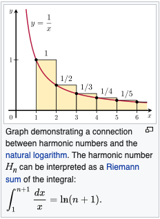
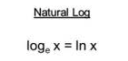
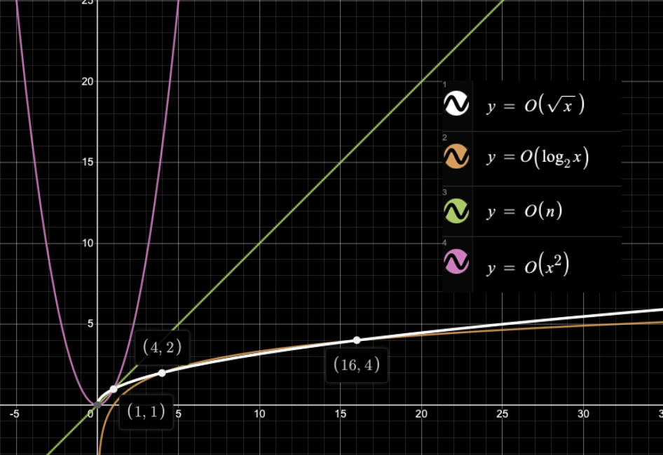

이번 소수 구하기에서 1978 소수 찾기, 2581 소수, 11653 소인수분해 문제와 다른 점은 시간제한이 있다.


n 값을 줬을 때 소수를 구하는 방법에는 크게 3가지 방법이 있다. 

### 첫 번째로 

모든 자연수, 즉 1~n까지 n 값을 나누어 값이 1, n을 제외한 다른 자연수로 나눠지면 소수가 아니게 된다.

```java
for (int i = 2; i < n; i++) {
// i의 값 범위를 2<=i<n 로 한 이유는 1,n값을 제외한 값으로 나눠지는지 확인하기 위함이다.
  if (n % i == 0) {
    check = false;
    System.out.println(n+"는 소수가 아닙니다.");
    break;
  }
}
System.out.println(n+"는 소수입니다.");
```

1~n까지의 값을 다 구해야 하므로 시간복잡도는 O(n)이 된다.

문제에서는 값의 범위(M~N)가 주어진다. 범위의 값을 N이라 하면 문제에서 시간복잡도는 O(n²)이다.


### 두 번째로

1~√n까지 값으로 n 값을 나누어 값이 1을 제외한 다른 값으로 나눠지면 소수가 아니게 된다.

범위를 1~√n까지인 이유는 √n*√n = n이기 때문에 √n의 값이 나눠지는 값의 최댓값이기 때문이다. 

```java
for (int i = 2; i <= Math.sqrt(n); i++) {
//Math.sqrt 는 자바에서 제공하는 라이브러리중 하나로 루트(√n) 값 을 제공해준다.
  if (n % i == 0) {
    check = false;
    System.out.println(n+"는 소수가 아닙니다.");
    break;
  }
}
System.out.println(n+"는 소수입니다.");
```

1~√n 까지의 값을 구하면 되서 시간 복잡도는 O(√n) 이 된다.

문제에서는 값의 범위(M~N)가 주어진다. 범위의 값을 N이라 하면 문제에서 시간복잡도는 O(n√n)이다.


### 세 번째로

에라토스테네스의 체

c=2 부터 √n 이하까지 반복하여 자연수들 중 c 값을 제외한 c의 배수들을 제외시킨다.


출처 : https://blog.kakaocdn.net/dn/vcP21/btqDp03wCZB/2zaIgivKDhL6PQp7AQpIb1/img.gif

1 ~ 𝑥 까지의 수가 있는 칸을 체크하는 횟수는 

(𝑥) + (𝑥/2) + (𝑥/3) + (𝑥/4) + (𝑥/5) + (𝑥/6) + ⋯ + 1

= 𝑥(1 + 1/2 + 1/3 + 1/5 + 1/6  ⋯ + 1/𝑥) 



출처 : https://en.wikipedia.org/wiki/Harmonic_number

즉, xln(x) 이 된다.



n 이하의 소수에 대하여 단순하게 체에 거르는 것만 해도 거르는 시간이 log n 이므로 시간 복잡도는 O(nlog n) 이다.

그렇지만, 이미 체크된 값은 검사하지 않고 넘기게 된다.

ex) 2, 3, ~~4~~, 5, ~~6~~, 7, ~~8~~, ~~9~~ ....

그럼 n값이 소수의 개수만큼만 검사하면 된다는 뜻이다. 이때 가우스의 소수 정리가 나오게 된다. 아직 증명되지 않은 정의지만, n보다 작거나 같은 소수의 밀도에 대해 대략 1 / ln(n) 라는 것이다. 즉 n번째 소수는 nlog n 이라는 의가 된다.

그럼 복잡도는 O(nlog(log n)) 이된다.


단순하면서도 가장 좋은 성능을 보여주고 있다.


빅오(O) 의 속도의 차이를 보면

