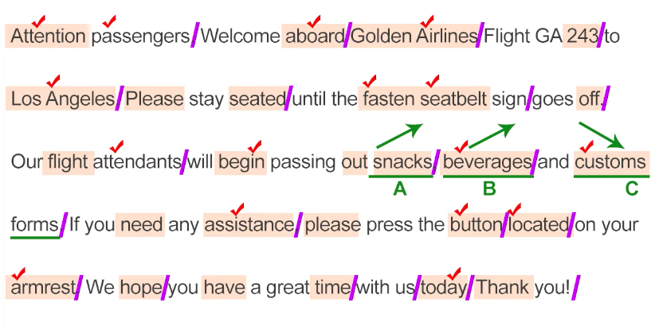

Q 1,2

### 빈출 유형

기내, 열차, 여행, 행사 안내문, 라디오, TV 방송문, 광고문, 전화 메시지

### 채점 포인트

의미 단위, 발음, 억양, 강세

### 준비 순서

- 의미 단위 파악 (끊어 읽는게 아닌 늘려 읽는 느낌 단, 마지막 구두점은 제외)
	- 전치사, 절, 접속사, 준동사, 구두점
- 문장 속 내용어 찾기
	- (본)동사, 2어동사 부정어, 명사, 복합명사, 고유명사, 보어, 숫자, 분사, 동명사, 비교급, 최상급, 한정사, 제한어(Let's, Please), 명령어, 인사말, 부사, 이름의 성
- 나열식 문장 파악
- 단어의 발음 및 강세

ex)

Reference : https://youtu.be/IRW9u_xVR-E