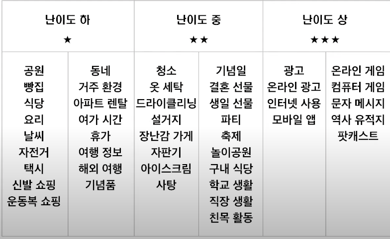

Q 5~7

### 빈출 유형

### 채점 포인트

- 내용의 연관성, 일관성, 완성도
- 어휘와 문법, 발음과 억양

### 준비 순서

15초 Q 5,6

- 질문을 활용한 핵심 단볍 말하기 (질문에 대해서 가장 직접적이고 핵심적인 답변을 우선적)

### 빈출

- **Q1) How often[freqiently] do you eat out?**

- A1) I eat out once a day.

- 주로 이렇게 사용하는게 편하다. once / twice + a + day / week / month

- **Q2) How many times did you eat out last week?**

- A2) I ate out seven times last week.

- **Q3) Where do you usually go when you eat out?**

- A3) I usually go to an Italian restaurant when I eat out.

- **Q4) Who do you usually eat out with?**

- A4) I usually eat out with my friend, Tom.

- **Q5) When do you usually eat out?**

- A5) I usually eat out for lunch.

- **Q6) When did you eat out most recently?**

- A6) Yesterday, I ate with my friends.

- **Q7) What is your favorite food when eating out? **

- A7) My facorite food is Italian food.

- **Q8) Would you consider eating out every day?**

- A8) Yes, I would consider it.(긍정적인 답변이 답변 확장에 용이)

- **Q9) How far is the nearest restaurant from your house?**

- A9) There is an Italian restaurant near my house.

	

- **답변 확장하기(15초 채우기)**

	- A1) I go to school every day. so, I eat lunch outside.
	- A2) On weekdays, I ate out with my classmates.
	- A2) On weekend, I ate out with my family.
	- A3) I love Italian food. I usually eat cream sauce pasta.
	- A4) We have the same taste in food. I like to eat out whit him.
	- A5) Somtimes, I eat out at the school cafeteria. Somtimes, I go to the restaurant near my school.
	- A6) We went to an Italian restaurant called Sorrento. We ordered many things such as pizza, pasta and so on.
	- A7) Especially, I love cream sauce pasta. It is super delicious.
	- A8) Beaouse I can save time. It is very convenient and helpful.
	- A9) It is called Sorrento. It takes five minutes on foot.

30초 

- 질문을 활용한 핵심 단볍 말하기 (질문에 대해서 가장 직접적이고 핵심적인 답변을 우선적)
	- ex)
- 답변 확장하기(30초 채우기)

### 어휘

#### go + 전치사

go to a + cafe / store

go at + my house / school

go + nearby / abroad / online

#### with

with + my friends / family / coworkers

alone / by myself / on my own

#### 시간대 표현

in the + morining / afternoon / evening

at + night

#### 계절

in + spring / summer / fall / winter

#### etc, 등등

~~ and so on.

#### 최애

My facorite food is Italian food. = I like pizza the most.

#### It takes five minutes on foot.

on foot

by + bus / subway / car

It takes ~ : ~ 만큼 걸리다.

to be honest 솔직히 말하자면

Reference : https://youtu.be/4Cmw1p_MC3E