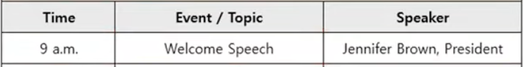
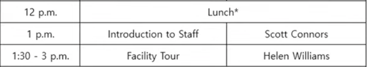

q 8,9,10

### 빈출 유형

행사 일정표, 면접 일정표, 출장 일정표, 개인 일정표, 강좌 프로그램, 이력서, 투어 프로그램, 영수증

### 채점 포인트

내용의 연관성, 내용의 완성도, 어휘와 문버, 발음과 억양

### 준비 순서

- 질문에 해당하는 핵심 답변 말하기
	- 문제 답변 시간이 짧기 때문에 핵심 답변을 반드시 먼저 말하기
- 내용 관련 부가 정보 말하기
	- 핵심 답변만 할 경우 반드시 시간이 남는다.

### 문제별 질문 유형

- Q8 : 의문사를 활용한 기본 정보 확인
	- When will the workshop be held?
	- Where will the orientaion take place?
	- What time will the first session start?
	- Who is the speaker?
- Q9 : 알고 있는 정보의 Yes / No 확인
	- I was told that lunch will not be provided. Is that true?
	- As far as I remember, the registration free is 55 dollars. Is that correct?
	- Will I miss any sessions if I leave at 3 P.M.?
- Q10 : 질문에 해당하는 사항 모두 말하기
	- What are all the workshops begin held at the seminar?
	- What lextures are offered in the afternoon?
	- Other than the opening speech, what sessions are schedule in the morning?

### 예시

Q8 : 의문사를 활용한 기본 정보 확인

- Q : When and where will the event take place? What time will it start?
- A : It will be held <u>in</u> the banquet hall <u>at</u> Emerald Hotel. It will take place <u>on</u> Thursday, April 5th. It will start <u>at</u> 10 a.m. <u>전치사 주의</u>

내용 관련 부가 정보 말하기

- Please don't be late.
- Please keep that in mind.
- Please don't forget.
- Please remember that.
- Please don't worry about it.

Q9 : 알고 있는 정보의 Yes / No 확인

- Q : I was told that the event will end around 4 p.m. Is that right?
- A : Actually, you have the worong information. It will end at 5 p.m.
- 긍정은 Yes, you have the ritght information.

Q10 : 질문에 해당하는 사항 모두 말하기

- Q : I am intersted in developing mobile apps. What sessions would be helpful for people like me?
- A : There are two sessions. First, at 2p.m., there will be a presentation on mobile app development given by Eden Randall. Second, at 3 p.m., Lucy Weber will give a presentaion on app development software.
	- 사람 이름이 뒤로 수동형 : there will be a presentation on mobile app development given by Eden Randall
	- 사람을 주어로 쓰는 능동형 : Lucy Weber will give a presentaion on app development software
	- 수동 능동 2가지 사용 가능한것을 보여주면 점수 잘 받는다.

내용 관련 부가 정보 말하기

- Both of them should be helpful. (추천 : 젤 편함)
- Both of them are lectures.
- Both of them are led by Sarah Lee.(두 강의자가 같으면 이런식으로 사용)

### 예시2

Q8 : 의문사를 활용한 기본 정보 확인

- Q : What time will the orientation start? Who is the first speaker?
- A : It will start at 9 a.m. Jennifer Brown, the president, will give a welcome speech.
- == A : It will start at 9 a.m. Jennifer Brown will give a welcome speech.

Q9 : 알고 있는 정보의 Yes / No 확인

- Q : I was told that lunch will not be provided at the orientation. Is that right?
- A : Actually, you have the wrong information. <u>Lunch will be provided</u> in the compalny cafeteria. <u>사람 주어가 아니므로 be + p.p의 수동형으로 구성</u>
- Don't worry about it.

Q10 : 질문에 해당하는 사항 모두 말하기

- Q : What are all the sessions scheduled after lunch?
- A : There are two sessions. At 1 p.m., <u>Scott Connors will introduce our staff</u>.<u>능동형</u>
- Next, <u>there will be a facillity tour led by Helen willams</u> (수동형) <u>from 1:30 to 3 p.m.</u>(시간 정보)
- Please keep that in mind.

### 고득점 전략

- 질문이 2개 이상일 경우 해당 사항에 대해 모두 답변하기
- 완성된 문장의 형태로 답변하기
- 질문에 나온 단어 및 내용을 답변에 재 언급
- 내용 관련 부가 정보 말하기 ( 시간, 내용, 제목, 누가, 등등 부가정보 말해주기)
- 숫자 및 고유 명사는 천천히, 또박또박 발음하기
- 빨리 말하기보다 천천히 올바른 문법을 지켜 말하기
- 가급적 다양한 문장 형태를 활용( 수동형, 능동형 등)
- 빈출 차트 유형별 단골 문제 사전에 숙지하기

### 어휘

It will be held : 

It will take place <u>on Thursday</u> , April 5th. : 4월 5일 <u>목요일</u>에 열릴것이다.

Reference : https://youtu.be/a070e5xVdrI