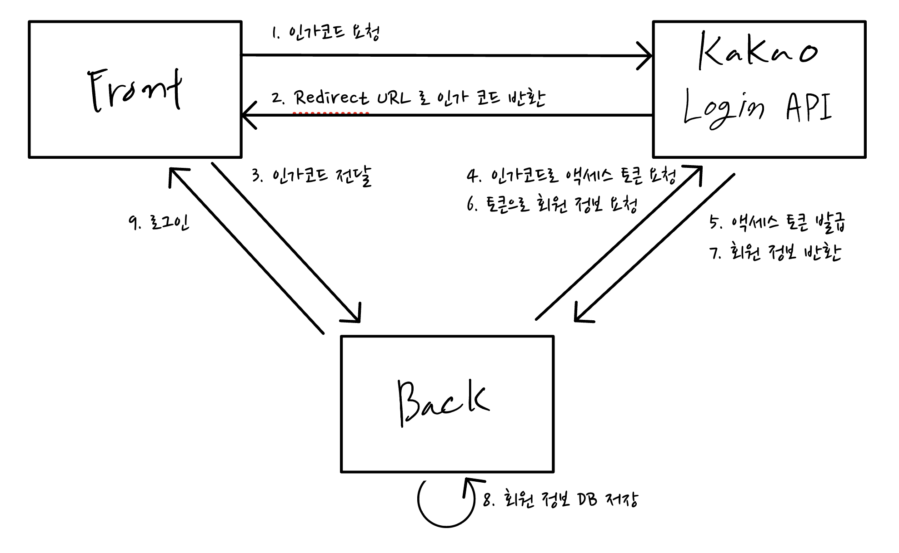
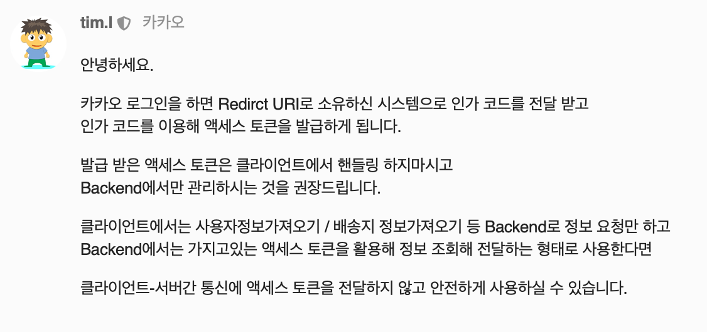

액세스 토큰을 프론트에서 받아서 백으로 보내는 예도 있는데, 카카오에서 발급받은 액세스 토큰을 바로 사용하는 건 추천하지 않는 방식이다.

출처 : https://devtalk.kakao.com/t/topic/124144/4

로그아웃이나, 연결 해제 요청 시 카카오 액세스 토큰이 필요하다.

그럼 백앤드에서 카카오 액세스 토큰을 저장할지 고민을 해야 한다.

암호화를 한번 걸어서 사용할지, 자체 토큰에 회원 식별 ID만을 보내고 캐시 혹은 DB에 식별 ID와 액세스 토큰을 가지고 있거나 하는 다양한 방법이 있다. 

Oauth 2.0 을 사용한 로그인이 Kakao만 있는 게 아니기 때문에 주로 사용하는 방법은 자체 토큰을 발급해 사용하는 것 같다. 

다시 돌아가 Kakao login API 에서 인증코드를 가지고 어디서 액세스 토큰을 발급할 건지 먼저 정하는 게 중요하다.

Oauth 참고 : https://www.rfc-editor.org/rfc/rfc6749