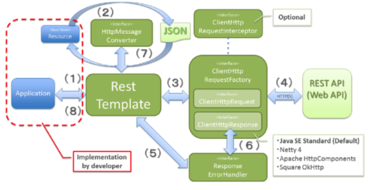

### RestTemplate

Spring 3.0 부터 지원한 RestTemplate는 Rest 방식 API를 호출할 수 있는 Spring 내장 클래스이다.

Spring 5.0 이후 부터는 RestTemplate는 deprecated 되었다. 그래서 WebClient 사용을 지향한다.

WebClient 와 RestTemplate 의 차이점은 동기, 비동기 차이이다.

**RestTemplate 특징**

- Spring 3.0 부터 지원하는 Spring의 HTTP 통신 템플릿
- HTTP 요청 후 JSON, XML, String 과 같은 응답을 받을 수 있는 템플릿
- RESTful 형식에 맞추어진 템플릿
- Header, Content-Tpye등을 설정하여 외부 API 호출
- Blocking I/O 기반의 동기방식을 사용하는 템플릿
- Server to Server 통신에 사용

**RestTemplate 동작 원리**

1. 애플리케이션 내부에서 REST API에 요청하기 위해 RestTemplate의 메서드를 호출한다.
1. RestTemplate은 MessageConverter를 이용해 java object를 request body에 담을 message 로 변환한다.
1. ClientHttpRequestFactory에서 ClientHttpRequest을 받아와 요청을 전달한다.
1. ClientHttpRequest가 HTTP 통신으로 요청을 수행한다.
1. RestTemplate 는 ResponseErrorHandler 로 오류를 확인하고 있다면 처리로직을 태운다.
1. ClientHttpResponse에서 응답 데이터를 가져와 오류가 있으면 ClientHttpResponse에서 처리한다.
1. RestTemplate 는 HttpMessageConverter 를 이용해서 응답메세지를 java object(Class responseType) 로 변환한다.
1. 결과를 애플리케이션에 돌려준다.

